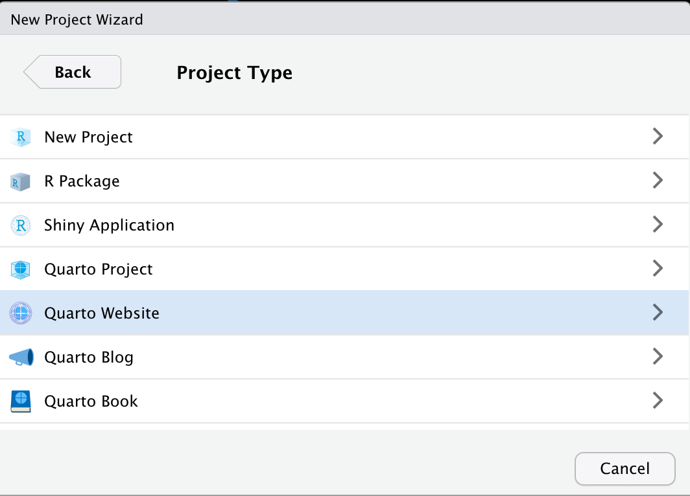
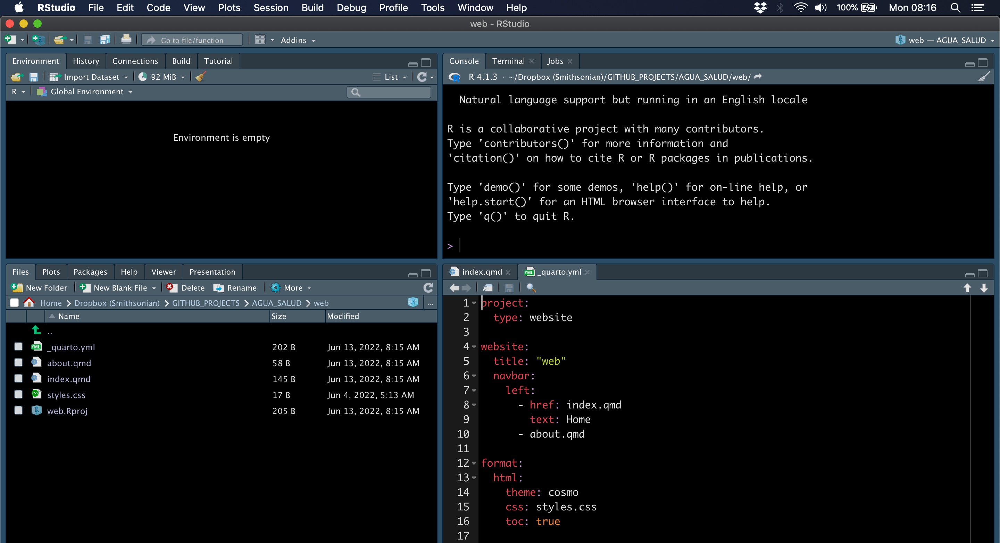

```{r setup, include=FALSE}
knitr::opts_chunk$set(echo = TRUE, eval = FALSE)
remove(list = ls())
```

```{r, xaringanExtra-clipboard, echo=FALSE, eval=TRUE}
htmltools::tagList(
  xaringanExtra::use_clipboard(
    button_text = "<i class=\"fa fa-clone fa-2x\" style=\"color: #301e64\"></i>",
    success_text = "<i class=\"fa fa-check fa-2x\" style=\"color: #90BE6D\"></i>",
    error_text = "<i class=\"fa fa-times fa-2x\" style=\"color: #F94144\"></i>"
  ),
  rmarkdown::html_dependency_font_awesome()
)
```

This is how I created this website for the SWELTR temperature manipulation experiment using **a**) [Distill](https://rstudio.github.io/distill/) to build the site and **b**) GitHub Pages to host the site. 

> This tutorial assumes you have **a**) [git installed](https://github.com/git-guides/install-git#:~:text=To%20install%20Git%2C%20run%20the,installation%20by%20typing%3A%20git%20version%20.), **b**) a [GitHub account](https://github.com/join), **c)**  [RStudio installed](https://www.rstudio.com/products/rstudio/download/), and **d**) [Distill](https://rstudio.github.io/distill/) for R installed. 

You will need to jump back and forth between the RStudio IDE and a terminal. You can use the terminal in RStudio if you wish, it is up to you. 

I will try to point out which code you run in the RStudio console and which you run in a terminal. I will use different code block colors to help you differentiate between the two. 

When you see a code block that looks like this, the command(s) must be executed in the RStudio console. 

```{r}
#R code blocks will look like this.
```

When you see a code block that looks like this, the command(s) must be executed in a terminal. 

```bash
#Terminal code will look like this.
```

## Overview 

There are two main options for a GitHub Pages website. 

- A **user or organization site**.  
- A **project site**.  

The difference between the two is that a user or organization site is a single site, like ht<span>tps://</span>microbes.github.io/, 
and individual pages on this site are indexed like so: 

ht<span>tps://</span>microbes.github.io/about.html. 

A project site on the other hand is like a  collection of sites within a main site. A project site would have the same root URL (e.g., ht<span>tps://</span>microbes.github.io/) but each  project would have it's own unique extension, like these examples:

ht<span>tps://</span>microbes.github.io/deep-sea/ **or** 
ht<span>tps://</span>microbes.github.io/forest-soils/. 

Individual pages within a project site would be indexed like this:
ht<span>tps://</span>microbes.github.io/deep-sea/about.html

As mentioned above, the instructions here are for a GitHub Pages **project site**.

For more information see the [GitHub Pages](https://pages.github.com/) documentation. You can also check out [A guide to using Github Pages](https://www.thinkful.com/learn/a-guide-to-using-github-pages/).

## Key Steps

Here is an overview of what we will be doing in this tutorial:

1) Create organization on GitHub.
2) Create two GitHub repos for the site, one to host the organization URL and  another to host the raw code ***plus*** the `gh-pages` branch.
3) Clone the code repo to your computer.
4) Create a `gh-pages` branch.
5) Build the initial site with Distill for R.
6) Customize the default `_site.yml` file.
7) Rebuild the site.
8) Push changes to GitHub. 

## 1. GitHub Setup

### Create organization on GitHub

> If you already have an organization [skip to the next step](about.html#create-repos-for-the-site).

**a**) In  the upper right-hand corner of your GitHub page click on your avatar and select `Your organizations`. 

```{r, echo=FALSE, layout="l-body-outset", warning=FALSE, fig.width=4, eval=TRUE}
knitr::include_graphics("include/about/step1.png")
```

***

**b**) On the page that opens, hit `New organization`.

```{r, echo=FALSE, layout="l-body-outset", warning=FALSE, fig.height=4, eval=TRUE}

```
***

**c**) Next, give your organization a name, provide an email address, and indicate whether  this is for a personal or institutional account. Then hit `Next`. 

> The name of the organization does not need to be the same as the website you create later.

```{r, echo=FALSE, layout="l-body", warning=FALSE, out.width = "75%", fig.align = "center", eval=TRUE}
knitr::include_graphics("include/about/step3.png")
```
***

**d**) Here you can add members. For now, just hit `Complete setup`. 

```{r, echo=FALSE, layout="l-body", warning=FALSE, out.width = "75%", fig.align = "center", eval=TRUE}

```

***

### Create repos for the site

In this section, we need to create two repositories for the site: **i**) one to host the organization URL (i.e., ht<span>tps://</span>sweltr.github.io/) and **ii**) another to host the raw code (e.g. `.Rmd` files) ***plus*** the `gh-pages` branch. More on that in a minute. I am including instructions for things you *MUST* do in order to get the rest of the tutorial to work properly. 

**a**) Hit the `Create a new repository button`. 

```{r, echo=FALSE, layout="l-body-outset", warning=FALSE, out.width = "100%", fig.align = "center", eval=TRUE}
knitr::include_graphics("include/about/step5.png")
```

***

**b**) First, we create the *github.io repo* to host the main site.

There are a few things to do here:

- Name the repo, Here we call it `sweltr.github.io`. it doesn't matter what you call this but it **must** be unique and have the `.github.io` extension. 
- Make sure repo is **public**. 
- **You must** Initialize this repository with a **README File**. 
- Hit the `Create repository` button. This creates the `main` branch of the repo. 

> Note: you can host a site on GitHub without the `github.io` extension but that is a more advanced skill and beyond the scope of this tutorial.

```{r, echo=FALSE, layout="l-body", warning=FALSE, out.width = "100%", fig.align = "center", eval=TRUE}
knitr::include_graphics("include/about/step6.png")
```

***

**c**) Next, we create the *build repo* to host the project source code. These steps are similar to those described above.

- Name the repo, here we call it `high-temp`. This will be the **extension of the project site**. So this project's URL will be ht<span>tps://</span>sweltr.github.io/high-temp/. 
- Make sure the repo is **public**. 
- **You must** Initialize this repository with a **README File**. 
- Hit the `Create repository` button. This creates the `main` branch of the repo. 

> Note: you can make these repos private, however that is a bit more advanced and beyond the scope of the tutorial provided here :)

```{r, echo=FALSE, layout="l-body", warning=FALSE, out.width = "100%", fig.align = "center", eval=TRUE}
knitr::include_graphics("include/about/step7.png")
```

### Review

Here is what we have so far:

An organization at [https://github.com/sweltr/](https://github.com/sweltr/) that contains 2 repos, one for the GitHub Pages root URL, [https://github.com/sweltr/sweltr.github.io](https://github.com/sweltr/sweltr.github.io) and another for the source code,  [https://github.com/sweltr/high-temp](https://github.com/sweltr/high-temp).  At this point both repos should only contain `README` files.

We also have two URLs, one for the *organiztion* site (ht<span>tps://</span>sweltr.github.io/) and another  for the *project* site (ht<span>tps://</span>sweltr.github.io/high-temp/). 

***

## 2. Local Setup 

Now that we have the main pieces in place of GitHub, it is time to setup everything on our local machine. 

### Clone the Code Repo

Let's take a look at the `high-temp` [repo page](https://github.com/sweltr/high-temp). There are two important things to point out. First, in the upper left corner is a box that says `main`. This is the primary branch for the repo and contains the source code for the site build (e.g., the `.Rmd` files). This will become important in a moment when we create a branch called `gh-pages` that will link the build files (e.g., `.html` files) to the organization URL. More on that in a minute.

First, we need to clone the `high-temp`  repo from GitHub to our local machine. There are several ways to do this,  but I will show you how I do it. Navigate to the [repo page](https://github.com/sweltr/high-temp). At the time of creation, it looked like this:

```{r, echo=FALSE, layout="l-body-outset", warning=FALSE, out.width = "100%", fig.align = "center", eval=TRUE}
knitr::include_graphics("include/about/step8.png")
```

***

See the green button that says `Code`. Click on that button and copy the URL.

```{r, echo=FALSE, layout="l-body", warning=FALSE, out.width = "75%", fig.align = "center", eval=TRUE}
knitr::include_graphics("include/about/step9.png")
```

***

Open a terminal window and navigate to a place where you want the repo to live on your computer. We will use the command `git clone` with the URL you just copied. Run the clone command and then `cd` into the directory.

```bash
git clone https://github.com/sweltr/high-temp.git
cd high-temp/
```

Now have a look at the contents of the directory using the `ls` command. We want to append the command with the `-al` flag. The  `l` option provides extended details about each file/directory and the `a` option lists *hidden* files---files/directories that begin with a period and are hidden by default. 

```bash
ls -al
```

So we have the `README.md` file that was generated when we created the repo and a hidden directory called `.git`. The `.git` directory is **super, super** important because this is how the remote repo (on GitHub) and the local repo (on your computer) keep track of changes. 

```
total 8
drwxr-xr-x@  4 scottjj  923590601  128 Oct 22 08:25 .
drwxr-xr-x@  5 scottjj  923590601  160 Oct 22 08:25 ..
drwxr-xr-x@ 12 scottjj  923590601  384 Oct 22 08:25 .git
-rw-r--r--@  1 scottjj  923590601   11 Oct 22 08:25 README.md
```

### Create a gh-pages branch

Great. We have the `high-temp` repo cloned on our local machine. For historical reason, a GitHub Pages site needs to be built to a directory called `public/`. But we do not need to upload the `public/` build directory to the `main` branch on our repo. So, we are going to create a `.gitignore` file and add `public/` to that file. The `.gitignore` tells `git` to ignore whatever is listed in that file when it pushes local changes to the remote repository. As you build your site, you will need to add additional items to the `.gitignore` file.

```bash
echo public/ >> .gitignore # Add items as needed.
```

If you run `ls -al` again you should see the `.gitignore` file is now listed in the directory. If you type `nano .gitignore` you can see the contents of the file. 

OK, now let's push the changes we made to the local branch (`origin`) to the remote branch (`main`). First, run:

```bash
git status
```

Hopefully you see the `.gitignore` file listed in red along with some other details. This means there are untracked files in your repo. Go ahead and run:

```bash
git add --all
git status
```

Now you should see the same files in green. This means the files are staged and ready to commit. Now run:

```bash
git commit -a -m "initial commit"
git push origin main
```

If everything worked OK, your files have been pushed to the GitHub repo. Have  a look at the code repo on GitHub to confirm your changes have been pushed.

```{r, echo=FALSE, layout="l-body-outset", warning=FALSE, out.width = "100%", fig.align = "center", eval=TRUE}
knitr::include_graphics("include/about/step9_1.png")
```

***

Now, it is important that there is no `public/` directory yet. Just to make sure there is no `public/` directory, we can run the remove command in our terminal.

```bash
rm -rf public 
```

Now we go through the steps to create the the `gh-pages` branch. 

```bash
git checkout --orphan gh-pages
```

```
Switched to a new branch 'gh-pages'
```

```bash
git reset --hard
git commit --allow-empty -m "Initializing gh-pages branch"
```

```
[gh-pages (root-commit) fd6028a] Initializing gh-pages branch
```

```bash
git push origin gh-pages
```

```
Enumerating objects: 2, done.
Counting objects: 100% (2/2), done.
Writing objects: 100% (2/2), 180 bytes | 180.00 KiB/s, done.
Total 2 (delta 0), reused 0 (delta 0), pack-reused 0
remote:
remote: Create a pull request for 'gh-pages' on GitHub by visiting:
remote:      https://github.com/sweltr/high-temp/pull/new/gh-pages
remote:
To https://github.com/sweltr/high-temp.git
 * [new branch]      gh-pages -> gh-pages
```

```bash
git checkout main
```

```
Enumerating objects: 2, done.
Counting objects: 100% (2/2), done.
Writing objects: 100% (2/2), 180 bytes | 180.00 KiB/s, done.
Total 2 (delta 0), reused 0 (delta 0), pack-reused 0
remote:
remote: Create a pull request for 'gh-pages' on GitHub by visiting:
remote:      https://github.com/sweltr/high-temp/pull/new/gh-pages
remote:
To https://github.com/sweltr/high-temp.git
 * [new branch]      gh-pages -> gh-pages
(base) high-temp: scottjj$ git checkout main
Switched to branch 'main'
Your branch is up to date with 'origin/main'.
```

```bash
git worktree add -B gh-pages public origin/gh-pages
```

```
Preparing worktree (resetting branch 'gh-pages'; was at fd6028a)
Branch 'gh-pages' set up to track remote branch 'gh-pages' from 'origin'.
HEAD is now at fd6028a Initializing gh-pages branch
```

Now run the following to see what is in the repo directory. 

```bash
ls -al
```

```
drwxr-xr-x@  6 scottjj  923590601  192 Oct 22 08:41 .
drwxr-xr-x@  5 scottjj  923590601  160 Oct 22 08:25 ..
drwxr-xr-x@ 14 scottjj  923590601  448 Oct 22 08:41 .git
-rw-r--r--@  1 scottjj  923590601    8 Oct 22 08:40 .gitignore
-rw-r--r--@  1 scottjj  923590601   11 Oct 22 08:40 README.md
drwxr-xr-x@  3 scottjj  923590601   96 Oct 22 08:41 public
```

There should now be a `public/` directory. Run the following to make sure this is a `.git` directory.

```bash
ls -al public/
```

```
total 8
drwxr-xr-x@ 3 scottjj  923590601   96 Oct 22 08:41 .
drwxr-xr-x@ 6 scottjj  923590601  192 Oct 22 08:41 ..
-rw-r--r--@ 1 scottjj  923590601  104 Oct 22 08:41 .git
```

### Review

At this point all the pieces are in place to build your site and host it on GitHub. In addition to the repos you have on GitHub, you should have a local directory of the code repo, in our case it is called `high-temp`. In this directory there should be a `README.md` file, a `.gitignore` file, a `.git` directory, and the `public/` directory. 

## 3. Site Build

Time to build the site. As mentioned in the intro, we  will use  [Distill](https://rstudio.github.io/distill/) to create  the website. To keep things simple, we will generate the  initial site in a temporary directory and copy the files to the git formatted directory at the end. 

Open RStudio and hit `File >> New Project`. In the pop-up window hit `New Project`. 

```{r, echo=FALSE, layout="l-body", warning=FALSE, out.width = "75%", fig.align = "center", eval=TRUE}
knitr::include_graphics("include/about/step10.png")
```

***

Then  in the ***New Project Wizard*** select the `New Directory` option. 

```{r, echo=FALSE, layout="l-body", warning=FALSE, out.width = "75%", fig.align = "center", eval=TRUE}

```

***

Under Project Type, scroll down until you see `Distill Website` and select that option. 

```{r, echo=FALSE, layout="l-body", warning=FALSE, out.width = "75%", fig.align = "center", eval=TRUE}

```

***

Give the Directory a name and hit `Create Project`. Consider this an intermediate step in the process. We need to create a project directory to generate the initial site. Eventually we will copy all of these file to the directory of the repo we cloned earlier. You can call this something like `web` if you wish, it doesn't really matter since this is only a temporary directory.

```{r, echo=FALSE, layout="l-body", warning=FALSE, out.width = "75%", fig.align = "center", eval=TRUE}
knitr::include_graphics("include/about/step13.png")
```

***

Now, if everything worked OK, you should see three files open in your RStudio IDE. 

-- `index.Rmd`. This is the *landing* page of your site. This file is the first thing people see when they navigate to your site.   
-- `about.Rmd`. This is really just a sample page for your site. You can use it or not, it is up to you.  
-- `_site.yml`. This is a [YAML](https://en.wikipedia.org/wiki/YAML) file and is used to configure your site. **DO NOT** erase this file.   

```{r, echo=FALSE, layout="l-body-outset", warning=FALSE, out.width = "100%", fig.align = "center", eval=TRUE}
knitr::include_graphics("include/about/step14.png")
```

***

In fact, we need to edit the `_site.yml` file to configure it for our site. As you move further into building your site, you will need to make many modifications to this file. For now however, we will just focus on the minimum changes you need to make to get your site online. Go ahead and click on that file. This is what the default file looks like. 

```{r, echo=FALSE, layout="l-body-outset", warning=FALSE, out.width = "100%", fig.align = "center", eval=TRUE}

```

***

First, below the `title` line (beginning on line 2) add the following lines. 

```
base_url: https://sweltr.github.io/
repository_url: https://github.com/sweltr/high-temp/
```

The `base_url` is the `.github.io` URL we created way back when we created the [site repo](#create-repos-for-the-site). The `repository_url` is the repo we created to host the project source code.

When you build or *render* your site, RStudio will dump all the site files (e.g., `.html` files) in the `output_dir`. The default output directory is `_site`, which RStudio generated when you first created the site. Take a look in your directory and you should see this sub directory. I see no reason why you cannot leave the build directory as is but I prefer to call mine `public_build/`. Go ahead and edit that line of the `_site.yml` file.

```
output_dir: "public_build"
```

Great. One last thing to do. When you render your site, RStudio will try to add everything in the main directory to the output directory, in this case `public_build/`. There are many cases where this is not desirable. For example, let's say we have you have a directory called `sequence_data` that contains a bunch of `fastq` files. We do not need these files to build the site (and we probably do not want these on GitHub) so we need to tell RStudio to ignore these files when it builds the site. For that, we add the line `exclude` below the `output_dir` line. Anything listed here will be ignored by RStudio when it builds the site. As you get deeper into building your site, you will likely have many files/directories that you want excluded. 

> Don't get confused here. The `exclude` line in the `_site.yml` file is different than the `.gitignore` file discussed earlier. They do completely different  things. If this is unclear, go back and review the section on the `.gitignore` file. 

For now, we will focus on the necessary things to include on the `exclude` line. Multiple items must be listed within square brackets, be in double quotes, and separated by commas. Go ahead and add this line.

```
exclude: ["public_build", "public", "README.html", "README.md"]
```

OK, a little explanation. The first thing we need to exclude in the actual build directory `public_build/` (or `_site` if you kept the default). If we do not include this, RStudio will get stuck in a loop where it continues to add `public_build/` to the `public_build/` directory. Next, remember that to host a gh-pages site, the build files (e.g., the `.html` files) **must** be in a directory called `public/`. We created this directory when we created the `gh-pages` branch.  

> So why don't we just make the buld directory `public/` instead of `public_build/` or `_site/`?

Good question. The reason is that `public/` is a special directory that contains git related files (hidden by default). When we render a site, RStudio will first overwrite the output directory, thereby deleting the `.git` files, and then recreate the output directory add the new build files. This is not cool. To avoid this, we use an intermediate output directory, `public_build/` (or whatever you call it), to generate the site. Than we can copy all the files from the output directory to the `public/` directory without losing the `git` info. This is a little cumbersome but I have not yet found a workaround. This is [still an issue](https://github.com/rstudio/rmarkdown/issues/1658) as of this writing.

If you changed the name of the default build directory, go ahead and remove the default directory now. In your terminal type:

```bash
rm -r _site
```

Now, save all of your changes to the `_site.yml` file and in the RStudio Console run the following:

```{r}
rmarkdown::render_site()
```

You should see a new directory called `public_build/`. Open that folder and double-click on `index.html`. The homepage of your new site should open in your default browser.  

### Review

Sweet. Let's review what we have so far. From the [1. GitHub Setup](#github-setup) we created two repos, one to host the `.github.io` organization and another to host the raw code (e.g. .Rmd files) plus the gh-pages branch. In [2. Local Setup](#local-setup) we cloned the code repo and create a gh-pages branch in a directory called `public/`. In [3. Site Build](#site-build) we generated an initial site within a dummy directory, modified the `_site.yml` file, and re-rendered the site to an output directory called `public_build/`

## Integration

Time to push our changes to GitHub. The first step is to copy all of the files in your dummy site directory to the directory of the cloned repo (`high-temp`). 

```{r, echo=FALSE, layout="l-body-outset", warning=FALSE, out.width = "100%", fig.align = "center", eval=TRUE}
knitr::include_graphics("include/about/step16.png")
```

***

First, in your terminal, navigate to the cloned repo directory. Use the `pwd` command to confirm your location.

```bash
pwd
```

```
/Users/scottjj/Dropbox (Smithsonian)/GITHUB_PROJECTS/AGUA_SALUD/high-temp
```

Assuming your directory structure  setup is similar to the image above, next run the following to copy all of the files. 

```bash
cp -r ../dummy/* .
```

Now take a look at the contents of the current working directory.


```bash
ls -al
```

It should look something like this: 

```
drwxr-xr-x  14 scottjj  923590601   448 Oct 22 09:18 .
drwxr-xr-x@  7 scottjj  923590601   224 Oct 22 09:15 ..
-rw-r--r--@  1 scottjj  923590601  6148 Oct 22 09:18 .DS_Store
-rw-r--r--   1 scottjj  923590601    50 Oct 22 09:18 .Rhistory
drwxr-xr-x   4 scottjj  923590601   128 Oct 22 09:18 .Rproj.user
drwxr-xr-x@ 14 scottjj  923590601   448 Oct 22 08:41 .git
-rw-r--r--@  1 scottjj  923590601     8 Oct 22 08:40 .gitignore
-rw-r--r--@  1 scottjj  923590601    11 Oct 22 08:40 README.md
-rw-r--r--   1 scottjj  923590601   383 Oct 22 09:18 _site.yml
-rw-r--r--   1 scottjj  923590601   162 Oct 22 09:18 about.Rmd
-rw-r--r--   1 scottjj  923590601   296 Oct 22 09:18 index.Rmd
drwxr-xr-x@  3 scottjj  923590601    96 Oct 22 08:41 public
drwxr-xr-x   7 scottjj  923590601   224 Oct 22 09:18 public_build
-rw-r--r--   1 scottjj  923590601   225 Oct 22 09:18 web.Rproj
```

At this point we need to do a few final housekeeping tasks. First, let's add a few additional files to the `.gitignore` file. 

Run this command in your terminal. You should only see the `public/` directory listed. 

```bash
nano .gitignore
```

Add the following lines, save the file, and exit `nano`.

```
.Rproj.user
.Rhistory
.RData
.Ruserdata
.Rapp.history
.DS_Store
web.Rproj

public_build/
```

Now, copy all of the files from `public_build/` to `public/`.

```bash
cp -r public_build/* public/
```

Then move into the `public/` directory and run `git status`.

```bash
cd public
git status
```

All the untracked or changed files should be in red. 

```
On branch gh-pages
Your branch is up to date with 'origin/gh-pages'.

Untracked files:
  (use "git add <file>..." to include in what will be committed)
	about.html
	index.html
	search.json
	site_libs/
	sitemap.xml

nothing added to commit but untracked files present (use "git add" to track)
```

Now add the files to be committed and check the status again. 

```bash
git add --all
git status
```

All the untracked or changed files should now be green.

```
On branch gh-pages
Your branch is up to date with 'origin/gh-pages'.

Changes to be committed:
  (use "git restore --staged <file>..." to unstage)
	new file:   about.html
	new file:   index.html
	new file:   search.json
	new file:   site_libs/anchor-4.2.2/anchor.min.js
	new file:   site_libs/autocomplete-0.37.1/autocomplete.min.js
	new file:   site_libs/bowser-1.9.3/bowser.min.js
	new file:   site_libs/distill-2.2.21/template.v2.js
	new file:   site_libs/font-awesome-5.1.0/css/all.css
	new file:   site_libs/font-awesome-5.1.0/css/v4-shims.css
	new file:   site_libs/font-awesome-5.1.0/webfonts/fa-brands-400.eot
	new file:   site_libs/font-awesome-5.1.0/webfonts/fa-brands-400.svg
	new file:   site_libs/font-awesome-5.1.0/webfonts/fa-brands-400.ttf
	new file:   site_libs/font-awesome-5.1.0/webfonts/fa-brands-400.woff
	new file:   site_libs/font-awesome-5.1.0/webfonts/fa-brands-400.woff2
	new file:   site_libs/font-awesome-5.1.0/webfonts/fa-regular-400.eot
	new file:   site_libs/font-awesome-5.1.0/webfonts/fa-regular-400.svg
	new file:   site_libs/font-awesome-5.1.0/webfonts/fa-regular-400.ttf
	new file:   site_libs/font-awesome-5.1.0/webfonts/fa-regular-400.woff
	new file:   site_libs/font-awesome-5.1.0/webfonts/fa-regular-400.woff2
	new file:   site_libs/font-awesome-5.1.0/webfonts/fa-solid-900.eot
	new file:   site_libs/font-awesome-5.1.0/webfonts/fa-solid-900.svg
	new file:   site_libs/font-awesome-5.1.0/webfonts/fa-solid-900.ttf
	new file:   site_libs/font-awesome-5.1.0/webfonts/fa-solid-900.woff
	new file:   site_libs/font-awesome-5.1.0/webfonts/fa-solid-900.woff2
	new file:   site_libs/fuse-6.4.1/fuse.min.js
	new file:   site_libs/header-attrs-2.11/header-attrs.js
	new file:   site_libs/headroom-0.9.4/headroom.min.js
	new file:   site_libs/jquery-3.6.0/jquery-3.6.0.js
	new file:   site_libs/jquery-3.6.0/jquery-3.6.0.min.js
	new file:   site_libs/jquery-3.6.0/jquery-3.6.0.min.map
	new file:   site_libs/popper-2.6.0/popper.min.js
	new file:   site_libs/tippy-6.2.7/tippy-bundle.umd.min.js
	new file:   site_libs/tippy-6.2.7/tippy-light-border.css
	new file:   site_libs/tippy-6.2.7/tippy.css
	new file:   site_libs/tippy-6.2.7/tippy.umd.min.js
	new file:   site_libs/webcomponents-2.0.0/webcomponents.js
	new file:   sitemap.xml
```

Commit the files.

```bash
git commit -m "Publishing to gh-pages initial commit"
```

```
[gh-pages f30f1ff] Publishing to gh-pages initial commit
 37 files changed, 22182 insertions(+)
 create mode 100644 about.html
 create mode 100644 index.html
 create mode 100644 search.json
 create mode 100644 site_libs/anchor-4.2.2/anchor.min.js
 create mode 100644 site_libs/autocomplete-0.37.1/autocomplete.min.js
 create mode 100644 site_libs/bowser-1.9.3/bowser.min.js
 create mode 100644 site_libs/distill-2.2.21/template.v2.js
 create mode 100644 site_libs/font-awesome-5.1.0/css/all.css
 create mode 100644 site_libs/font-awesome-5.1.0/css/v4-shims.css
 create mode 100644 site_libs/font-awesome-5.1.0/webfonts/fa-brands-400.eot
 create mode 100644 site_libs/font-awesome-5.1.0/webfonts/fa-brands-400.svg
 create mode 100644 site_libs/font-awesome-5.1.0/webfonts/fa-brands-400.ttf
 create mode 100644 site_libs/font-awesome-5.1.0/webfonts/fa-brands-400.woff
 create mode 100644 site_libs/font-awesome-5.1.0/webfonts/fa-brands-400.woff2
 create mode 100644 site_libs/font-awesome-5.1.0/webfonts/fa-regular-400.eot
 create mode 100644 site_libs/font-awesome-5.1.0/webfonts/fa-regular-400.svg
 create mode 100644 site_libs/font-awesome-5.1.0/webfonts/fa-regular-400.ttf
 create mode 100644 site_libs/font-awesome-5.1.0/webfonts/fa-regular-400.woff
 create mode 100644 site_libs/font-awesome-5.1.0/webfonts/fa-regular-400.woff2
 create mode 100644 site_libs/font-awesome-5.1.0/webfonts/fa-solid-900.eot
 create mode 100644 site_libs/font-awesome-5.1.0/webfonts/fa-solid-900.svg
 create mode 100644 site_libs/font-awesome-5.1.0/webfonts/fa-solid-900.ttf
 create mode 100644 site_libs/font-awesome-5.1.0/webfonts/fa-solid-900.woff
 create mode 100644 site_libs/font-awesome-5.1.0/webfonts/fa-solid-900.woff2
 create mode 100644 site_libs/fuse-6.4.1/fuse.min.js
 create mode 100644 site_libs/header-attrs-2.11/header-attrs.js
 create mode 100644 site_libs/headroom-0.9.4/headroom.min.js
 create mode 100644 site_libs/jquery-3.6.0/jquery-3.6.0.js
 create mode 100644 site_libs/jquery-3.6.0/jquery-3.6.0.min.js
 create mode 100644 site_libs/jquery-3.6.0/jquery-3.6.0.min.map
 create mode 100644 site_libs/popper-2.6.0/popper.min.js
 create mode 100644 site_libs/tippy-6.2.7/tippy-bundle.umd.min.js
 create mode 100644 site_libs/tippy-6.2.7/tippy-light-border.css
 create mode 100644 site_libs/tippy-6.2.7/tippy.css
 create mode 100644 site_libs/tippy-6.2.7/tippy.umd.min.js
 create mode 100644 site_libs/webcomponents-2.0.0/webcomponents.js
 create mode 100644 sitemap.xml
```

And finally push the files to the gh-pages branch.

```bash
git push origin gh-pages
```

```
Enumerating objects: 55, done.
Counting objects: 100% (55/55), done.
Delta compression using up to 8 threads
Compressing objects: 100% (45/45), done.
Writing objects: 100% (54/54), 1.37 MiB | 348.00 KiB/s, done.
Total 54 (delta 1), reused 0 (delta 0), pack-reused 0
remote: Resolving deltas: 100% (1/1), done.
To https://github.com/sweltr/high-temp.git
   fd6028a..f30f1ff  gh-pages -> gh-pages
``` 

Do the same for the build files. Make sure you back out of the public directory with the `cd ../` command. This time you are pushing to the `main` branch, not the `gh-pages` branch.

```bash
cd ../
git status
git add --all
git status
git commit -m "Publishing to gh-pages initial commit"
git push origin main
```

Now head over to your GitHub code repo and look at the two branches to make sure everything looks good. In this case, https://github.com/sweltr/high-temp. You should see the `main` branch of this repo---this contains all of the `.Rmd` files. 


```{r, echo=FALSE, layout="l-body-outset", warning=FALSE, out.width = "100%", fig.align = "center", eval=TRUE}
knitr::include_graphics("include/about/step17.png")
```

*** 

Find the button in the upper left that says `main`. Click on that and select `gh-pages`. 

```{r, echo=FALSE, layout="l-body", warning=FALSE, out.width = "75%", fig.align = "center", eval=TRUE}

```

***

The `gh-pages` branch contains all of the `.html` files. 

```{r, echo=FALSE, layout="l-body-outset", warning=FALSE, out.width = "100%", fig.align = "center", eval=TRUE}
knitr::include_graphics("include/about/step19.png")
```

*** 

Wait a few minutes and navigate to your project webpage. In our case, https://sweltr.github.io/high-temp/.

You site should be LIVE!!!

## Adding content

Most of the steps up to this point **should only need to be done once**. Now it is time to add content to your site, customize the look, etc. From this point forward, whenever you make changes that you want to make public, you need to do the following:

1) Render the site.

```{r}
rmarkdown::render_site()
```

Or to build individual pages run:

```{r}
rmarkdown::render_site("new_page.Rmd")
```

2) Copy files from `public_build/` to `public/`

```bash
cp -r public_build/* public/
```

3) Commit and push the changes to the `gh-pages` branch.

```bash
cd public/
git status
git add --all
git status
git commit -m "added new page"
git push origin gh-pages
```

4) Commit and push the changes to the `main` branch.

```bash
cd ../
git status
git add --all
git status
git commit -m "added new page"
git push origin main
```

##  Source Code {.appendix}

The source code for this page can be accessed on GitHub by [clicking this link](https://github.com/sweltr/high-temp/blob/master/about.Rmd). 

## Last updated on {.appendix}

```{r,echo=FALSE, eval=TRUE}
Sys.time()
```
