::: {.cell}

:::

::: {.cell}

:::

::: {.cell}

:::

*** 

::: {.callout-note appearance="minimal"}
This document contains Supplementary methods, results, tables, and figures for the manuscript. Large tables are provided as additional **Supplementary Dataset** files. See \hyperref[appendix-1]{\color{blue}Appendix 1} for more details. The source code for this PDF---including all figures, tables, and data sets---can be found here: [https://github.com/sweltr/high-temp/tree/main/paper/ESM](https://github.com/sweltr/high-temp/tree/main/paper/ESM). An HTML version of this file, including all Supplementary Datasets, can be found on the project website  at [https://sweltr.github.io/high-temp/som.html](https://sweltr.github.io/high-temp/som.html).  
:::

# Data & Code Availability

We provide additional data products and code through online repositories (**Supplementary Table 1**). For further details, please see the Data Availability page on the project website at [https://sweltr.github.io/high-temp/data-availability.html](https://sweltr.github.io/high-temp/data-availability.html).

::: {.cell df-print='paged'}
::: {.cell-output-display}
\begin{table}[H]

\caption{\label{tab:unnamed-chunk-9}\textbf{Supplementary Table 1 |} Publicly available data and data products.}
\centering
\fontsize{8}{10}\selectfont
\begin{tabular}[t]{>{}l>{\raggedright\arraybackslash}p{5em}>{\raggedright\arraybackslash}p{16em}}
\toprule
\begingroup\fontsize{10}{12}\selectfont \textcolor{black}{\textbf{url}}\endgroup & \begingroup\fontsize{10}{12}\selectfont \textcolor{black}{\textbf{archive}}\endgroup & \begingroup\fontsize{10}{12}\selectfont \textcolor{black}{\textbf{content}}\endgroup\\
\midrule
\cellcolor{gray!6}{\url{https://doi.org/10.25573/data.c.5667571}{}} & \cellcolor{gray!6}{Figshare} & \cellcolor{gray!6}{collection of data and data products.}\\
\multirow{2}{*}[0pt]{\url{https://zenodo.org/badge/latestdoi/368915237}{}} & \multirow{2}{*}[0pt]{Zenodo} & reproducible workflows in R Markdown format.\\
\cellcolor{gray!6}{\multirow{2}{*}[0pt]{\url{https://doi.org/10.25573/data.14686665}{}}} & \cellcolor{gray!6}{\multirow{2}{*}[0pt]{Figshare}} & \cellcolor{gray!6}{Raw 16S rRNA data for each sample (before removing primers).}\\
\multirow{2}{*}[-1.5pt]{\url{https://doi.org/10.25573/data.14686755}{}} & \multirow{2}{*}[0pt]{Figshare} & Raw ITS data for each sample (before removing primers).\\
\cellcolor{gray!6}{\multirow{2}{*}[-1.5pt]{\url{https://www.ebi.ac.uk/ena/browser/view/PRJEB45074}{}}} & \cellcolor{gray!6}{European Nucleotide Archive} & \cellcolor{gray!6}{study accession number PRJEB45074 (ERP129199) for all sequencing data (primers removed).}\\
\addlinespace
\multirow{2}{*}[-1.5pt]{\url{https://www.ebi.ac.uk/ena/browser/view/ERS6485270-ERS6485284}{}} & European Nucleotide Archive & 16S rRNA sample accession numbers (ERS6485270-ERS6485284, primers removed).\\
\cellcolor{gray!6}{\multirow{2}{*}[-1.5pt]{\url{https://www.ebi.ac.uk/ena/browser/view/ERS6485285-ERS6485299}{}}} & \cellcolor{gray!6}{European Nucleotide Archive} & \cellcolor{gray!6}{ITS sample accession numbers (ERS6485285-ERS6485299, primers removed).}\\
\bottomrule
\end{tabular}
\end{table}
:::
:::

# Supplementary Methods

## DNA extraction & sequencing

Samples were named by combining the plot number (P01--P10) with the treatment (C = control, W = warming), the temperature (0 = no warming, 3 = +3°C warming, and 8 = +8°C warming), and the plot pairing designation (A—E). For example, **P07_W3D** is the sample from plot #7 that was warmed by +3°C. This sample is part of group **D** which contains P07_W8D (warmed by +8°C) and P08_C0D (the control sample for this group) (**Supplementary Table 2**).

::: {.cell df-print='paged'}
::: {.cell-output-display}
\begin{table}[H]

\caption{\label{tab:unnamed-chunk-10}\textbf{Supplementary Table 2 |} Sample Details.}
\centering
\fontsize{7.5}{9.5}\selectfont
\begin{tabular}[t]{lcccc}
\toprule
\textcolor{black}{\textbf{Sample ID}} & \textcolor{black}{\textbf{Plot}} & \textcolor{black}{\textbf{Depth (cm)}} & \textcolor{black}{\textbf{Treatment}} & \textcolor{black}{\textbf{Pair}}\\
\midrule
\addlinespace[-0.4em]
\multicolumn{5}{l}{\textbf{}}\\
\hspace{1em}\cellcolor{gray!6}{P01\_W3A} & \cellcolor{gray!6}{P01} & \cellcolor{gray!6}{00\_010} & \cellcolor{gray!6}{+3°C} & \cellcolor{gray!6}{A}\\
\hspace{1em}P01\_W8A & P01 & 00\_010 & +8°C & A\\
\hspace{1em}\cellcolor{gray!6}{P02\_C0A} & \cellcolor{gray!6}{P02} & \cellcolor{gray!6}{00\_010} & \cellcolor{gray!6}{Control} & \cellcolor{gray!6}{A}\\
\addlinespace[-0.4em]
\multicolumn{5}{l}{\textbf{}}\\
\hspace{1em}P03\_W3B & P03 & 00\_010 & +3°C & B\\
\hspace{1em}\cellcolor{gray!6}{P03\_W8B} & \cellcolor{gray!6}{P03} & \cellcolor{gray!6}{00\_010} & \cellcolor{gray!6}{+8°C} & \cellcolor{gray!6}{B}\\
\hspace{1em}P04\_C0B & P04 & 00\_010 & Control & B\\
\addlinespace[-0.4em]
\multicolumn{5}{l}{\textbf{}}\\
\hspace{1em}\cellcolor{gray!6}{P05\_W3C} & \cellcolor{gray!6}{P05} & \cellcolor{gray!6}{00\_010} & \cellcolor{gray!6}{+3°C} & \cellcolor{gray!6}{C}\\
\hspace{1em}P05\_W8C & P05 & 00\_010 & +8°C & C\\
\hspace{1em}\cellcolor{gray!6}{P06\_C0C} & \cellcolor{gray!6}{P06} & \cellcolor{gray!6}{00\_010} & \cellcolor{gray!6}{Control} & \cellcolor{gray!6}{C}\\
\addlinespace[-0.4em]
\multicolumn{5}{l}{\textbf{}}\\
\hspace{1em}P07\_W3D & P07 & 00\_010 & +3°C & D\\
\hspace{1em}\cellcolor{gray!6}{P07\_W8D} & \cellcolor{gray!6}{P07} & \cellcolor{gray!6}{00\_010} & \cellcolor{gray!6}{+8°C} & \cellcolor{gray!6}{D}\\
\hspace{1em}P08\_C0D & P08 & 00\_010 & Control & D\\
\addlinespace[-0.4em]
\multicolumn{5}{l}{\textbf{}}\\
\hspace{1em}\cellcolor{gray!6}{P09\_W3E} & \cellcolor{gray!6}{P09} & \cellcolor{gray!6}{00\_010} & \cellcolor{gray!6}{+3°C} & \cellcolor{gray!6}{E}\\
\hspace{1em}P09\_W8E & P09 & 00\_010 & +8°C & E\\
\hspace{1em}\cellcolor{gray!6}{P10\_C0E} & \cellcolor{gray!6}{P10} & \cellcolor{gray!6}{00\_010} & \cellcolor{gray!6}{Control} & \cellcolor{gray!6}{E}\\
\bottomrule
\end{tabular}
\end{table}
:::
:::

DNA was extracted using the DNeasy Powersoil kit (Qiagen). Bacterial and fungal communities were amplified using a two-stage PCR protocol. Locus specific primers used for PCR1 included the Illumina sequencing primer sequence on their 5’ ends. For bacteria, we amplified the V4 hypervariable region of the 16S rRNA gene with the 515F–806R[@caporaso2011global] primer pair (**Supplementary Table 3**). For fungi, we amplified the first internal transcribed spacer (ITS1) region of the rRNA operon with the primers ITS1F[@gardes1993its] and ITS2[@white1990amplification] (**Supplementary Table 3**). 

::: {.cell df-print='paged'}
::: {.cell-output-display}
\begin{table}[H]

\caption{\label{tab:unnamed-chunk-11}\textbf{Supplementary Table 3 |} Primer sequences for 16S rRNA \& ITS gene amplification.}
\centering
\fontsize{8}{10}\selectfont
\begin{tabular}[t]{lcl}
\toprule
\textcolor{black}{\textbf{Data set}} & \textcolor{black}{\textbf{Primer name}} & \textcolor{black}{\textbf{Primer sequence}}\\
\midrule
\addlinespace[1em]
\multicolumn{3}{l}{\textbf{16S rRNA}}\\
\hspace{1em}\cellcolor{gray!6}{} & \cellcolor{gray!6}{515F} & \cellcolor{gray!6}{GTGCCAGCMGCCGCGGTAA}\\
\hspace{1em} & 806R & GGACTACHVGGGTWTCTAAT\\
\addlinespace[0.3em]
\multicolumn{3}{l}{\textbf{ITS}}\\
\hspace{1em}\cellcolor{gray!6}{} & \cellcolor{gray!6}{ITS1f} & \cellcolor{gray!6}{CTTGGTCATTTAGAGGAAGTAA}\\
\hspace{1em} & ITS2 & GCTGCGTTCTTCATCGATGC\\
\bottomrule
\end{tabular}
\end{table}
:::
:::

We used Platinum 2X Mastermix (Thermo) in PCR reactions with a final volume of 12.5µl with 25 cycles using a 50°C annealing temperature for both loci. PCR2 used 2µl of PCR1 as template and added on remaining Illumina adaptors and index sequences. PCR2 products were cleaned and normalized using PCR Normalization plates (CharmBiotech, USA) and pooled libraries concentrated using AMPure beads (Beckman Coulter, USA). Libraries were sequenced on an Illumina MiSeq with 250bp paired end reads. 

## Processing microbial community data

Reads in both data sets were trimmed of forward and reverse primers using cutadapt[@martin2011cutadapt] (v1.18) following an initial filtering step that removed reads with ambiguous bases. Primer sequences with more than 12% error rate (--error-rate = 0.12) were discarded. Reads were then processed using DADA2[@callahan2016dada2] (v1.16.0) within R[@team2013r] (v4.1.0). Reads were dropped from the data set if they had three or more expected errors (maxEE = 2), at least one base with very low quality (truncQ = 2), or at least one position with an unspecified nucleotide (maxN = 0). Based on visual inspection of quality plots, only the forward reads from the 16S rRNA data were retained, while both forward and reverse reads were retained in the ITS data set. Remaining reads were dereplicated before inferring amplicon sequence variants (ASVs). We used ASVs over traditional OTUs because ASVs provide single nucleotide resolution, thus providing more detailed resolution when examining treatment effects. Paired-end reads (ITS only) were merged and read pairs that did not match exactly across at least 12 base pairs (minOverlap = 12) were discarded. For the 16S rRNA data we retained amplicons between 230 and 235 base pairs and for the ITS data we retained amplicons between 100 and 450 base pairs. Reads were then screened for chimeras (method = consensus). Taxonomy for the 16S rRNA data set was assigned to each ASV using the naive Bayesian classifier[@wang2007naive] against the Silva reference database[@quast2012silva] (Silva_nr_v138_train_set version 138). For taxonomic classification of the ITS data set, we used the naive Bayesian classifier[@wang2007naive] against the UNITE[@nilsson2019unite] database, specifically the UNITE general FASTA release for Fungi (v. 04.02.2020)[@abarenkov2020unite]. **Supplementary Dataset1** and **Supplementary Dataset2** contain the ASV table, taxonomic assignments, and unique sequences for the 16S rRNA and ITS data sets, respectively. The complete DADA2 workflow is available here: [https://sweltr.github.io/high-temp/dada2.html](https://sweltr.github.io/high-temp/dada2.html). Prior to community analysis of the 16S rRNA data set, ASVs classified as chloroplasts, mitochondria, or Eukaryota, or ASVs that remained unclassified (i.e., NA) at the kingdom level, were removed from the data set using the phyloseq package[@mcmurdie2013phyloseq] (v1.36.0) in R[@team2013r]. No curation was performed on the ITS data set since all ASVs could be classified to kingdom level (Fungi). The complete data set preparation workflow is available here: [https://sweltr.github.io/high-temp/data-prep.html](https://sweltr.github.io/high-temp/data-prep.html).

## Filtering

We applied three complementary methods of prevalence filtering to the 16S rRNA and ITS data sets. The complete filtering workflow is available here: [https://sweltr.github.io/high-temp/filtering.html](https://sweltr.github.io/high-temp/filtering.html).

**i**) Sample-wise filtering with arbitrary functions. We used the `genefilter_sample` function (phyloseq package[@mcmurdie2013phyloseq], v1.36.0) to remove ASVs represented by fewer than 5 reads and/or present in less that 20% of samples. 

**ii**) PERFect (PERmutation Filtering test for microbiome data)[@smirnova2019perfect] (v0.2.4) filtering. Here we used the function `PERFect_sim` with the alpha parameter set to 0.05 for the 16S rRNA data and 0.1 for the ITS data. 

**iii**) PIME (Prevalence Interval for Microbiome Evaluation)[@roesch2020pime] (v0.1.0) filtering. We rarefied all samples to even depths (per the developer's recommendation) then split the data sets by predictor variable (temperature treatment) using  `pime.split.by.variable`. We then calculated the prevalence intervals with `pime.prevalence` and  used `pime.best.prevalence` to calculate the best prevalence. The best prevalence interval was selected when the out-of-bag (OOB) error rate first reached zero or close to zero. The most prevalent ASVs (at the best interval) were retained from each split. Splits were merged to obtain the final PIME data set. 

## Alpha diversity estimates

To account for presence of rare sequence variants caused by sequencing errors (or other technical artifacts), we used Hill numbers[@alberdi2019guide] for alpha diversity estimates. Hill numbers allow the weight put on rare versus abundant sequence variants to be scaled while providing intuitive comparisons of diversity levels using *effective number of ASVs* as a measuring unit. This approach allows for balancing the over representation of rare ASVs that might be inflated due to sequencing errors. We calculated three  Hill numbers (using the R package hilldiv[@alberdi2019hilldiv]) that weigh common ASVs differently: **(i)** Observed richness, where q-value = 0; **(ii)** Shannon exponential (q-value = 1), which weighs ASVs by their frequency; and **(iii)** Simpson multiplicative inverse (q-value = 2), which over weighs abundant ASVs. We report all three metrics of alpha diversity, while acknowledging that each metric is based on (measured) relative abundance and can be subject to bias due to variation in extraction efficiency and sequencing depth, especially when detecting rare taxa (or ASVs)[@balint2016millions]. However, we also recognize that each metric provides complementary information, by varying in their relative sensitivity towards rare and common species[@roswell2021conceptual]. We therefore interpret alpha diversity metrics in terms of changes in diversity due to changes in rarer ASVs (observed richness) and due to changes in more proportionally abundant ASVs (Shannon and inverse Simpson). Next, we assessed whether the alpha diversity estimates were normally distributed using both the Shapiro-Wilk Normality test[@shapiro1965analysis] and the Bartlett Test of Homogeneity of Variances[@bartlett1937properties]. If the p-values from both tests were not significant (p > 0.05), we accepted the null hypothesis that the results were normally distributed. If one or both of the the p-values were significant (p < 0.05), we rejected the null hypothesis. For parametric data we tested for significance across treatments using ANOVA followed by Tukey post-hoc test. For non-parametric data we tested for significance across treatments using Kruskal-Wallis followed by Dunn test with Benjamini-Hochberg correction. All tests were performed using the vegan package[@oksanen2013community] in R[@team2013r]. The complete alpha diversity workflow is available here: [https://sweltr.github.io/high-temp/alpha.html](https://sweltr.github.io/high-temp/alpha.html).

## Beta diversity estimates

To test for significance between temperature treatments, we performed the following steps for the 16S rRNA and ITS data sets. First, we transformed the sample counts to relative abundance. We then generated distance matrices using the phyloseq[@mcmurdie2013phyloseq] function `phyloseq::distance`. For the 16S rRNA data, we used unweighted and weighted UniFrac[@chen2012associating]. For the ITS data, we used Jensen-Shannon Divergence[@fuglede2004jensen] and Bray-Curtis dissimilarity[@bray1957ordination]. Next, we calculated beta dispersion using the `betadisper` function from the `vegan` package[@oksanen2013community]. Then we used the function `permutest` to run a Permutation test for homogeneity of multivariate dispersions[@legendre2011testing]. If beta dispersion tests were not significant, we ran a PERMANOVA[@legendre1999distance] using `adonis` (PERMANOVA assumes equal dispersion), otherwise we used Analysis of Similarity[@clarke1993non] (`anosim`), both available in the `vegan` package[@oksanen2013community]. Ordination plots were generated for each distance matrix using Principal Coordinate Analysis[@gower1966some] (PCoA). The complete beta diversity workflow is available here: [https://sweltr.github.io/high-temp/beta.html](https://sweltr.github.io/high-temp/beta.html).

## Diffentially abundant ASVs

Diffentially abundant ASVs across temperature treatments (PIME filtered data sets) were identified using (**i**) the `labdsv` package[@roberts2016package] (v.2.0-1)---to run Dufrene-Legendre Indicator Species Analysis (ISA)---and (**ii**) the microbiomeMarker package[@cao2020package] (v.0.0.1.9000) to run linear discriminant analysis (LDA) effect size (LEfSe)[@segata2011metagenomic]. ISA calculates the indicator value (fidelity and relative abundance) of ASVs in treatment groups. For the 16S rRNA and ITS data, we set the p-value cutoff to 0.5. For all other parameters the default values were used. For the LEfSe analysis we used pre-sample normalization of the sum of the values to 1e^+06^ (norm = "CPM"), set the LDA score cutoff to 2 (lda_cutoff = 2), set the p-value cutoff of Wilcoxon test to 0.05 (wilcoxon_cutoff = 0.05), and the p-value cutoff of Kruskal-Wallis test to 0.05 (kw_cutoff = 0.05). The complete diffentially abundant workflow is available here: [https://sweltr.github.io/high-temp/da.html](https://sweltr.github.io/high-temp/da.html).

## Multivariate analysis

Here we compare the environmental metadata (**Supplementary Dataset3**) with both the PIME filtered 16S rRNA and the ITS community data. The complete multivariate workflow is available here: [https://sweltr.github.io/high-temp/metadata.html](https://sweltr.github.io/high-temp/metadata.html). Each workflow contained the same major steps:

1) **Metadata normality tests**: We used Shapiro-Wilk Normality Test[@shapiro1965analysis] to test whether each metadata parameter was normally distributed.
2) **Normalize parameters**: Use the R package `bestNormalize`[@peterson2019ordered; @peterson2021finding] and default parameters to find and execute the best normalizing transformation for non-parametric metadata parameters identified in step #1. The function tested the following normalizing transformations: arcsinh, Box-Cox, Yeo-Johnson, Ordered Quantile (ORQ) normalization, log transformation,  square-root, and exponential. Once the non-parametric parameters were transformed, we reran the normality tests. 
3) **Partition metadata**: Next we split the metadata parameters into three groups: **a**) environmental and edaphic properties; **b**) microbial functional responses; and **c**) temperature adaptation properties. 

    \small a) **Environmental and edaphic properties**: AST, H~2~O, N, P, Al, Ca, Fe, K, Mg, Mn, Na, TEB, ECEC, pH, NH~4~, NO~3~, PO~4~, DOC, DON, DOCN.

    \small b) **Microbial functional responses**: micC, micN, micP, micCN, micCP, micNP, AG~ase~, BG~ase~, BP~ase~, CE~ase~, P~ase~, N~ase~, S~ase~, XY~ase~,  LP~ase~, PX~ase~, CO~2~, enzCN, enzCP, enzNP.

    \small c) **Temperature adaptation**: AG~Q10~, BG~Q10~, BP~Q10~, CE~Q10~, P~Q10~, N~Q10~, S~Q10~, XY~Q10~, LP~Q10~, PX~Q10~, CUE~cn~, CUE~cp~, NUE, PUE, T~min~, SI.

The following parameters were collected but not used in the analysis: minPO~4~, minNH~4~, minNO~3~, minTIN.

4) **Autocorrelation tests**: Then we tested all possible pair-wise comparisons of the normalized metadata (from step #2) for each group (step #3) to identify potential autocorrelated parameters.
5) **Remove autocorrelated parameters**. Based on the results of step #4.
6) **Dissimilarity correlation tests**: We used Mantel Tests to determine if any metadata groups were significantly correlated with community data. We generated Bray-Curtis[@bray1957ordination] distance matrices for the community data and Euclidean distance matrices for each metadata group. We performed Mantel tests[@mantel1967detection; @legendre2012numerical] for all comparisons using the function `mantel` from the vegan[@oksanen2013community] package.
7) **Best subset of variables**: We determined which metadata parameters (from each group) were the most strongly correlated with the community data using the `bioenv` function from the vegan[@oksanen2013community] package where method = "spearman", index = "bray", and metric = "euclidean".
8) **Distance-based Redundancy Analysis (dbRDA)**: We performed ordination analysis of samples and metadata vectors for each of the three metadata subsets using the following recipe:

    i) Run `rankindex`[@faith1987compositional] in the vegan package to compare metadata and community dissimilarity indices for gradient detection. This aids in the selection of the best dissimilarity metric to use. Here we tested the following metrics: Euclidean, Manhattan, Gower, Bray–Curtis, and Kulczynski.
    ii) Run `capscale` in the vegan[@oksanen2013community] package for distance-based redundancy analysis.
    iii) Run `envfit` to fit environmental parameters onto the ordination. This function basically calculates correlation scores between the metadata parameters and the ordination axes.
    iv) Select metadata parameters significant for `bioenv` (see above) and/or `envfit` analyses.
    v) Plot the ordination and vector overlays.

# Supplementary Results

## Tracking reads through DADA2 workflow

### 16S rRNA data

The processed and curated 16S rRNA data set contained 937,761 high-quality reads, with a range of 25,151--86,600 reads per sample (mean 62,443). Modelling and error correcting amplicon errors inferred 20,332 ASVs, 19% of which were doubletons. After removing reads classified as mitochondria, chloroplast, or Eukaryota, the data set contained 20,173 ASVs and 936,640 reads—--with a range of 25,088–-86,600 reads (mean 62,443) and 813–-3065 (mean 2063) ASVs per sample (**Supplementary Table 4**). 

::: {.cell df-print='paged'}
::: {.cell-output-display}
\begin{table}[H]

\caption{\textbf{Supplementary Table 4 |} Tracking read changes through DADA2 workflow (16S rRNA).}
\centering
\fontsize{8}{10}\selectfont
\begin{threeparttable}
\begin{tabular}[t]{lcccccccc}
\toprule
\textcolor{black}{\textbf{Sample}} & \textcolor{black}{\textbf{raw\textsuperscript{1}}} & \textcolor{black}{\textbf{pre filt\textsuperscript{2}}} & \textcolor{black}{\textbf{cut\textsuperscript{3}}} & \textcolor{black}{\textbf{filter\textsuperscript{4}}} & \textcolor{black}{\textbf{denoiseF\textsuperscript{5}}} & \textcolor{black}{\textbf{nonchim\textsuperscript{6}}} & \textcolor{black}{\textbf{final\textsuperscript{7}}} & \textcolor{black}{\textbf{asvs\textsuperscript{8}}}\\
\midrule
\cellcolor{gray!6}{P01\_W3A} & \cellcolor{gray!6}{85489} & \cellcolor{gray!6}{85482} & \cellcolor{gray!6}{85402} & \cellcolor{gray!6}{79804} & \cellcolor{gray!6}{70434} & \cellcolor{gray!6}{68037} & \cellcolor{gray!6}{67902} & \cellcolor{gray!6}{2371}\\
P01\_W8A & 77645 & 77642 & 77470 & 72760 & 65950 & 60535 & 60509 & 1610\\
\cellcolor{gray!6}{P02\_C0A} & \cellcolor{gray!6}{87091} & \cellcolor{gray!6}{87085} & \cellcolor{gray!6}{86878} & \cellcolor{gray!6}{81240} & \cellcolor{gray!6}{71961} & \cellcolor{gray!6}{70436} & \cellcolor{gray!6}{70412} & \cellcolor{gray!6}{2272}\\
\addlinespace
P03\_W3B & 93065 & 93053 & 92851 & 86732 & 78067 & 75183 & 75123 & 2356\\
\cellcolor{gray!6}{P03\_W8B} & \cellcolor{gray!6}{66401} & \cellcolor{gray!6}{66367} & \cellcolor{gray!6}{65498} & \cellcolor{gray!6}{60860} & \cellcolor{gray!6}{54822} & \cellcolor{gray!6}{53437} & \cellcolor{gray!6}{53347} & \cellcolor{gray!6}{1575}\\
P04\_C0B & 67810 & 67800 & 67617 & 63037 & 54678 & 53813 & 53770 & 2040\\
\addlinespace
\cellcolor{gray!6}{P05\_W3C} & \cellcolor{gray!6}{58266} & \cellcolor{gray!6}{58259} & \cellcolor{gray!6}{58006} & \cellcolor{gray!6}{54127} & \cellcolor{gray!6}{47868} & \cellcolor{gray!6}{47070} & \cellcolor{gray!6}{47023} & \cellcolor{gray!6}{1663}\\
P05\_W8C & 120892 & 120842 & 117015 & 109421 & 100026 & 86841 & 86600 & 2124\\
\cellcolor{gray!6}{P06\_C0C} & \cellcolor{gray!6}{101599} & \cellcolor{gray!6}{101592} & \cellcolor{gray!6}{101363} & \cellcolor{gray!6}{94740} & \cellcolor{gray!6}{83190} & \cellcolor{gray!6}{81219} & \cellcolor{gray!6}{81150} & \cellcolor{gray!6}{3065}\\
\addlinespace
P07\_W3D & 76781 & 76776 & 76583 & 71678 & 64031 & 61742 & 61632 & 2010\\
\cellcolor{gray!6}{P07\_W8D} & \cellcolor{gray!6}{79032} & \cellcolor{gray!6}{79022} & \cellcolor{gray!6}{78724} & \cellcolor{gray!6}{73639} & \cellcolor{gray!6}{65125} & \cellcolor{gray!6}{62202} & \cellcolor{gray!6}{62117} & \cellcolor{gray!6}{2157}\\
P08\_C0D & 77599 & 77591 & 77133 & 72263 & 63248 & 62171 & 62136 & 2441\\
\addlinespace
\cellcolor{gray!6}{P09\_W3E} & \cellcolor{gray!6}{95566} & \cellcolor{gray!6}{95564} & \cellcolor{gray!6}{95310} & \cellcolor{gray!6}{89315} & \cellcolor{gray!6}{79799} & \cellcolor{gray!6}{76299} & \cellcolor{gray!6}{76231} & \cellcolor{gray!6}{2386}\\
P09\_W8E & 95182 & 94457 & 44250 & 33000 & 31620 & 25151 & 25088 & 813\\
\cellcolor{gray!6}{P10\_C0E} & \cellcolor{gray!6}{67583} & \cellcolor{gray!6}{67579} & \cellcolor{gray!6}{67432} & \cellcolor{gray!6}{62598} & \cellcolor{gray!6}{54075} & \cellcolor{gray!6}{53625} & \cellcolor{gray!6}{53600} & \cellcolor{gray!6}{2066}\\
\bottomrule
\end{tabular}
\begin{tablenotes}[para]
\item \textbf{Column descriptions. } 
\item 
\item[1] raw:  number of initial reads; 
\item[2] pre filt: after removing reads with ambiguous bases; 
\item[3] cut:  after removing primers; 
\item[4] filter:  after filtering; 
\item[5] denoiseF: forward reads after denoising; 
\item[6] nonchim:  after removing chimeras; 
\item[7] final: final read totals; 
\item[8] asvs: total ASVs. 
\end{tablenotes}
\end{threeparttable}
\end{table}
:::
:::

### ITS data

The processed and curated ITS data set contained 491,143 high-quality reads, with a range of 80--64,636 reads per sample (mean 32,743). Modelling and error correcting amplicon errors inferred 3357 ASVs, 2.1% of which were doubleton ASVs. After removing 2 samples with low read counts (< 500 reads), the data set contained 3357 ASVs and 490,767 reads—--with a range of 9172–-64,636 reads (mean 37,751) and 335--1017 (mean 757) ASVs per sample (**Supplementary Table 5**). 

::: {.cell df-print='paged'}
::: {.cell-output-display}
\begin{table}[H]

\caption{\textbf{Supplementary Table 5 |} Tracking read changes through DADA2 workflow (ITS).}
\centering
\fontsize{8}{10}\selectfont
\begin{threeparttable}
\begin{tabular}[t]{lcccccccccc}
\toprule
\textcolor{black}{\textbf{Sample}} & \textcolor{black}{\textbf{raw\textsuperscript{1}}} & \textcolor{black}{\textbf{pre filt\textsuperscript{2}}} & \textcolor{black}{\textbf{cut\textsuperscript{3}}} & \textcolor{black}{\textbf{filter\textsuperscript{4}}} & \textcolor{black}{\textbf{denoiseF\textsuperscript{5}}} & \textcolor{black}{\textbf{denoiseR\textsuperscript{6}}} & \textcolor{black}{\textbf{merge\textsuperscript{7}}} & \textcolor{black}{\textbf{nonchim\textsuperscript{8}}} & \textcolor{black}{\textbf{final\textsuperscript{9}}} & \textcolor{black}{\textbf{asvs\textsuperscript{10}}}\\
\midrule
\cellcolor{gray!6}{P01\_W3A} & \cellcolor{gray!6}{50894} & \cellcolor{gray!6}{50882} & \cellcolor{gray!6}{50419} & \cellcolor{gray!6}{35999} & \cellcolor{gray!6}{32635} & \cellcolor{gray!6}{33389} & \cellcolor{gray!6}{29795} & \cellcolor{gray!6}{29794} & \cellcolor{gray!6}{29794} & \cellcolor{gray!6}{945}\\
P01\_W8A & 70734 & 70649 & 68075 & 48230 & 47150 & 47059 & 41880 & 41880 & 41880 & 719\\
\cellcolor{gray!6}{P02\_C0A} & \cellcolor{gray!6}{74581} & \cellcolor{gray!6}{74557} & \cellcolor{gray!6}{73994} & \cellcolor{gray!6}{58956} & \cellcolor{gray!6}{58018} & \cellcolor{gray!6}{58130} & \cellcolor{gray!6}{51144} & \cellcolor{gray!6}{51144} & \cellcolor{gray!6}{51144} & \cellcolor{gray!6}{1011}\\
\addlinespace
P03\_W3B & 60006 & 59953 & 58146 & 42563 & 42253 & 42151 & 38442 & 38374 & 38374 & 765\\
\cellcolor{gray!6}{P03\_W8B} & \cellcolor{gray!6}{31174} & \cellcolor{gray!6}{31029} & \cellcolor{gray!6}{25782} & \cellcolor{gray!6}{17548} & \cellcolor{gray!6}{17132} & \cellcolor{gray!6}{17210} & \cellcolor{gray!6}{14188} & \cellcolor{gray!6}{14188} & \cellcolor{gray!6}{14188} & \cellcolor{gray!6}{349}\\
P04\_C0B & 88732 & 88694 & 87532 & 68259 & 64797 & 67613 & 56594 & 56593 & 56593 & 1017\\
\addlinespace
\cellcolor{gray!6}{P05\_W3C\textsuperscript{*}} & \cellcolor{gray!6}{809} & \cellcolor{gray!6}{797} & \cellcolor{gray!6}{412} & \cellcolor{gray!6}{308} & \cellcolor{gray!6}{302} & \cellcolor{gray!6}{302} & \cellcolor{gray!6}{296} & \cellcolor{gray!6}{296} & \cellcolor{gray!6}{} & \cellcolor{gray!6}{}\\
P05\_W8C & 81908 & 81671 & 74669 & 48518 & 41357 & 46321 & 35713 & 35600 & 35600 & 616\\
\cellcolor{gray!6}{P06\_C0C} & \cellcolor{gray!6}{67419} & \cellcolor{gray!6}{67399} & \cellcolor{gray!6}{66656} & \cellcolor{gray!6}{51055} & \cellcolor{gray!6}{50634} & \cellcolor{gray!6}{50362} & \cellcolor{gray!6}{45851} & \cellcolor{gray!6}{45850} & \cellcolor{gray!6}{45850} & \cellcolor{gray!6}{954}\\
\addlinespace
P07\_W3D & 70123 & 70073 & 68474 & 43471 & 42194 & 42074 & 36121 & 36063 & 36063 & 867\\
\cellcolor{gray!6}{P07\_W8D} & \cellcolor{gray!6}{15435} & \cellcolor{gray!6}{15417} & \cellcolor{gray!6}{14955} & \cellcolor{gray!6}{9488} & \cellcolor{gray!6}{9426} & \cellcolor{gray!6}{9427} & \cellcolor{gray!6}{9172} & \cellcolor{gray!6}{9172} & \cellcolor{gray!6}{9172} & \cellcolor{gray!6}{335}\\
P08\_C0D & 60799 & 60604 & 54534 & 41563 & 41243 & 41077 & 38392 & 38371 & 38371 & 702\\
\addlinespace
\cellcolor{gray!6}{P09\_W3E} & \cellcolor{gray!6}{55927} & \cellcolor{gray!6}{55764} & \cellcolor{gray!6}{51382} & \cellcolor{gray!6}{35722} & \cellcolor{gray!6}{35410} & \cellcolor{gray!6}{35168} & \cellcolor{gray!6}{29155} & \cellcolor{gray!6}{29102} & \cellcolor{gray!6}{29102} & \cellcolor{gray!6}{745}\\
P09\_W8E\textsuperscript{*} & 1418 & 1383 & 141 & 85 & 84 & 82 & 80 & 80 &  & \\
\cellcolor{gray!6}{P10\_C0E} & \cellcolor{gray!6}{96531} & \cellcolor{gray!6}{96492} & \cellcolor{gray!6}{95256} & \cellcolor{gray!6}{80877} & \cellcolor{gray!6}{68681} & \cellcolor{gray!6}{70013} & \cellcolor{gray!6}{64805} & \cellcolor{gray!6}{64636} & \cellcolor{gray!6}{64636} & \cellcolor{gray!6}{812}\\
\bottomrule
\end{tabular}
\begin{tablenotes}[para]
\item \textbf{Column descriptions. } 
\item 
\item[1] raw: number of initial reads; 
\item[2] pre filt: after removing reads with ambiguous bases; 
\item[3] cut:  after removing primers; 
\item[4] filter:  after filtering; 
\item[5] denoiseF: forward reads after denoising; 
\item[6] denoiseR: reverse reads after denoising; 
\item[7] merge:  after merging paired-end reads; 
\item[8] nonchim:  after removing chimeras; 
\item[9] final: final read totals; 
\item[10] asvs: total ASVs. 
\item[*] These samples were removed from final analysis. 
\end{tablenotes}
\end{threeparttable}
\end{table}
:::
:::

## Filtering 

### 16S rRNA data

The curated 16S rRNA data set contained 936,640 reads and 20,173 ASVs. Applying arbitrary filtering---removing ASVs represented by fewer than 5 reads and/or present in less than 20% of samples---reduced the number of reads by 22% and the number of ASVs by 90%. Similarly, PERFect filtering reduced the number of reads by 22% and the number of ASVs by 92% (**Supplementary Table 6**). Rarefying the FULL data set to even read depths (25,088 reads/sample) prior to PIME filtering removed 2741 ASVs, reducing the number of reads by 60% and the number of ASVs by 14%. Baseline noise detection indicated the out-of-bag (OOB) error rate was 0.67. Splitting the rarefied data by predictor variable (temperature treatment) resulted in a total of 7883 ASVs for the Control group, 7173 ASVs for the +3°C group, and 6027 ASVs for the +8°C group. The Best Prevalence interval, calculated using the function `pime.best.prevalence`, was 50%, the first interval where the OOB error rate dropped to 0%. At this interval (compared to the FULL data set), the number of reads was reduced by 75% and the number of ASVs by 95% (**Supplementary Table 6**).

::: {.cell df-print='paged'}
::: {.cell-output-display}
\begin{table}[H]

\caption{\label{tab:unnamed-chunk-14}\textbf{Supplementary Table 6 |} Results of different filtering approaches (16S rRNA).}
\centering
\fontsize{8}{10}\selectfont
\begin{tabular}[t]{llccc}
\toprule
\textcolor{black}{\textbf{Description}} & \textcolor{black}{\textbf{subset by treatment}} & \textcolor{black}{\textbf{no. samples}} & \textcolor{black}{\textbf{total reads}} & \textcolor{black}{\textbf{total asvs}}\\
\midrule
\addlinespace[-0.3em]
\multicolumn{5}{l}{\textbf{}}\\
\hspace{1em}\cellcolor{gray!6}{FULL data set} & \cellcolor{gray!6}{} & \cellcolor{gray!6}{15} & \cellcolor{gray!6}{936640} & \cellcolor{gray!6}{20173}\\
\hspace{1em} & Control & 5 & 321068 & 9026\\
\hspace{1em}\cellcolor{gray!6}{} & \cellcolor{gray!6}{+3°C} & \cellcolor{gray!6}{5} & \cellcolor{gray!6}{327911} & \cellcolor{gray!6}{8154}\\
\hspace{1em} & +8°C & 5 & 287661 & 6735\\
\addlinespace[-0.3em]
\multicolumn{5}{l}{\textbf{}}\\
\hspace{1em}\cellcolor{gray!6}{Arbitrary filter} & \cellcolor{gray!6}{} & \cellcolor{gray!6}{15} & \cellcolor{gray!6}{729973} & \cellcolor{gray!6}{1822}\\
\hspace{1em} & Control & 5 & 247405 & 1592\\
\hspace{1em}\cellcolor{gray!6}{} & \cellcolor{gray!6}{+3°C} & \cellcolor{gray!6}{5} & \cellcolor{gray!6}{266549} & \cellcolor{gray!6}{1682}\\
\hspace{1em} & +8°C & 5 & 216019 & 1399\\
\addlinespace[-0.3em]
\multicolumn{5}{l}{\textbf{}}\\
\hspace{1em}\cellcolor{gray!6}{PERFect filter} & \cellcolor{gray!6}{} & \cellcolor{gray!6}{15} & \cellcolor{gray!6}{731508} & \cellcolor{gray!6}{1659}\\
\hspace{1em} & Control & 5 & 243480 & 1254\\
\hspace{1em}\cellcolor{gray!6}{} & \cellcolor{gray!6}{+3°C} & \cellcolor{gray!6}{5} & \cellcolor{gray!6}{262133} & \cellcolor{gray!6}{1339}\\
\hspace{1em} & +8°C & 5 & 225895 & 1336\\
\addlinespace[-0.3em]
\multicolumn{5}{l}{\textbf{}}\\
\hspace{1em}\cellcolor{gray!6}{PIME filter} & \cellcolor{gray!6}{} & \cellcolor{gray!6}{15} & \cellcolor{gray!6}{232532} & \cellcolor{gray!6}{1058}\\
\hspace{1em} & Control & 5 & 80595 & 752\\
\hspace{1em}\cellcolor{gray!6}{} & \cellcolor{gray!6}{+3°C} & \cellcolor{gray!6}{5} & \cellcolor{gray!6}{84976} & \cellcolor{gray!6}{692}\\
\hspace{1em} & +8°C & 5 & 66961 & 355\\
\bottomrule
\end{tabular}
\end{table}
:::
:::

### ITS data

The curated ITS data set contained 490,767 reads and 3355 ASVs. Applying arbitrary filtering---removing ASVs represented by fewer than 5 reads and/or present in less that 20% of samples---reduced the number of reads by 21% and the number of ASVs by 76%. PERFect filtering reduced the number of reads by 26% and the number of ASVs by 91% (**Supplementary Table 7**). Rarefying the FULL data set to even read depths (9172 reads/sample) prior to PIME filtering removed 298 ASVs, reducing the number of reads by 76% and the number of ASVs by 9%. Baseline noise detection indicated the out-of-bag (OOB) error rate was 0.39. Splitting the rarefied data by predictor variable (i.e., temperature treatment) yielded a total of 1932 ASVs for the Control group, 1682 ASVs for the +3°C group, and 1306 ASVs for the +8°C group. The Best Prevalence interval, calculated using the function `pime.best.prevalence`, was 55%, the first interval where the OOB error rate dropped to 0%. At this interval (compared to the FULL data set), the number of reads was reduced by 86% and the number of ASVs by 87% (**Supplementary Table 7**).

::: {.cell df-print='paged'}
::: {.cell-output-display}
\begin{table}[H]

\caption{\label{tab:unnamed-chunk-15}\textbf{Supplementary Table 7 |} Results of different filtering approaches (ITS).}
\centering
\fontsize{8}{10}\selectfont
\begin{tabular}[t]{llccc}
\toprule
\textcolor{black}{\textbf{Description}} & \textcolor{black}{\textbf{subset by treatment}} & \textcolor{black}{\textbf{no. samples}} & \textcolor{black}{\textbf{total reads}} & \textcolor{black}{\textbf{total asvs}}\\
\midrule
\addlinespace[-0.3em]
\multicolumn{5}{l}{\textbf{}}\\
\hspace{1em}\cellcolor{gray!6}{FULL data set} & \cellcolor{gray!6}{} & \cellcolor{gray!6}{13} & \cellcolor{gray!6}{490767} & \cellcolor{gray!6}{3355}\\
\hspace{1em} & Control & 5 & 256594 & 2397\\
\hspace{1em}\cellcolor{gray!6}{} & \cellcolor{gray!6}{+3°C} & \cellcolor{gray!6}{4} & \cellcolor{gray!6}{133333} & \cellcolor{gray!6}{1998}\\
\hspace{1em} & +8°C & 4 & 100840 & 1376\\
\addlinespace[-0.3em]
\multicolumn{5}{l}{\textbf{}}\\
\hspace{1em}\cellcolor{gray!6}{Arbitrary filter} & \cellcolor{gray!6}{} & \cellcolor{gray!6}{13} & \cellcolor{gray!6}{385643} & \cellcolor{gray!6}{816}\\
\hspace{1em} & Control & 5 & 208940 & 769\\
\hspace{1em}\cellcolor{gray!6}{} & \cellcolor{gray!6}{+3°C} & \cellcolor{gray!6}{4} & \cellcolor{gray!6}{108219} & \cellcolor{gray!6}{780}\\
\hspace{1em} & +8°C & 4 & 68484 & 556\\
\addlinespace[-0.3em]
\multicolumn{5}{l}{\textbf{}}\\
\hspace{1em}\cellcolor{gray!6}{PERFect filter} & \cellcolor{gray!6}{} & \cellcolor{gray!6}{13} & \cellcolor{gray!6}{361399} & \cellcolor{gray!6}{306}\\
\hspace{1em} & Control & 5 & 208458 & 264\\
\hspace{1em}\cellcolor{gray!6}{} & \cellcolor{gray!6}{+3°C} & \cellcolor{gray!6}{4} & \cellcolor{gray!6}{92836} & \cellcolor{gray!6}{257}\\
\hspace{1em} & +8°C & 4 & 60105 & 167\\
\addlinespace[-0.3em]
\multicolumn{5}{l}{\textbf{}}\\
\hspace{1em}\cellcolor{gray!6}{PIME filter} & \cellcolor{gray!6}{} & \cellcolor{gray!6}{13} & \cellcolor{gray!6}{67665} & \cellcolor{gray!6}{474}\\
\hspace{1em} & Control & 5 & 30009 & 315\\
\hspace{1em}\cellcolor{gray!6}{} & \cellcolor{gray!6}{+3°C} & \cellcolor{gray!6}{4} & \cellcolor{gray!6}{20827} & \cellcolor{gray!6}{234}\\
\hspace{1em} & +8°C & 4 & 16829 & 138\\
\bottomrule
\end{tabular}
\end{table}
:::
:::

## Taxonomic diversity of microbial communities

Bacterial diversity was largely comprised of Proteobacteria (Alpha, Gamma), Acidobacteriota, Actinobacteriota, Bacteroidota, Firmicutes, Myxococcota, Verrucomicrobiota, Chloroflexi, and Planctomycetota. Methylomirabilota and Crenarchaeota were the dominanmt phyla of Archaeal diversity (**Supplementary Figure 1**). For a breakdown of dominant bacterial phyla by family, see \hyperref[appendix-2]{\color{blue}Appendix 2}. Fungal diversity was largely comprised of Ascomycota, Basidiomycota, and Glomeromycota (**Supplementary Figure 2**). The complete taxonomic workflow is available here: [https://sweltr.github.io/high-temp/taxa.html](https://sweltr.github.io/high-temp/taxa.html).

::: {.cell layout-align="center"}
::: {.cell-output-display}
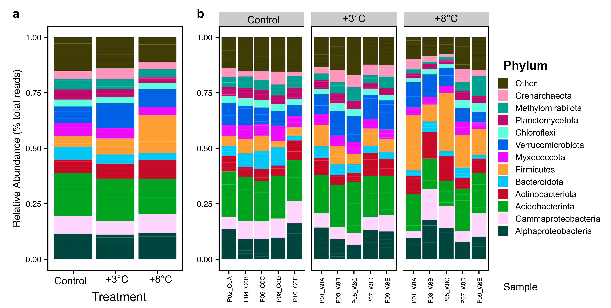{fig-align='center' width=87%}
:::
:::

::: {.cell layout-align="center"}
::: {.cell-output-display}
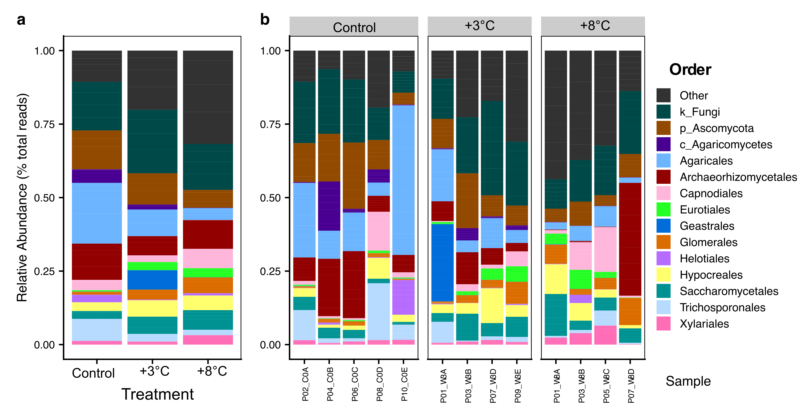{fig-align='center' width=87%}
:::
:::

## Alpha diversity of microbial communities

Shapiro-Wilk Normality and Bartlett tests indicated all data was normally distributed except for Shannon exponential estimates of the 16S rRNA PIME filtered data. Differences in alpha diversity assessed using analysis of variance (ANOVA) followed by Tukey HSD post hoc tests (normally distributed data) or Kruskal-Wallis followed by Dunn test with Benjamini-Hochberg correction (non-normally distributed data). 

See subsequent pages for results from the 16S rRNA data set (**Supplementary Table 8**, **Supplementary Table 9**, and **Supplementary Figure 3**) and the ITS data set (**Supplementary Table 10**, **Supplementary Table 11**, and **Supplementary Figure 4**)



### 16S rRNA data

**Supplementary Table 8**  contains the results of alpha diversity estimates for different filtering methods. In **Supplementary Table 9** we report the results of the Shapiro-Wilk Normality and Bartlett tests (and results of post-hoc analysis) for each Hill number. **Supplementary Figure 3** contains alpha diversity plots comparing the different filtering methods for Hill numbers.

::: {.cell df-print='paged'}
::: {.cell-output-display}
\begin{table}[H]

\caption{\textbf{Supplementary Table 8 |} Hill numbers for 16S rRNA samples.}
\centering
\fontsize{7}{9}\selectfont
\begin{threeparttable}
\begin{tabular}[t]{lcccccccccccc}
\toprule
\multicolumn{1}{c}{ } & \multicolumn{4}{c}{Observed richness} & \multicolumn{4}{c}{Shannon exponential} & \multicolumn{4}{c}{Simpson multiplicative inverse} \\
\cmidrule(l{3pt}r{3pt}){2-5} \cmidrule(l{3pt}r{3pt}){6-9} \cmidrule(l{3pt}r{3pt}){10-13}
\textcolor{black}{\textbf{Sample}} & \textcolor{black}{\textbf{FULL}} & \textcolor{black}{\textbf{FILT}} & \textcolor{black}{\textbf{PERFect}} & \textcolor{black}{\textbf{PIME}} & \textcolor{black}{\textbf{FULL}} & \textcolor{black}{\textbf{FILT}} & \textcolor{black}{\textbf{PERFect}} & \textcolor{black}{\textbf{PIME}} & \textcolor{black}{\textbf{FULL}} & \textcolor{black}{\textbf{FILT}} & \textcolor{black}{\textbf{PERFect}} & \textcolor{black}{\textbf{PIME}}\\
\midrule
\cellcolor{gray!6}{P01\_W3A} & \cellcolor{gray!6}{2371} & \cellcolor{gray!6}{831} & \cellcolor{gray!6}{707} & \cellcolor{gray!6}{502} & \cellcolor{gray!6}{760.7} & \cellcolor{gray!6}{385.1} & \cellcolor{gray!6}{353.4} & \cellcolor{gray!6}{226.3} & \cellcolor{gray!6}{200.3} & \cellcolor{gray!6}{128.0} & \cellcolor{gray!6}{123.6} & \cellcolor{gray!6}{84.2}\\
P01\_W8A & 1610 & 620 & 563 & 322 & 236.1 & 127.8 & 126.5 & 59.2 & 25.5 & 18.9 & 19.1 & 12.0\\
\cellcolor{gray!6}{P02\_C0A} & \cellcolor{gray!6}{2272} & \cellcolor{gray!6}{884} & \cellcolor{gray!6}{737} & \cellcolor{gray!6}{590} & \cellcolor{gray!6}{781.1} & \cellcolor{gray!6}{437.1} & \cellcolor{gray!6}{397.4} & \cellcolor{gray!6}{291.2} & \cellcolor{gray!6}{261.5} & \cellcolor{gray!6}{178.5} & \cellcolor{gray!6}{171.6} & \cellcolor{gray!6}{129.3}\\
\addlinespace
P03\_W3B & 2356 & 922 & 764 & 596 & 686.8 & 373.7 & 337.3 & 235.0 & 159.4 & 108.7 & 103.8 & 75.8\\
\cellcolor{gray!6}{P03\_W8B} & \cellcolor{gray!6}{1575} & \cellcolor{gray!6}{422} & \cellcolor{gray!6}{411} & \cellcolor{gray!6}{224} & \cellcolor{gray!6}{501.0} & \cellcolor{gray!6}{181.0} & \cellcolor{gray!6}{211.9} & \cellcolor{gray!6}{90.1} & \cellcolor{gray!6}{153.3} & \cellcolor{gray!6}{69.2} & \cellcolor{gray!6}{82.6} & \cellcolor{gray!6}{38.6}\\
P04\_C0B & 2040 & 802 & 663 & 570 & 797.8 & 439.4 & 388.4 & 309.2 & 272.0 & 178.8 & 166.8 & 130.7\\
\addlinespace
\cellcolor{gray!6}{P05\_W3C} & \cellcolor{gray!6}{1663} & \cellcolor{gray!6}{680} & \cellcolor{gray!6}{574} & \cellcolor{gray!6}{499} & \cellcolor{gray!6}{578.8} & \cellcolor{gray!6}{329.4} & \cellcolor{gray!6}{299.2} & \cellcolor{gray!6}{246.1} & \cellcolor{gray!6}{201.2} & \cellcolor{gray!6}{139.5} & \cellcolor{gray!6}{132.6} & \cellcolor{gray!6}{111.0}\\
P05\_W8C & 2124 & 572 & 661 & 289 & 307.3 & 102.4 & 146.9 & 47.9 & 27.3 & 14.9 & 18.5 & 9.6\\
\cellcolor{gray!6}{P06\_C0C} & \cellcolor{gray!6}{3065} & \cellcolor{gray!6}{1011} & \cellcolor{gray!6}{857} & \cellcolor{gray!6}{664} & \cellcolor{gray!6}{1098.4} & \cellcolor{gray!6}{518.7} & \cellcolor{gray!6}{481.3} & \cellcolor{gray!6}{324.7} & \cellcolor{gray!6}{309.4} & \cellcolor{gray!6}{182.0} & \cellcolor{gray!6}{179.7} & \cellcolor{gray!6}{120.6}\\
\addlinespace
P07\_W3D & 2010 & 843 & 725 & 516 & 598.8 & 353.4 & 327.5 & 208.0 & 146.8 & 103.7 & 99.7 & 67.5\\
\cellcolor{gray!6}{P07\_W8D} & \cellcolor{gray!6}{2157} & \cellcolor{gray!6}{771} & \cellcolor{gray!6}{671} & \cellcolor{gray!6}{276} & \cellcolor{gray!6}{560.8} & \cellcolor{gray!6}{284.2} & \cellcolor{gray!6}{270.3} & \cellcolor{gray!6}{88.1} & \cellcolor{gray!6}{91.5} & \cellcolor{gray!6}{60.2} & \cellcolor{gray!6}{60.2} & \cellcolor{gray!6}{24.4}\\
P08\_C0D & 2441 & 813 & 681 & 594 & 973.3 & 464.8 & 419.8 & 331.3 & 394.2 & 230.0 & 220.5 & 168.7\\
\addlinespace
\cellcolor{gray!6}{P09\_W3E} & \cellcolor{gray!6}{2386} & \cellcolor{gray!6}{874} & \cellcolor{gray!6}{751} & \cellcolor{gray!6}{563} & \cellcolor{gray!6}{680.1} & \cellcolor{gray!6}{352.7} & \cellcolor{gray!6}{334.5} & \cellcolor{gray!6}{224.4} & \cellcolor{gray!6}{168.5} & \cellcolor{gray!6}{110.3} & \cellcolor{gray!6}{109.4} & \cellcolor{gray!6}{76.5}\\
P09\_W8E & 813 & 376 & 332 & 170 & 375.3 & 165.6 & 149.9 & 67.9 & 120.2 & 55.7 & 56.8 & 26.4\\
\cellcolor{gray!6}{P10\_C0E} & \cellcolor{gray!6}{2066} & \cellcolor{gray!6}{670} & \cellcolor{gray!6}{571} & \cellcolor{gray!6}{491} & \cellcolor{gray!6}{886.8} & \cellcolor{gray!6}{416.5} & \cellcolor{gray!6}{379.4} & \cellcolor{gray!6}{298.3} & \cellcolor{gray!6}{427.6} & \cellcolor{gray!6}{242.8} & \cellcolor{gray!6}{231.4} & \cellcolor{gray!6}{174.7}\\
\bottomrule
\end{tabular}
\begin{tablenotes}
\item FULL = unfiltered data set; FILT = arbitrary filtering where nreads > 5 and prevalence > 20\%; PERFect = PERFect filtering; PIME = PIME filtering
\end{tablenotes}
\end{threeparttable}
\end{table}
:::
:::

::: {.cell df-print='paged'}
::: {.cell-output-display}
\begin{table}[H]

\caption{\textbf{Supplementary Table 9 |} Summary of 16S rRNA significant tests. Posthoc p-values adjusted for multiple comparisons.}
\centering
\fontsize{8}{10}\selectfont
\begin{threeparttable}
\begin{tabular}[t]{lccclcc}
\toprule
\textcolor{black}{\textbf{metric\textsuperscript{1}}} & \textcolor{black}{\textbf{data set\textsuperscript{2}}} & \textcolor{black}{\textbf{pval shap\textsuperscript{3}}} & \textcolor{black}{\textbf{pval bart\textsuperscript{4}}} & \textcolor{black}{\textbf{method\textsuperscript{5}}} & \textcolor{black}{\textbf{posthoc method\textsuperscript{6}}} & \textcolor{black}{\textbf{posthoc pval\textsuperscript{7}}}\\
\midrule
\cellcolor{gray!6}{Observed} & \cellcolor{gray!6}{FULL} & \cellcolor{gray!6}{0.268} & \cellcolor{gray!6}{0.599} & \cellcolor{gray!6}{ANOVA} & \cellcolor{gray!6}{Tukey post-hoc test} & \cellcolor{gray!6}{6.05e-02}\\
Observed & FILT & 0.367 & 0.585 & ANOVA & Tukey post-hoc test & 6.08e-03\\
\cellcolor{gray!6}{Observed} & \cellcolor{gray!6}{PERFect} & \cellcolor{gray!6}{0.191} & \cellcolor{gray!6}{0.437} & \cellcolor{gray!6}{ANOVA} & \cellcolor{gray!6}{Tukey post-hoc test} & \cellcolor{gray!6}{5.05e-02}\\
Observed & PIME & 0.055 & 0.755 & ANOVA & Tukey post-hoc test & 1.40e-06\\
\addlinespace
\cellcolor{gray!6}{Shannon exponential} & \cellcolor{gray!6}{FULL} & \cellcolor{gray!6}{0.994} & \cellcolor{gray!6}{0.490} & \cellcolor{gray!6}{ANOVA} & \cellcolor{gray!6}{Tukey post-hoc test} & \cellcolor{gray!6}{6.27e-05}\\
Shannon exponential & FILT & 0.230 & 0.107 & ANOVA & Tukey post-hoc test & 2.60e-06\\
\cellcolor{gray!6}{Shannon exponential} & \cellcolor{gray!6}{PERFect} & \cellcolor{gray!6}{0.331} & \cellcolor{gray!6}{0.159} & \cellcolor{gray!6}{ANOVA} & \cellcolor{gray!6}{Tukey post-hoc test} & \cellcolor{gray!6}{7.10e-06}\\
Shannon exponential & PIME & 0.037 & 0.880 & Kruskal-Wallis & Dunn test & 1.93e-03\\
\addlinespace
\cellcolor{gray!6}{Inverse Simpson} & \cellcolor{gray!6}{FULL} & \cellcolor{gray!6}{0.584} & \cellcolor{gray!6}{0.155} & \cellcolor{gray!6}{ANOVA} & \cellcolor{gray!6}{Tukey post-hoc test} & \cellcolor{gray!6}{4.67e-05}\\
Inverse Simpson & FILT & 0.673 & 0.413 & ANOVA & Tukey post-hoc test & 1.30e-06\\
\cellcolor{gray!6}{Inverse Simpson} & \cellcolor{gray!6}{PERFect} & \cellcolor{gray!6}{0.747} & \cellcolor{gray!6}{0.348} & \cellcolor{gray!6}{ANOVA} & \cellcolor{gray!6}{Tukey post-hoc test} & \cellcolor{gray!6}{3.20e-06}\\
Inverse Simpson & PIME & 0.370 & 0.371 & ANOVA & Tukey post-hoc test & 1.00e-06\\
\bottomrule
\end{tabular}
\begin{tablenotes}[para]
\item \textbf{Column descriptions. } 
\item 
\item[1] metric: Hill number; 
\item[2] data set: FULL = unfiltered data set; FILT = arbitrary filtering where nreads > 5 and prevalence > 20\%; PERFect = PERFect filtering; PIME = PIME filtering
\item[3] pval\_shap: p-value of Shapiro-Wilk Normality test; 
\item[4] pval\_bart: p-value of Bartlett Test of Homogeneity of Variances; 
\item[5] method: Selected significance test; 
\item[6] posthoc method: Selected posthoc test; 
\item[7] posthoc pval: Posthoc p-value; 
\end{tablenotes}
\end{threeparttable}
\end{table}
:::
:::



::: {.cell layout-align="center"}
::: {.cell-output-display}
![\textbf{Supplementary Figure 3 |} Alpha diversity estimates of 16S rRNA communities. The centre line of each box plot represents the median, the lower and upper hinges represent the first and third quartiles and whiskers represent + 1.5 the interquartile range. Shapiro-Wilk Normality Test and Bartlett Test of Homogeneity of Variances normality tests indicated all data was normally distributed except for Shannon exponential estimates of the PIME filtered data. Differences in alpha diversity assessed using analysis of variance (ANOVA) followed by Tukey HSD post hoc tests (normally distributed data) or Kruskal-Wallis followed by Dunn test with Benjamini-Hochberg correction (non-normally distributed data). Only significant differences (p-values adjusted for multiple comparisons) between treatments and controls are shown in plots, where n = 5 for each treatment.](FIGURES/ssu_supp_alpha_div.png){fig-align='center' width=100%}
:::
:::



### ITS data

**Supplementary Table 10**  contains the results of alpha diversity estimates for different filtering methods. In **Supplementary Table 11** we report the results of the Shapiro-Wilk Normality and Bartlett tests (and results of post-hoc analysis) for each Hill number. **Supplementary Figure 4** contains alpha diversity plots comparing the different filtering methods for Hill numbers.

::: {.cell df-print='paged'}
::: {.cell-output-display}
\begin{table}[H]

\caption{\textbf{Supplementary Table 10 |} Hill numbers for ITS samples.}
\centering
\fontsize{7}{9}\selectfont
\begin{threeparttable}
\begin{tabular}[t]{lcccccccccccc}
\toprule
\multicolumn{1}{c}{ } & \multicolumn{4}{c}{Observed richness} & \multicolumn{4}{c}{Shannon exponential} & \multicolumn{4}{c}{Simpson multiplicative inverse} \\
\cmidrule(l{3pt}r{3pt}){2-5} \cmidrule(l{3pt}r{3pt}){6-9} \cmidrule(l{3pt}r{3pt}){10-13}
\textcolor{black}{\textbf{Sample}} & \textcolor{black}{\textbf{FULL}} & \textcolor{black}{\textbf{FILT}} & \textcolor{black}{\textbf{PERFect}} & \textcolor{black}{\textbf{PIME}} & \textcolor{black}{\textbf{FULL}} & \textcolor{black}{\textbf{FILT}} & \textcolor{black}{\textbf{PERFect}} & \textcolor{black}{\textbf{PIME}} & \textcolor{black}{\textbf{FULL}} & \textcolor{black}{\textbf{FILT}} & \textcolor{black}{\textbf{PERFect}} & \textcolor{black}{\textbf{PIME}}\\
\midrule
\cellcolor{gray!6}{P01\_W3A} & \cellcolor{gray!6}{945} & \cellcolor{gray!6}{499} & \cellcolor{gray!6}{148} & \cellcolor{gray!6}{181} & \cellcolor{gray!6}{55.9} & \cellcolor{gray!6}{33.8} & \cellcolor{gray!6}{18.5} & \cellcolor{gray!6}{14.8} & \cellcolor{gray!6}{10.7} & \cellcolor{gray!6}{8.4} & \cellcolor{gray!6}{6.8} & \cellcolor{gray!6}{5.6}\\
P01\_W8A & 719 & 344 & 98 & 123 & 141.5 & 79.0 & 31.8 & 31.6 & 42.4 & 28.1 & 17.3 & 12.5\\
\cellcolor{gray!6}{P02\_C0A} & \cellcolor{gray!6}{1011} & \cellcolor{gray!6}{494} & \cellcolor{gray!6}{147} & \cellcolor{gray!6}{238} & \cellcolor{gray!6}{112.5} & \cellcolor{gray!6}{64.0} & \cellcolor{gray!6}{38.1} & \cellcolor{gray!6}{43.3} & \cellcolor{gray!6}{36.1} & \cellcolor{gray!6}{26.2} & \cellcolor{gray!6}{21.9} & \cellcolor{gray!6}{19.9}\\
\addlinespace
P03\_W3B & 765 & 423 & 136 & 196 & 132.9 & 83.0 & 45.7 & 56.5 & 44.1 & 29.1 & 24.4 & 26.9\\
\cellcolor{gray!6}{P03\_W8B} & \cellcolor{gray!6}{349} & \cellcolor{gray!6}{204} & \cellcolor{gray!6}{64} & \cellcolor{gray!6}{109} & \cellcolor{gray!6}{112.1} & \cellcolor{gray!6}{72.2} & \cellcolor{gray!6}{26.2} & \cellcolor{gray!6}{42.8} & \cellcolor{gray!6}{49.0} & \cellcolor{gray!6}{36.4} & \cellcolor{gray!6}{17.8} & \cellcolor{gray!6}{23.7}\\
P04\_C0B & 1017 & 471 & 161 & 229 & 60.9 & 43.3 & 25.2 & 39.5 & 17.6 & 15.5 & 12.5 & 20.6\\
\addlinespace
\cellcolor{gray!6}{P05\_W8C} & \cellcolor{gray!6}{616} & \cellcolor{gray!6}{296} & \cellcolor{gray!6}{90} & \cellcolor{gray!6}{131} & \cellcolor{gray!6}{157.5} & \cellcolor{gray!6}{76.6} & \cellcolor{gray!6}{34.2} & \cellcolor{gray!6}{35.1} & \cellcolor{gray!6}{41.8} & \cellcolor{gray!6}{20.7} & \cellcolor{gray!6}{15.3} & \cellcolor{gray!6}{11.5}\\
P06\_C0C & 954 & 486 & 157 & 246 & 99.5 & 58.4 & 34.2 & 35.2 & 23.9 & 16.5 & 14.8 & 13.1\\
\addlinespace
\cellcolor{gray!6}{P07\_W3D} & \cellcolor{gray!6}{867} & \cellcolor{gray!6}{492} & \cellcolor{gray!6}{147} & \cellcolor{gray!6}{205} & \cellcolor{gray!6}{160.4} & \cellcolor{gray!6}{102.9} & \cellcolor{gray!6}{46.3} & \cellcolor{gray!6}{48.0} & \cellcolor{gray!6}{56.2} & \cellcolor{gray!6}{42.8} & \cellcolor{gray!6}{27.2} & \cellcolor{gray!6}{22.5}\\
P07\_W8D & 335 & 223 & 76 & 97 & 35.0 & 28.0 & 16.9 & 18.1 & 13.7 & 12.3 & 9.1 & 9.9\\
\cellcolor{gray!6}{P08\_C0D} & \cellcolor{gray!6}{702} & \cellcolor{gray!6}{345} & \cellcolor{gray!6}{105} & \cellcolor{gray!6}{198} & \cellcolor{gray!6}{87.2} & \cellcolor{gray!6}{46.7} & \cellcolor{gray!6}{25.7} & \cellcolor{gray!6}{30.7} & \cellcolor{gray!6}{25.5} & \cellcolor{gray!6}{17.9} & \cellcolor{gray!6}{14.2} & \cellcolor{gray!6}{14.2}\\
\addlinespace
P09\_W3E & 745 & 390 & 118 & 196 & 232.7 & 133.6 & 51.9 & 66.6 & 96.0 & 61.7 & 33.9 & 34.9\\
\cellcolor{gray!6}{P10\_C0E} & \cellcolor{gray!6}{812} & \cellcolor{gray!6}{404} & \cellcolor{gray!6}{143} & \cellcolor{gray!6}{203} & \cellcolor{gray!6}{24.6} & \cellcolor{gray!6}{14.7} & \cellcolor{gray!6}{11.1} & \cellcolor{gray!6}{8.1} & \cellcolor{gray!6}{4.9} & \cellcolor{gray!6}{4.0} & \cellcolor{gray!6}{3.8} & \cellcolor{gray!6}{2.5}\\
\bottomrule
\end{tabular}
\begin{tablenotes}
\item FULL = unfiltered data set; FILT = arbitrary filtering where nreads > 5 and prevalence > 20\%; PERFect = PERFect filtering; PIME = PIME filtering
\end{tablenotes}
\end{threeparttable}
\end{table}
:::
:::

::: {.cell df-print='paged'}
::: {.cell-output-display}
\begin{table}[H]

\caption{\textbf{Supplementary Table 11 |} Summary of ITS significant tests. Posthoc p-values adjusted for multiple comparisons.}
\centering
\fontsize{8}{10}\selectfont
\begin{threeparttable}
\begin{tabular}[t]{lccclcc}
\toprule
\textcolor{black}{\textbf{metric\textsuperscript{1}}} & \textcolor{black}{\textbf{data set\textsuperscript{2}}} & \textcolor{black}{\textbf{pval shap\textsuperscript{3}}} & \textcolor{black}{\textbf{pval bart\textsuperscript{4}}} & \textcolor{black}{\textbf{method\textsuperscript{5}}} & \textcolor{black}{\textbf{posthoc method\textsuperscript{6}}} & \textcolor{black}{\textbf{posthoc pval\textsuperscript{7}}}\\
\midrule
\cellcolor{gray!6}{Observed} & \cellcolor{gray!6}{FULL} & \cellcolor{gray!6}{0.128} & \cellcolor{gray!6}{0.516} & \cellcolor{gray!6}{ANOVA} & \cellcolor{gray!6}{Tukey post-hoc test} & \cellcolor{gray!6}{6.14e-03}\\
Observed & FILT & 0.115 & 0.938 & ANOVA & Tukey post-hoc test & 2.36e-03\\
\cellcolor{gray!6}{Observed} & \cellcolor{gray!6}{PERFect} & \cellcolor{gray!6}{0.162} & \cellcolor{gray!6}{0.667} & \cellcolor{gray!6}{ANOVA} & \cellcolor{gray!6}{Tukey post-hoc test} & \cellcolor{gray!6}{1.09e-03}\\
Observed & PIME & 0.134 & 0.454 & ANOVA & Tukey post-hoc test & 7.40e-06\\
\addlinespace
\cellcolor{gray!6}{Shannon exponential} & \cellcolor{gray!6}{FULL} & \cellcolor{gray!6}{0.846} & \cellcolor{gray!6}{0.445} & \cellcolor{gray!6}{ANOVA} & \cellcolor{gray!6}{Tukey post-hoc test} & \cellcolor{gray!6}{2.21e-01}\\
Shannon exponential & FILT & 0.934 & 0.363 & ANOVA & Tukey post-hoc test & 1.39e-01\\
\cellcolor{gray!6}{Shannon exponential} & \cellcolor{gray!6}{PERFect} & \cellcolor{gray!6}{0.919} & \cellcolor{gray!6}{0.555} & \cellcolor{gray!6}{ANOVA} & \cellcolor{gray!6}{Tukey post-hoc test} & \cellcolor{gray!6}{1.87e-01}\\
Shannon exponential & PIME & 0.972 & 0.436 & ANOVA & Tukey post-hoc test & 3.46e-01\\
\addlinespace
\cellcolor{gray!6}{Inverse Simpson} & \cellcolor{gray!6}{FULL} & \cellcolor{gray!6}{0.184} & \cellcolor{gray!6}{0.126} & \cellcolor{gray!6}{ANOVA} & \cellcolor{gray!6}{Tukey post-hoc test} & \cellcolor{gray!6}{1.82e-01}\\
Inverse Simpson & FILT & 0.349 & 0.159 & ANOVA & Tukey post-hoc test & 1.83e-01\\
\cellcolor{gray!6}{Inverse Simpson} & \cellcolor{gray!6}{PERFect} & \cellcolor{gray!6}{0.961} & \cellcolor{gray!6}{0.236} & \cellcolor{gray!6}{ANOVA} & \cellcolor{gray!6}{Tukey post-hoc test} & \cellcolor{gray!6}{2.05e-01}\\
Inverse Simpson & PIME & 0.955 & 0.477 & ANOVA & Tukey post-hoc test & 3.42e-01\\
\bottomrule
\end{tabular}
\begin{tablenotes}[para]
\item \textbf{Column descriptions. } 
\item 
\item[1] metric: Hill number; 
\item[2] data set: FULL = unfiltered data set; FILT = arbitrary filtering where nreads > 5 and prevalence > 20\%; PERFect = PERFect filtering; PIME = PIME filtering
\item[3] pval\_shap: p-value of Shapiro-Wilk Normality test; 
\item[4] pval\_bart: p-value of Bartlett Test of Homogeneity of Variances; 
\item[5] method: Selected significance test; 
\item[6] posthoc method: Selected posthoc test; 
\item[7] posthoc pval: Posthoc p-value; 
\end{tablenotes}
\end{threeparttable}
\end{table}
:::
:::



::: {.cell layout-align="center"}
::: {.cell-output-display}
![\textbf{Supplementary Figure 4 |} Alpha diversity estimates of ITS communities. The centre line of each box plot represents the median, the lower and upper hinges represent the first and third quartiles and whiskers represent + 1.5 the interquartile range. Shapiro-Wilk Normality Test and Bartlett Test of Homogeneity of Variances indicated all data was normally distributed. Differences in alpha diversity for all metrics assessed using analysis of variance (ANOVA) followed by Tukey HSD post hoc tests. Only significant differences (p-values adjusted for multiple comparisons) between treatments and controls are shown in plots, where n = 5 (control) and n = 4 (treatments).](FIGURES/its_supp_alpha_div.png){fig-align='center' width=100%}
:::
:::



## Beta diversity of microbial communities

To test for significance between treatment groups, we calculated the beta dispersion (using the `betadisper` function, vegan package) for each 16S rRNA distance matrix (unweighted and weighted UniFrac) and each ITS distance matrix (Jensen-Shannon and Bray-Curtis). We then used the function `permutest` to run a Permutation Test for Homogeneity of multivariate dispersions against the results of each beta dispersion test (**Supplementary Table 12**, **Supplementary Table 13**). If the results were not significant (i.e., p-value > 0.05) we ran a PERMANOVA using `adonis` (PERMANOVA assumes equal dispersion), otherwise we used Analysis of Similarity (ANOSIM). **Supplementary Table 14** contains the results of the significance tests. 

::: {.cell df-print='paged'}
::: {.cell-output-display}
\begin{table}[H]

\caption{\label{tab:unnamed-chunk-24}\textbf{Supplementary Table 12 |} Results of beta dispersion \& permutation test for homogeneity of multivariate dispersions (16S rRNA).}
\centering
\fontsize{8}{10}\selectfont
\begin{tabular}[t]{llcc}
\toprule
\textcolor{black}{\textbf{Description}} & \textcolor{black}{\textbf{distance metric}} & \textcolor{black}{\textbf{p-value}} & \textcolor{black}{\textbf{selected test}}\\
\midrule
\addlinespace[-0.3em]
\multicolumn{4}{l}{\textbf{}}\\
\hspace{1em}\cellcolor{gray!6}{FULL data set} & \cellcolor{gray!6}{unweighted UniFrac} & \cellcolor{gray!6}{0.013} & \cellcolor{gray!6}{ANOSIM}\\
\hspace{1em} & weighted UniFrac & 0.004 & \vphantom{1} ANOSIM\\
\addlinespace[-0.3em]
\multicolumn{4}{l}{\textbf{}}\\
\hspace{1em}\cellcolor{gray!6}{Arbitrary filter} & \cellcolor{gray!6}{unweighted UniFrac} & \cellcolor{gray!6}{0.002} & \cellcolor{gray!6}{ANOSIM}\\
\hspace{1em} & weighted UniFrac & 0.004 & ANOSIM\\
\addlinespace[-0.3em]
\multicolumn{4}{l}{\textbf{}}\\
\hspace{1em}\cellcolor{gray!6}{PERFect filter} & \cellcolor{gray!6}{unweighted UniFrac} & \cellcolor{gray!6}{0.001} & \cellcolor{gray!6}{ANOSIM}\\
\hspace{1em} & weighted UniFrac & 0.003 & ANOSIM\\
\addlinespace[-0.3em]
\multicolumn{4}{l}{\textbf{}}\\
\hspace{1em}\cellcolor{gray!6}{PIME filter} & \cellcolor{gray!6}{unweighted UniFrac} & \cellcolor{gray!6}{0.474} & \cellcolor{gray!6}{ADONIS}\\
\hspace{1em} & weighted UniFrac & 0.012 & ANOSIM\\
\bottomrule
\end{tabular}
\end{table}
:::
:::

::: {.cell df-print='paged'}
::: {.cell-output-display}
\begin{table}[H]

\caption{\label{tab:unnamed-chunk-25}\textbf{Supplementary Table 13 |} Results of beta dispersion \& permutation test for homogeneity of multivariate dispersions (ITS).}
\centering
\fontsize{8}{10}\selectfont
\begin{tabular}[t]{llcc}
\toprule
\textcolor{black}{\textbf{Description}} & \textcolor{black}{\textbf{distance metric}} & \textcolor{black}{\textbf{p-value}} & \textcolor{black}{\textbf{selected test}}\\
\midrule
\addlinespace[-0.3em]
\multicolumn{4}{l}{\textbf{}}\\
\hspace{1em}\cellcolor{gray!6}{FULL data set} & \cellcolor{gray!6}{Jensen-Shannon} & \cellcolor{gray!6}{0.745} & \cellcolor{gray!6}{ADONIS}\\
\hspace{1em} & Bray-Curtis & 0.696 & ADONIS\\
\addlinespace[-0.3em]
\multicolumn{4}{l}{\textbf{}}\\
\hspace{1em}\cellcolor{gray!6}{Arbitrary filter} & \cellcolor{gray!6}{Jensen-Shannon} & \cellcolor{gray!6}{0.920} & \cellcolor{gray!6}{ADONIS}\\
\hspace{1em} & Bray-Curtis & 0.864 & ADONIS\\
\addlinespace[-0.3em]
\multicolumn{4}{l}{\textbf{}}\\
\hspace{1em}\cellcolor{gray!6}{PERFect filter} & \cellcolor{gray!6}{Jensen-Shannon} & \cellcolor{gray!6}{0.865} & \cellcolor{gray!6}{ADONIS}\\
\hspace{1em} & Bray-Curtis & 0.819 & ADONIS\\
\addlinespace[-0.3em]
\multicolumn{4}{l}{\textbf{}}\\
\hspace{1em}\cellcolor{gray!6}{PIME filter} & \cellcolor{gray!6}{Jensen-Shannon} & \cellcolor{gray!6}{0.704} & \cellcolor{gray!6}{ADONIS}\\
\hspace{1em} & Bray-Curtis & 0.756 & ADONIS\\
\bottomrule
\end{tabular}
\end{table}
:::
:::

::: {.cell df-print='paged'}
::: {.cell-output-display}
\begin{table}[H]

\caption{\label{tab:unnamed-chunk-26}\textbf{Supplementary Table 14 |} Summary of beta diversity significant tests. Where beta dispersion tests were not significant, we used Permutational multivariate analysis of variance (PERMANOVA) to calculate dissimilarity among treatment groups. Where beta dispersion tests were significant, we used Analysis of Similarity (ANOSIM).}
\centering
\fontsize{9}{11}\selectfont
\begin{tabular}[t]{llcccc}
\toprule
\textcolor{black}{\textbf{Data set}} & \textcolor{black}{\textbf{Distance metric}} & \textcolor{black}{\textbf{(FULL)}} & \textcolor{black}{\textbf{(FILT)}} & \textcolor{black}{\textbf{(PERFect)}} & \textcolor{black}{\textbf{(PIME)}}\\
\midrule
\addlinespace[1em]
\multicolumn{6}{l}{\textbf{16S rRNA}}\\
\hspace{1em}\cellcolor{gray!6}{} & \cellcolor{gray!6}{unweighted UniFrac} & \cellcolor{gray!6}{0.003} & \cellcolor{gray!6}{0.003} & \cellcolor{gray!6}{0.003} & \cellcolor{gray!6}{0.001}\\
\hspace{1em} & weighted UniFrac & 0.001 & 0.001 & 0.001 & 0.001\\
\addlinespace[0.3em]
\multicolumn{6}{l}{\textbf{ITS}}\\
\hspace{1em}\cellcolor{gray!6}{} & \cellcolor{gray!6}{Jensen-Shannon divergence} & \cellcolor{gray!6}{0.036} & \cellcolor{gray!6}{0.030} & \cellcolor{gray!6}{0.063} & \cellcolor{gray!6}{0.002}\\
\hspace{1em} & Bray-Curtis dissimilarity & 0.047 & 0.028 & 0.079 & 0.003\\
\bottomrule
\end{tabular}
\end{table}
:::
:::

## Differentially abundant ASVs

Indicator Species Analysis (ISA) of the 16S rRNA data set identified 251 differentially abundant (DA) ASVs. Of those, 154 ASVs were enriched in the Control samples, 82 in the +3°C treatment, and 15 in the +8°C treatment (**Supplementary Dataset4**). Linear discriminant analysis (LDA) effect size (LEfSe) identified 676 DA ASVs with an LDA score > 2.0 and a p-value < 0.05. Of those, 355 ASVs were enriched in the Control samples, 227 in the +3°C treatment, and 94 in the +8°C treatment (**Supplementary Dataset5**).

ISA of the ITS data set identified 203 DA ASVs. Of those, 54 ASVs were enriched in the Control samples, 95 in the +3°C treatment, and 54 in the +8°C treatment (**Supplementary Dataset6**). LEfSe identified 228 DA ASVs with an LDA score > 2.0 and a p-value < 0.05. Of those, 52 ASVs were enriched in the Control samples, 107 in the +3°C treatment, and 69 in the +8°C treatment (**Supplementary Dataset7**).

## Multivariate analysis

### Normality tests & parameter normalization    

We used Shapiro-Wilk Normality Test[@shapiro1965analysis] to determine which of the 61 metadata parameters were or were not normally distributed. For the 16S rRNA data we needed to transform 25 metadata parameters (p-value < 0.05) and for the ITS data, 21 metadata parameters needed transformation (p-value < 0.05). Please see the project website for the specific parameters that were transformed and the method of transformation used in each case ([https://sweltr.github.io/high-temp/metadata.html](https://sweltr.github.io/high-temp/metadata.html)). For both community data sets, `bestNormalize` was unable to find a suitable transformation for `Al` and `Fe.` This is likely because there was very little variation in these parameters and/or there were too few significant digits.

### Removing autocorrelated parameters

Based on autocorrelation tests between the metadata and community data (**Supplementary Figure 5, Supplementary Figure 6**), we removed the following parameters: 

Environmental and edaphic properties: TEB, DON, Na, Al, Ca.  
Microbial functional responses: micN, micNP, enzCN, enzCP, BP~ase~, CE~ase~, LP~ase~, N~ase~, P~ase~.  
Temperature adaptation: NUE, PUE, SI.
    
We removed P~Q10~ (temperature adaptation) from the ITS analysis based on the autocorrelation tests.

::: {.cell}

:::

::: {.cell layout-align="center"}
::: {.cell-output-display}
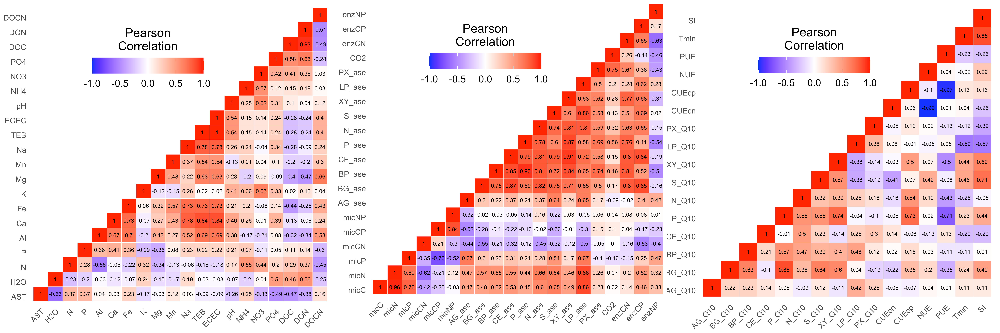{fig-align='center' width=100%}
:::
:::

::: {.cell}

:::

::: {.cell layout-align="center"}
::: {.cell-output-display}
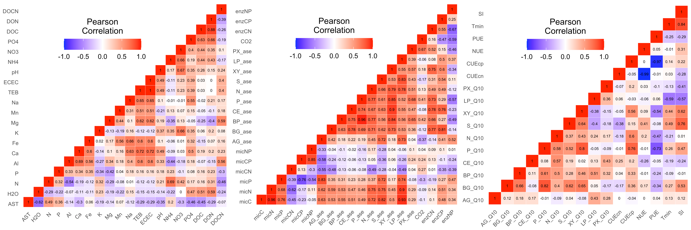{fig-align='center' width=100%}
:::
:::

### Dissimilarity correlation tests

We used Mantel Tests to determine if any metadata groups were significantly correlated with 16S rRNA or ITS community data (**Supplementary Table 15**).

::: {.cell df-print='paged'}
::: {.cell-output-display}
\begin{table}[H]

\caption{\label{tab:unnamed-chunk-31}\textbf{Supplementary Table 15 |} Mantel tests for 16S rRNA \& ITS data compared to each of the three metadata groups. Significant differences denoted by p-values < 0.05.}
\centering
\fontsize{9}{11}\selectfont
\begin{tabular}[t]{lccc}
\toprule
\textcolor{black}{\textbf{Data set}} & \textcolor{black}{\textbf{edaphic properties}} & \textcolor{black}{\textbf{soil functional response}} & \textcolor{black}{\textbf{temperature adaptation}}\\
\midrule
\cellcolor{gray!6}{16S rRNA} & \cellcolor{gray!6}{0.003} & \cellcolor{gray!6}{0.180} & \cellcolor{gray!6}{0.001}\\
ITS & 0.002 & 0.288 & 0.001\\
\bottomrule
\end{tabular}
\end{table}
:::
:::

### Best subset of variables

The `bioenv` function found the following metadata parameters (normalized with autocorrelated data removed) significantly correlated with community data (results of Mantel tests shown in parentheses).

\underline{Environmental and edaphic properties}

**16S rRNA**: AST (*r* = 1.0, *p* = 0.001).  
**ITS**: AST (*r* = 1.0, *p* = 0.001).  

\underline{Microbial functional responses}

**16S rRNA**: AG~ase~ (*r* = 0.559, *p* = 0.001), enzNP (*r* = 0.462, *p* = 0.006), S~ase~ (*r* = 0.614, *p* = 0.001), PX~ase~ (*r* = 0.612, *p* = 0.001), XY~ase~ (*r* = 0.456, *p* = 0.002).  
**ITS**: enzNP (*r* = 0.553, *p* = 0.001), PX~ase~ (*r* = 0.685, *p* = 0.001), XY~ase~ (*r* = 0.505, *p* = 0.002).  

\underline{Temperature adaptation}

**16S rRNA**: CUE~cp~ (*r* = 0.325, *p* = 0.013), LP~Q10~ (*r* = 0.377, *p* = 0.005), P~Q10~ (*r* = 0.518, *p* = 0.001), S~Q10~ (*r* = 0.440, *p* = 0.001), and T~min~ (*r* = 0.404, *p* = 0.005).  
**ITS**: XY~Q10~ (*r* = 0.726, *p* = 0.001), T~min~ (*r* = 0.616, *p* = 0.001).  

### Distance-based Redundancy Analysis (dbRDA)

In all cases (i.e., both community data sets against each of the three metadata subsets), `rankindex`[@faith1987compositional]  indicated that Bray-Curtis was best dissimilarity metric to use. Based on these results, we set `dist = "bray"` for each dbRDA analysis using `capscale`. Due to issue pertaining to degrees of freedom, we needed to remove some metadata parameters from specific groups. From the 16S rRNA analysis, we removed  Mg and Mn (environmental and edaphic properties). From the ITS analysis, we removed  Mg, Mn, Na, Al, Fe, and K (environmental and edaphic properties) and S~Q10~ (temperature adaptation). Next, we used the vegan function `envfit` to fit environmental parameters onto the ordination. This function calculates correlation scores between metadata parameters and ordination axes. `envfit` found the following parameters were significantly correlated with community data (Goodness of fit statistic/squared correlation coefficient and empirical p-values for each variable shown in parentheses).

\underline{Environmental and edaphic properties}

**16S rRNA**: AST (*r^2^* =0.829, *p*  = 0.001), H~2~O (*r^2^* =0.519, *p*  = 0.010), DOC (*r^2^* =0.446, *p*  = 0.024).  
**ITS**: AST (*r^2^* =0.485, *p*  = 0.037), DOC (*r^2^* =0.535, *p*  = 0.028).  

\underline{Microbial functional responses}

**16S rRNA**: AG~ase~ (*r^2^* = 0.444, *p*  = 0.026), BG~ase~ (*r^2^* = 0.560, *p*  = 0.007), S~ase~ (*r^2^* = 0.737, *p*  = 0.002), XY~ase~ (*r^2^* = 0.519, *p*  = 0.009), PX~ase~ (*r^2^* = 0.764, *p*  = 0.001), CO~2~ (*r^2^* = 0.504, *p*  = 0.013), enzNP (*r^2^* = 0.624, *p*  = 0.004).  
**ITS**: micP (*r^2^* = 0.693, *p*  = 0.002), micCP (*r^2^* = 0.583, *p*  = 0.016), AG~ase~ (*r^2^* = 0.506, *p*  = 0.037), PX~ase~ (*r^2^* = 0.500, *p*  = 0.035), enzNP (*r^2^* = 0.547, *p*  = 0.014).  

\underline{Temperature adaptation}

**16S rRNA**: S~Q10~ (*r^2^* = 0.496, *p*  = 0.015), XY~Q10~ (*r^2^* = 0.373, *p*  = 0.049), LP~Q10~ (*r^2^* = 0.413, *p*  = 0.041), T~min~ (*r^2^* = 0.446, *p*  = 0.030).  
**ITS**: XY~Q10~ (*r^2^* = 0.617, *p*  = 0.010), CUE~cp~ (*r^2^* = 0.479, *p*  = 0.035), T~min~ (*r^2^* = 0.475, *p*  = 0.028).  



# Appendices 

## Appendix 1: Description of Supplementary Datasets {#appendix-1}

For this study, **Supplementary Datasets** are text files that were too large to include in the Supplementary Material. The individual files can be downloaded from the journal's website. Below are descriptions for each Supplementary Data item.

### Supplementary Dataset1 

**Description:** Output from the **16S rRNA** DADA2 workflow before manual curation. Table is a tab delimited text file containing information for 20,332 ASVs. The first column is the unique ASV ID, followed by the read counts for each sample, ASV taxonomic lineage (Kingdom to Genus), and finally the unique ASV sequence.

::: {.callout-note appearance="minimal"}
**Filename** Supplementary_Dataset1.txt
:::

### Supplementary Dataset2

**Description:** Output from the **ITS** DADA2 workflow before manual curation. Table is a tab delimited text file containing information for 3357 ASVs. The first column is the unique ASV ID, followed by the read counts for each sample, ASV taxonomic lineage (Kingdom to Genus), and finally the unique ASV sequence.

::: {.callout-note appearance="minimal"}
**Filename** Supplementary_Dataset2.txt
:::

### Supplementary Dataset3

**Description:** Complete **metadata** information collected in this study. Tab delimited text file containing data for 61 metadata parameters (before normalization) associated with each sample. The first column is the sample ID, followed plot number (1--10), treatment (control or warm), temperature (0°C, +3°C, +8°C), plot pair ID (A--E), and collection season (W = rainy season). Subsequent columns contain values for all metadata parameters.

::: {.callout-note appearance="minimal"}
**Filename** Supplementary_Dataset3.txt
:::

### Supplementary Dataset4 

**Description:** Differentially abundant (DA) ASVs from the **16S rRNA** data identified using Indicator Species Analysis (ISA) against the PIME filtered data set. Tab delimited text file of all 251 DA ASVs between temperature treatments.

::: {.callout-note appearance="minimal"}
**Filename** Supplementary_Dataset4.txt
:::

Description of table headers:

* **ASV_ID** ASV name.
* **group** Sample group ASV is enriched in. 
* **indval** Indicator value from Dufrene-Legendre Indicator Species Analysis. 
* **pval** p-value from Dufrene-Legendre Indicator Species Analysis.
* **freq** Total number of samples where ASV was detected.
* **freq_C0** Total number of Control samples where ASV was detected.
* **freq_W3** Total number of +3°C samples where ASV was detected.
* **freq_W8** Total number of +8°C samples where ASV was detected.
* **reads_total** Total reads in data set. 
* **reads_C0** Total reads in Control samples. 
* **reads_W3** Total reads in +3°C samples. 
* **reads_W8** Total reads in +8°C samples. 

The remaining columns contain lineage information for each ASV followed by its' unique sequence. 

### Supplementary Dataset5 

**Description:** Differentially abundant (DA) ASVs from the **16S rRNA** data identified using  linear discriminant analysis (LDA) effect size (LEfSe) against the PIME filtered data set. Tab delimited text file of all 676 DA ASVs between temperature treatments.

::: {.callout-note appearance="minimal"}
**Filename** Supplementary_Dataset5.txt
:::

Description of table headers:

* **ASV_ID** ASV name.
* **group** Sample group ASV is enriched in. 
* **lda** Linear discriminant analysis (LDA) scores.
* **pval** p-value from LEfSe analysis.
* **freq** Total number of samples where ASV was detected.
* **freq_C0** Total number of Control samples where ASV was detected.
* **freq_W3** Total number of +3°C samples where ASV was detected.
* **freq_W8** Total number of +8°C samples where ASV was detected.
* **reads_total** Total reads in data set. 
* **reads_C0** Total reads in Control samples. 
* **reads_W3** Total reads in +3°C samples. 
* **reads_W8** Total reads in +8°C samples. 

The remaining columns contain lineage information for each ASV followed by its' unique sequence. 

### Supplementary Dataset6

**Description:** Differentially abundant (DA) ASVs from the **ITS** data identified using Indicator Species Analysis (ISA) against the PIME filtered data set. Tab delimited text file of all 203 DA ASVs between temperature treatments.

::: {.callout-note appearance="minimal"}
**Filename** Supplementary_Dataset6.txt
:::

Description of table headers:

* **ASV_ID** ASV name.
* **group** Sample group ASV is enriched in. 
* **indval** Indicator value from Dufrene-Legendre Indicator Species Analysis. 
* **pval** p-value from Dufrene-Legendre Indicator Species Analysis.
* **freq** Total number of samples where ASV was detected.
* **freq_C0** Total number of Control samples where ASV was detected.
* **freq_W3** Total number of +3°C samples where ASV was detected.
* **freq_W8** Total number of +8°C samples where ASV was detected.
* **reads_total** Total reads in data set. 
* **reads_C0** Total reads in Control samples. 
* **reads_W3** Total reads in +3°C samples. 
* **reads_W8** Total reads in +8°C samples. 

The remaining columns contain lineage information for each ASV followed by its' unique sequence. 

### Supplementary Dataset7 

**Description:** Differentially abundant (DA) ASVs from the **ITS** data identified using  linear discriminant analysis (LDA) effect size (LEfSe) against the PIME filtered data set. Tab delimited text file of all 228 DA ASVs between temperature treatments.

::: {.callout-note appearance="minimal"}
**Filename** Supplementary_Dataset7.txt
:::

Description of table headers:

* **ASV_ID** ASV name.
* **group** Sample group ASV is enriched in. 
* **lda** Linear discriminant analysis (LDA) scores.
* **pval** p-value from LEfSe analysis.
* **freq** Total number of samples where ASV was detected.
* **freq_C0** Total number of Control samples where ASV was detected.
* **freq_W3** Total number of +3°C samples where ASV was detected.
* **freq_W8** Total number of +8°C samples where ASV was detected.
* **reads_total** Total reads in data set. 
* **reads_C0** Total reads in Control samples. 
* **reads_W3** Total reads in +3°C samples. 
* **reads_W8** Total reads in +8°C samples. 

The remaining columns contain lineage information for each ASV followed by its' unique sequence. 



## Appendix 2: Family-level bacterial charts {#appendix-2}

Top twelve (12) families of abundant bacterial phyla. Remaining taxa are grouped in *Other*. In cases where ASVs could not be classified to family level, abundance data was calculated for the next highest taxonomic rank, denoted by the prefix **rank abbreviation** plus **underscore** (e.g., **c_** is Class). As above, relative abundance of taxa based on the full, unfiltered data set. Left plots show taxa collapsed by temperature treatment while right plots show individual samples faceted by temperature treatment. Taxa are ordered first by rank and then alphabetically. The same color palette displayed in the same order was used for each plot. 

::: {.cell layout-align="center"}
::: {.cell-output-display}
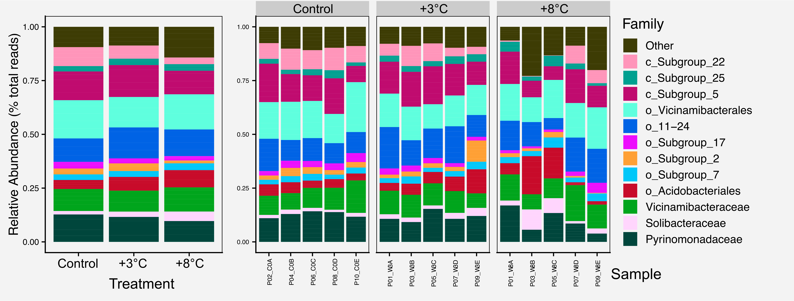{fig-align='center' width=95%}
:::
:::

::: {.cell layout-align="center"}
::: {.cell-output-display}
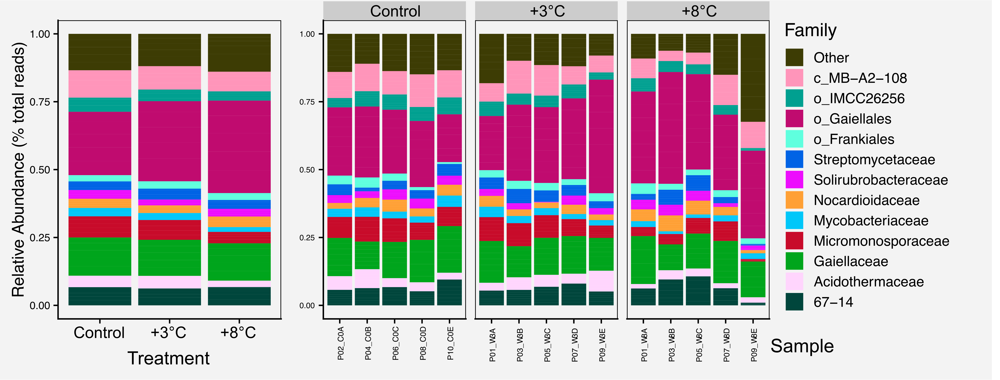{fig-align='center' width=95%}
:::
:::

::: {.cell layout-align="center"}
::: {.cell-output-display}
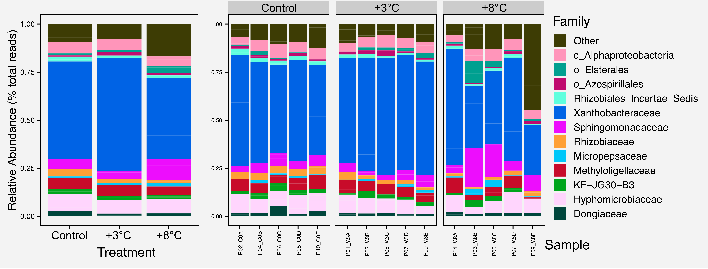{fig-align='center' width=95%}
:::
:::

::: {.cell layout-align="center"}
::: {.cell-output-display}
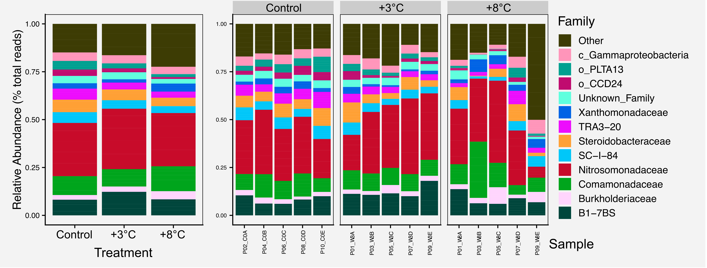{fig-align='center' width=95%}
:::
:::

::: {.cell layout-align="center"}
::: {.cell-output-display}
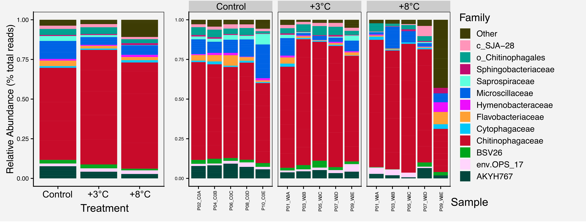{fig-align='center' width=95%}
:::
:::

::: {.cell layout-align="center"}
::: {.cell-output-display}
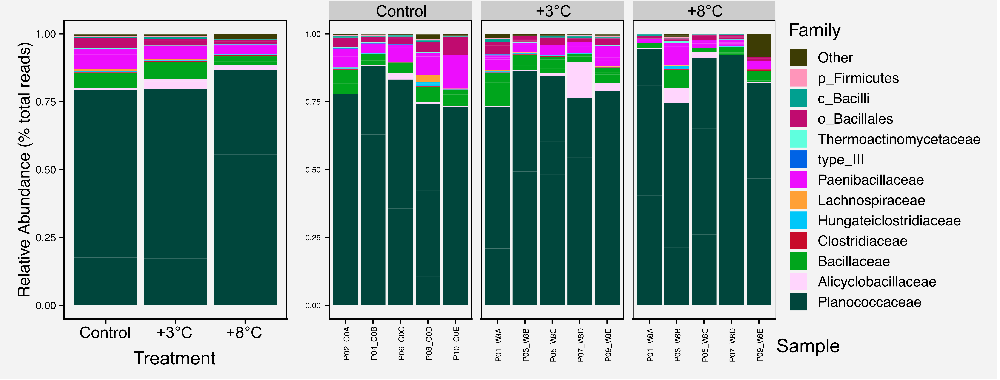{fig-align='center' width=95%}
:::
:::

::: {.cell layout-align="center"}
::: {.cell-output-display}
{fig-align='center' width=95%}
:::
:::

::: {.cell layout-align="center"}
::: {.cell-output-display}
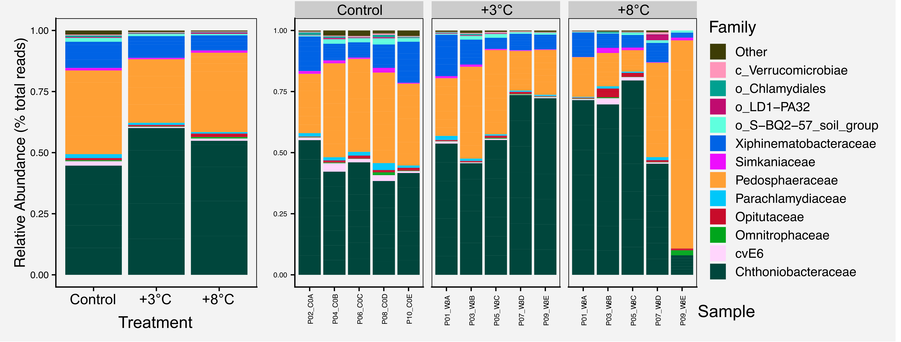{fig-align='center' width=95%}
:::
:::



# References 

::: {#refs}
:::

