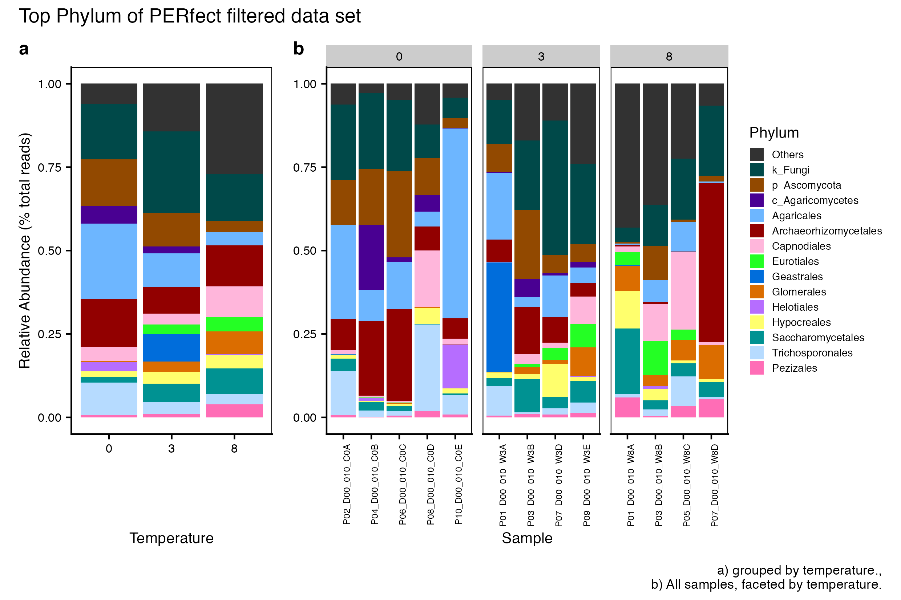

<details markdown="1">
<summary>Click here for setup information.</summary>


```{r setup}
knitr::opts_chunk$set(echo = TRUE, eval = FALSE)
set.seed(119)
#library(conflicted)
#pacman::p_depends(phangorn, local = TRUE)  
#pacman::p_depends_reverse(phangorn, local = TRUE)  

library(phyloseq); packageVersion("phyloseq")
library(Biostrings); packageVersion("Biostrings")
pacman::p_load(tidyverse, metacoder, hilldiv, patchwork, ampvis2, 
               agricolae, labdsv, naniar, codefolder, pairwiseAdonis, 
               microbiome, seqRFLP, DT, 
               install = FALSE, update = FALSE)
options(scipen=999)
knitr::opts_current$get(c(
  "cache",
  "cache.path",
  "cache.rebuild",
  "dependson",
  "autodep"
))
```
</details>

<br/>

> Hit the *Hide Code* button to collapse the R code (visible by default).

<aside>
```{r codefolder_ssu18, echo=FALSE, results='asis', eval=TRUE}
codefolder::generic(init = "show", query = "pre.sourceCode",
  style = "position: absolute; right: 14%; z-index: 200")
```
</aside>

# Synopsis

This workflow contains taxonomic diversity assessments for the 2018 high temperature data sets. In order to run the workflow, you either need to first run the  [DADA2 Workflow for 2018 High Temp samples](dada2.html) and then the [Data Preparation workflow](data-prep.html) **or** begin with the output files from the Data Preparation and PIME workflows. See the [Data Availability](data-availability.html) page for complete details.

In this workflow...

# 16s rRNA

```{r, eval=TRUE, echo=FALSE}
#TEMP LOAD ONLY REMOVE WHEN WORKFLOW FINISHED
remove(list = ls())
load("page_build/taxa_ssu18_wf_part_1.rdata")
```

```{r, include=FALSE}
## Initial Load for  ANALYSIS #1
remove(list = ls())
set.seed(119)
ssu18_ps_work <- readRDS("files/data-prep/rdata/ssu18_ps_work.rds")
ssu18_ps_work_otu <- readRDS("files/otu/rdata/ssu18_ps_work_otu.rds")
ssu18_ps_pime <- readRDS("files/pime/rdata/ssu18_ps_pime.rds")
ssu18_ps_pime_otu <- readRDS("files/pime/rdata/ssu18_ps_pime_otu.rds")
ssu18_ps_perfect <- readRDS("files/perfect/rdata/ssu18_ps_perfect.rds")
ssu18_ps_perfect_otu <- readRDS("files/perfect/rdata/ssu18_ps_perfect_otu.rds")
objects()
```

```{r, echo=FALSE}
swel_col <- c("#2271B2", "#71B222", "#B22271")
```

## Bar charts of Major Taxa

Here we compare the taxonomic breakdown of the FULL (unfiltered), PIME filtered, and PERfect filtered data sets, split by temperature treatment.

<details markdown="1">
<summary>Detailed Bar chart workflow </summary>

To create a bar chart by Phylum and Proteobacteria classes, we perform the following steps:

1) Get all Class-level Proteobacteria names

```{r}
ssu18_data_sets <- c("ssu18_ps_pime",  "ssu18_ps_pime_otu",
                     "ssu18_ps_work", "ssu18_ps_work_otu",
                     "ssu18_ps_perfect", "ssu18_ps_perfect_otu")

for (i in ssu18_data_sets) {
     tmp_name <- purrr::map_chr(i, ~paste0(., "_proteo"))
     tmp_get <- get(i)
     tmp_df <- subset_taxa(tmp_get, Phylum == "Proteobacteria")
     assign(tmp_name, tmp_df)
     print(tmp_name)
     tmp_get_taxa <- get_taxa_unique(tmp_df,
                                     taxonomic.rank = rank_names(tmp_df)[3],
                                     errorIfNULL=TRUE)
     print(tmp_get_taxa)
     rm(list = ls(pattern = "tmp_"))
     rm(list = ls(pattern = "_proteo"))
}
```

2) Replace Phylum == Proteobacteria with the Class name.

````{r}
for (j in ssu18_data_sets) {
  tmp_name <- purrr::map_chr(j, ~paste0(., "_proteo_clean"))
  tmp_get <- get(j)
  tmp_clean <- data.frame(tax_table(tmp_get))

   for (i in 1:nrow(tmp_clean)){
       if (tmp_clean[i,2] == "Proteobacteria" & tmp_clean[i,3] == "Alphaproteobacteria"){
           phylum <- base::paste("Alphaproteobacteria")
           tmp_clean[i, 2] <- phylum
   }   else if (tmp_clean[i,2] == "Proteobacteria" & tmp_clean[i,3] == "Gammaproteobacteria"){
           phylum <- base::paste("Gammaproteobacteria")
           tmp_clean[i, 2] <- phylum
   }   else if (tmp_clean[i,2] == "Proteobacteria" & tmp_clean[i,3] == "Zetaproteobacteria"){
              phylum <- base::paste("Zetaproteobacteria")
           tmp_clean[i, 2] <- phylum
   }   else if (tmp_clean[i,2] == "Proteobacteria" & tmp_clean[i,3] == "p_Proteobacteria"){
           phylum <- base::paste("p_Proteobacteria")
           tmp_clean[i, 2] <- phylum
       }
     }
  tax_table(tmp_get) <- as.matrix(tmp_clean)
  rank_names(tmp_get)
  assign(tmp_name, tmp_get)
  print(c(tmp_name, tmp_get))
  print(length(get_taxa_unique(tmp_get,
                               taxonomic.rank = rank_names(tmp_get)[2],
                               errorIfNULL=TRUE)))
  tmp_path <- file.path("files/taxa/rdata/")
  saveRDS(tmp_get, paste(tmp_path, j, "_clean.rds", sep = ""))
  rm(list = ls(pattern = "tmp_"))
}
rm(class, order, phylum)
objects(pattern="_proteo_clean")
```

3) Choose the **number** of taxa to display and the taxonomic **level**. Aggregate the rest into "Other".

```{r}
top_hits <- 12
top_level <- "Phylum"
```

```{r}
for (i in ssu18_data_sets){
  tmp_get <- get(i)
  tmp_otu <- data.frame(t(otu_table(tmp_get)))
  tmp_otu[] <- lapply(tmp_otu, as.numeric)
  tmp_otu <- as.matrix(tmp_otu)
  tmp_clean_name <- purrr::map_chr(i, ~ paste0(., "_proteo_clean"))
  tmp_get_clean <- get(tmp_clean_name)
  tmp_tax <- as.matrix(data.frame(tax_table(tmp_get_clean)))
  tmp_samples <- data.frame(sample_data(tmp_get_clean))
  tmp_clean_name <- purrr::map_chr(i, ~paste0(., "_clean_", top_level))
  tmp_clean_df <- merge_phyloseq(otu_table(tmp_otu, taxa_are_rows = TRUE),
                          tax_table(tmp_tax, tmp_tax),
                          sample_data(tmp_samples))
  assign(tmp_clean_name, tmp_clean_df)
  tmp_agg_name <- purrr::map_chr(i, ~paste0(., "_clean_", top_level, "_agg"))
  tmp_agg_df <- microbiome::aggregate_top_taxa(tmp_clean_df,
                                                    top = top_hits,
                                                    level = top_level)
  assign(tmp_agg_name, tmp_agg_df)
  rm(list = ls(pattern = "tmp_"))
}
objects(pattern = "_agg")
```

```{r}
for (i in objects(pattern="_agg$")) {
  tmp_name <- purrr::map_chr(i, ~ paste0(., "_order"))
  tmp_get <- get(i)
  tmp_list <- get_taxa_unique(tmp_get, taxonomic.rank = rank_names(tmp_get)[2],
                        errorIfNULL = TRUE)
  assign(tmp_name, tmp_list)
  rm(list = ls(pattern = "tmp_"))
}
objects(pattern="_order")
```

Next, we need to set the order of the taxa to display in the plots. This must be done manually, probably.

```{r}
ssu18_ps_work_clean_Phylum_agg_order <- c("Alphaproteobacteria", "Gammaproteobacteria", "Acidobacteriota", "Actinobacteriota", "Bacteroidota", "Firmicutes", "Myxococcota", "Verrucomicrobiota", "Chloroflexi", "Planctomycetota", "Methylomirabilota", "Crenarchaeota", "Other")

ssu18_ps_pime_clean_Phylum_agg_order <- c("Alphaproteobacteria", "Gammaproteobacteria", "Acidobacteriota", "Actinobacteriota", "Bacteroidota", "Firmicutes", "Myxococcota", "Verrucomicrobiota", "RCP2-54", "Nitrospirota", "Methylomirabilota", "Crenarchaeota", "Other")
  
ssu18_ps_perfect_clean_Phylum_agg_order <- c("Alphaproteobacteria", "Gammaproteobacteria", "Acidobacteriota", "Actinobacteriota", "Bacteroidota", "Firmicutes", "Myxococcota", "Verrucomicrobiota", "RCP2-54", "Planctomycetota", "Methylomirabilota", "Crenarchaeota", "Other")
```

4) Now, transform the data to relative abundance.

```{r}
for (i in objects(pattern="_agg$")) {
  tmp_name <- purrr::map_chr(i, ~paste0(., "_tax"))
  tmp_agg <- purrr::map_chr(i, ~paste0(., "_order"))
  tmp_get <- get(i)
  tmp_get_agg <- get(tmp_agg)
  tmp_df <- tmp_get %>%
            transform_sample_counts(function(x) {x/sum(x)} ) %>%
            psmelt()
  tmp_df[[top_level]] <- gdata::reorder.factor(tmp_df[[top_level]],
                                                  new.order = rev(tmp_get_agg))
  tmp_df <- tmp_df %>% dplyr::arrange(get(top_level))
  assign(tmp_name, tmp_df)
  print(c(i, tmp_name, tmp_agg))
  rm(list = ls(pattern = "tmp_"))
}
objects(pattern = "_tax")
```


```{r}
for (i in objects(pattern="_tax")) {
  tmp_get <- get(i)
  tmp_levels <- levels(tmp_get[[top_level]])
  print(c(i, tmp_levels))
}
```

5) Plot the data for a single phyloseq object. Here you use an aggregated tax file.

```{r}
# SOME COLOR PALETTES
fifteen <- c("#68023F", "#008169", "#EF0096", "#00DCB5", "#FFCFE2", "#003C86", "#9400E6", "#009FFA", "#FF71FD", "#7CFFFA", "#6A0213", "#008607", "#F60239", "#00E307", "#FFDC3D")
fifteen_alt <- c("#00463C", "#C00B6F", "#00A090", "#FF95BA", "#5FFFDE", "#590A87", "#0063E5", "#ED0DFD", "#00C7F9", "#FFD5FD", "#3D3C04", "#C80B2A", "#00A51C", "#FFA035", "#9BFF2D")
twelve_alt <- c("#006A5E", "#ED0D88", "#00BDA9", "#FFC4D4", "#0058CC", "#D208FB", "#FF66FD", "#00EFF9", "#156D03", "#009719", "#00C61B", "#00FB1D")
twelve <- c("#9F0162", "#009F81", "#FF5AAF", "#00FCCF", "#8400CD", "#008DF9", "#00C2F9", "#FFB2FD", "#A40122", "#E20134", "#FF6E3A", "#FFC33B")
```

```{r, echo=FALSE}
ssu18_colvec.tax <- c(
"#3D3C04",
"#FF95BA",
"#00A090",
"#C00B6F",
#"#9BFF2D",
#"#590A87",
"#5FFFDE",
"#0063E5",
"#ED0DFD",
"#FFA035",
"#00C7F9",
"#C80B2A",
"#00A51C",
"#FFD5FD",
"#00463C"
)
show_col(ssu18_colvec.tax)
```

```{r}
#Select data set
set_to_plot <- "ssu18_ps_work"
set_type <- "FULL" # FULL PIME or PERFECT
```


```{r}
rm(i)
for (i in  set_to_plot) {
     tmp_plot_name <- purrr::map_chr(i, ~paste0(., "_", top_level, "_plot"))
     tmp_get <- get(purrr::map_chr(i, ~paste0(., "_clean_Phylum_agg_tax")))
     tmp_plot <- ggplot(tmp_get,
                        aes(x = factor(TEMP),
                            y = Abundance, fill = get(top_level))) +
       geom_bar(stat = "identity", position = "fill") +
       scale_fill_manual(values = ssu18_colvec.tax) +
       #scale_x_discrete("Temperature", expand = waiver(), position = "bottom", drop = FALSE) +
       theme_cowplot() +
       guides(fill = guide_legend(title = top_level)) +
       #guides(fill = guide_legend(reverse = FALSE, keywidth = 1, keyheight = 1)) +
       ylab("Relative Abundance (% total reads)") + xlab("Temperature") +
       theme(panel.grid.major = element_blank(), panel.grid.minor = element_blank(),
             panel.background = element_rect(fill = "transparent", colour = NA),
             plot.background = element_rect(fill = "transparent", colour = NA),
             panel.border = element_rect(fill = NA, color = "black"),
             legend.position = "none",
             axis.text = element_text(size = 8),
             axis.title = element_text(size = 10))
     assign(tmp_plot_name, tmp_plot)
     rm(list = ls(pattern = "tmp_"))
}
rm(i)
```

6) Plot the data for a multiple phyloseq objects. Here again you use an aggregated tax file. This code can be used to generate plots for multiple data frames by adding the base  phyloseq names to the `set_to_plot` variable. This code will also facet the plots by a metadata variable. If you do not want to facet remove the line beginning with `facet_grid`.

```{r}
for (i in set_to_plot) {
  tmp_level_get <- get(i)
  tmp_level <- data.frame(sample_data(tmp_level_get))
  tmp_level <- tmp_level[order(tmp_level$TEMP), ]
  tmp_level <- as.vector(tmp_level$SamName)

  tmp_agg_name <- purrr::map_chr(i, ~paste0(., "_clean_", top_level, "_agg_tax"))
  tmp_get <- get(tmp_agg_name)
  tmp_df <- reshape::melt(tmp_get, id.vars = c("Sample", "TEMP", "Abundance", top_level))
  tmp_plot_name <- purrr::map_chr(i, ~paste0(., "_", top_level, "_melt_plot"))

  tmp_plot <- ggplot(tmp_df,
                aes(x = Sample,
                    y = Abundance, fill = get(top_level))) +
    facet_grid(. ~TEMP, scale = "free_x", space = "free_x")+
    geom_bar(stat = "identity", position = "fill")  +
    scale_fill_manual(values = ssu18_colvec.tax) +
    #scale_x_discrete("Treatment", expand = waiver(),
    #                 position = "bottom", drop = FALSE, limits = tmp_level) +
    theme_cowplot() +
    guides(fill = guide_legend(title = top_level, reverse = FALSE,
                               keywidth = 0.7, keyheight = 0.7)) +
    ylab(NULL) +
    theme(panel.grid.major = element_blank(), panel.grid.minor = element_blank(),
        panel.background = element_rect(fill = "transparent", colour = NA),
        plot.background = element_rect(fill = "transparent", colour = NA),
        panel.border = element_rect(fill = NA, color = "black"),
        legend.text = element_text(size = 7),
        legend.title = element_text(size = 10),
        legend.position = "right",
        #legend.key.size = unit(1.5, "cm"),
        axis.text.y = element_text(size = 8),
        axis.text.x = element_text(size = 6, angle = 90),
        strip.text = element_text(size = 8, angle = 0),
        axis.title = element_text(size = 10)) + ylab(NULL)
  assign(tmp_plot_name, tmp_plot)
  rm(list = ls(pattern = "tmp_"))
}
rm(i)
```

7) Finally we use the `patchwork` package to combine the two plots and customize the look.

```{r}
for (i in  set_to_plot) {
     tmp_plot_final_name <- purrr::map_chr(i, ~paste0(., "_", top_level, "_plot_final"))
     tmp_p_plot <- get(purrr::map_chr(i, ~paste0(., "_", top_level, "_plot")))
     tmp_m_plot <- get(purrr::map_chr(i, ~paste0(., "_", top_level, "_melt_plot")))
     tmp_plot_final <- tmp_p_plot + tmp_m_plot
     tmp_plot_final <- tmp_plot_final +
         plot_annotation(tag_levels = "A", 
                         title = paste("Top", top_level, "of", set_type, "data set"), 
                         #subtitle = 'Top taxa of non-filtered data',
                         caption = "A) grouped by temperature.,
                         B) All samples, faceted by temperature.") + 
       plot_layout(widths = c(1, 2)) &
       theme(plot.title = element_text(size = 13),
             plot.subtitle = element_text(size = 10), 
             plot.tag = element_text(size = 12), 
             axis.title = element_text(size = 10), 
             axis.text = element_text(size = 8)) 
     #legend.position = "right") 
     #legend.position = "right", 
     #legend.title = element_text(size = rel(1)), 
     #legend.text = element_text(size = rel(1)))
  assign(tmp_plot_final_name, tmp_plot_final)
  rm(list = ls(pattern = "tmp_"))
}
rm(i)
```

```{r, echo=FALSE}
tmp_plot_final <- get(purrr::map_chr(set_to_plot, ~paste0(., "_", top_level,  "_plot_final")))
tmp_plot_final
dev.off()
png(paste("files/taxa/figures/", set_to_plot, "_tax_div_bar_plots.png", sep = ""), 
    height = 14, width = 21, units = 'cm', res = 600, bg = "white")
tmp_plot_final
dev.off()
pdf(paste("files/taxa/figures/", set_to_plot, "_tax_div_bar_plots.pdf", sep = ""), height = 10, width = 12)
tmp_plot_final
dev.off()
rm(list = ls(pattern = "tmp_"))
```

</details>

```{r, echo=FALSE}
system("cp files/taxa/figures/ssu18_ps_work_tax_div_bar_plots.png include/taxa/ssu18_ps_work_tax_div_bar_plots.png")
system("cp files/taxa/figures/ssu18_ps_pime_tax_div_bar_plots.png include/taxa/ssu18_ps_pime_tax_div_bar_plots.png")
system("cp files/taxa/figures/ssu18_ps_perfect_tax_div_bar_plots.png include/taxa/ssu18_ps_perfect_tax_div_bar_plots.png")
```

```{r, echo=FALSE}
save.image("page_build/taxa_ssu18_wf_part_1.rdata")
```

```{r, echo=FALSE, eval=TRUE}
xaringanExtra::use_panelset()
```

<br/>

> It is important to note that while most of the dominant taxa are the same across the FULL, PIME, and PERfect data sets, there a few key difference:

1) Planctomycetota was not among the dominant taxa in the PIME data set. Nitrospirota was substituted. 

2) Chloroflexi was not among the dominant taxa in either the PIME or PERfect data sets. RCP2-54 was substituted in both cases.

::: l-body-outset
::: {.panelset}
::: {.panel}

#### FULL dataset

```{r, echo=FALSE, eval=TRUE, warning=FALSE, layout='l-body-outset'}
knitr::include_graphics("include/taxa/ssu18_ps_work_tax_div_bar_plots.png")
```
:::

::: {.panel}
#### PIME dataset

```{r, echo=FALSE, eval=TRUE, warning=FALSE, layout='l-body-outset'}
knitr::include_graphics("include/taxa/ssu18_ps_pime_tax_div_bar_plots.png")
```
:::

::: {.panel}
#### PERFECT dataset

```{r, echo=FALSE, eval=TRUE, warning=FALSE, layout='l-body-outset'}
knitr::include_graphics("include/taxa/ssu18_ps_perfect_tax_div_bar_plots.png")
```
:::
:::
:::


## Bar charts of Major Taxa by Family

We can also look at the relative abundance of groups within dominant Phyla. **Please note** these analyses are for the FULL data set only, before any type of filtering.

<aside>
This code ***only*** works for multiple taxa from a *single* phyloseq object.
</aside>

<details markdown="1">
<summary>Detailed Bar chart workflow </summary>

1) Subset Phyla of interest. This can be done for multiple data sets by adding to the `ssu18_data_sets` list

```{r, echo=FALSE, eval=TRUE}
rm(list = ls())
load("page_build/taxa_ssu18_wf_part_2.rdata")
```

```{r, echo=FALSE}
rm(list = ls())
load("page_build/taxa_ssu18_wf_part_1.rdata")
to_keep <- objects(pattern = "_proteo_clean")
gdata::keep(list = to_keep, sure = TRUE)
objects()
```

```{r}
set_to_plot <- "ssu18_ps_work"
tax_group <- c("Alphaproteobacteria", "Gammaproteobacteria", "Acidobacteriota", 
               "Actinobacteriota", "Bacteroidota", "Firmicutes", 
               "Myxococcota", "Verrucomicrobiota")
for (i in set_to_plot) {
  for (j in tax_group) {
  tmp_get <- get(purrr::map_chr(i, ~ paste0(., "_proteo_clean")))
  tmp_sub <- subset_taxa(tmp_get, Phylum == j)
  tmp_name <- purrr::map_chr(i, ~ paste0(., "_", j))
  assign(tmp_name, tmp_sub)
  rm(list = ls(pattern = "tmp_"))
  }
}
objects()
```

```{r}
for (i in tax_group) {
  tmp_get <- get(purrr::map_chr(i, ~ paste0(set_to_plot, "_", i)))
  tmp_list <-  get_taxa_unique(tmp_get, taxonomic.rank = rank_names(tmp_get)[5], errorIfNULL = TRUE)
  cat("\n")
  cat("####################################################", "\n")
  tmp_print <- c("Unique taxa:", i)
  cat(tmp_print, "\n")
  cat("####################################################")
  cat("\n")
  print(tmp_list)
  rm(list = ls(pattern = "tmp_"))
}
```

3) Choose the **number** of taxa to display and the taxonomic **level**. Aggregate the rest into "Other".

```{r}
top_hits <- 12
top_level <- "Family"
for (i in tax_group){
  tmp_get <- get(purrr::map_chr(i, ~ paste0(set_to_plot, "_", i)))
  tmp_otu <- data.frame(t(otu_table(tmp_get)))
  tmp_otu[] <- lapply(tmp_otu, as.numeric)
  tmp_otu <- as.matrix(tmp_otu)
  tmp_tax <- as.matrix(data.frame(tax_table(tmp_get)))
  tmp_samples <- data.frame(sample_data(tmp_get))
  tmp_clean_df <- merge_phyloseq(otu_table(tmp_otu, taxa_are_rows = TRUE),
                          tax_table(tmp_tax),
                          sample_data(tmp_samples))
  tmp_agg_df <- microbiome::aggregate_top_taxa(tmp_clean_df,
                                                    top = top_hits,
                                                    level = top_level)
  tmp_agg_name <- purrr::map_chr(i, ~ paste0(set_to_plot, "_", i, "_agg"))
  assign(tmp_agg_name, tmp_agg_df)
  rm(list = ls(pattern = "_sep_agg"))
}
objects(pattern = "_agg$")
objects()
```

```{r}
for (i in tax_group){
  tmp_data <- purrr::map_chr(i, ~ paste0(set_to_plot, "_", i, "_agg"))
  tmp_get <- get(tmp_data)
  tmp_list <- get_taxa_unique(tmp_get, taxonomic.rank = rank_names(tmp_get)[2],
                        errorIfNULL = TRUE)
  tmp_name <- purrr::map_chr(tmp_data, ~ paste0(., "_order"))
  assign(tmp_name, tmp_list)
  rm(list = ls(pattern = "tmp_"))
}
objects(pattern = "_agg_order$")
```

```{r}
for (i in tax_group) {
  tmp_get <- get(purrr::map_chr(i, ~ paste0(set_to_plot, "_", i, "_agg_order")))
  cat("\n")
  cat("#########", i, "########", "\n")
  tmp_print <- c(tmp_get)
  cat(tmp_print, "\n")
  cat("####################################################")
  cat("\n")
  rm(list = ls(pattern = "tmp_"))
}
rm(i, j)
```

```{r}
tmp_order <- rev(c("Other", "c_Alphaproteobacteria", "o_Elsterales", "o_Azospirillales", "Rhizobiales_Incertae_Sedis", "Xanthobacteraceae", "Sphingomonadaceae", "Rhizobiaceae", "Micropepsaceae", "Methyloligellaceae", "KF-JG30-B3", "Hyphomicrobiaceae", "Dongiaceae"))
assign(paste(set_to_plot, "_", "Alphaproteobacteria", "_agg_order", sep = ""), tmp_order) 
###################
tmp_order <- rev(c("Other", "c_Gammaproteobacteria", "o_PLTA13", "o_CCD24", "Unknown_Family", "Xanthomonadaceae", "TRA3-20", "Steroidobacteraceae", "SC-I-84", "Nitrosomonadaceae", "Comamonadaceae", "Burkholderiaceae", "B1-7BS"))
assign(paste(set_to_plot, "_", "Gammaproteobacteria", "_agg_order", sep = ""), tmp_order) 
###################
tmp_order <- rev(c("Other", "c_Subgroup_22", "c_Subgroup_25", "c_Subgroup_5", "o_Vicinamibacterales", "o_11-24", "o_Subgroup_17", "o_Subgroup_2", "o_Subgroup_7", "o_Acidobacteriales", "Vicinamibacteraceae", "Solibacteraceae", "Pyrinomonadaceae"))
assign(paste(set_to_plot, "_", "Acidobacteriota", "_agg_order", sep = ""), tmp_order) 
###################
tmp_order <- rev(c("Other", "c_MB-A2-108", "o_IMCC26256", "o_Gaiellales", "o_Frankiales", "Streptomycetaceae", "Solirubrobacteraceae", "Nocardioidaceae", "Mycobacteriaceae", "Micromonosporaceae", "Gaiellaceae", "Acidothermaceae", "67-14"))
assign(paste(set_to_plot, "_", "Actinobacteriota", "_agg_order", sep = ""), tmp_order) 
###################
tmp_order <- rev(c("Other", "c_SJA-28", "o_Chitinophagales", "Sphingobacteriaceae", "Saprospiraceae", "Microscillaceae", "Hymenobacteraceae", "Flavobacteriaceae", "Cytophagaceae", "Chitinophagaceae", "BSV26", "env.OPS_17", "AKYH767"))
assign(paste(set_to_plot, "_", "Bacteroidota", "_agg_order", sep = ""), tmp_order) 
###################
tmp_order <- rev(c("Other", "p_Firmicutes", "c_Bacilli", "o_Bacillales", "Thermoactinomycetaceae", "type_III", "Paenibacillaceae", "Lachnospiraceae", "Hungateiclostridiaceae", "Clostridiaceae", "Bacillaceae", "Alicyclobacillaceae", "Planococcaceae"))
assign(paste(set_to_plot, "_", "Firmicutes", "_agg_order", sep = ""), tmp_order) 
###################
tmp_order <- rev(c("Other", "p_Myxococcota", "c_bacteriap25", "c_Polyangia", "o_mle1-27", "o_MSB-4B10", "Sandaracinaceae", "Polyangiaceae", "Phaselicystidaceae", "Myxococcaceae", "Haliangiaceae", "BIrii41", "Anaeromyxobacteraceae"))
assign(paste(set_to_plot, "_", "Myxococcota", "_agg_order", sep = ""), tmp_order) 
###################
tmp_order <- rev(c("Other", "c_Verrucomicrobiae", "o_Chlamydiales", "o_LD1-PA32", "o_S-BQ2-57_soil_group", "Xiphinematobacteraceae", "Simkaniaceae", "Pedosphaeraceae", "Parachlamydiaceae", "Opitutaceae", "Omnitrophaceae", "cvE6", "Chthoniobacteraceae"))
assign(paste(set_to_plot, "_", "Verrucomicrobiota", "_agg_order", sep = ""), tmp_order) 
###################
```


[1] "c_Alphaproteobacteria"      "Dongiaceae"                 "Hyphomicrobiaceae"          "KF-JG30-B3"                
 [5] "Methyloligellaceae"         "Micropepsaceae"             "o_Azospirillales"           "o_Elsterales"              
 [9] "Other"                      "Rhizobiaceae"               "Rhizobiales_Incertae_Sedis" "Sphingomonadaceae"         
[13] "Xanthobacteraceae"   

4) Now, transform the data to relative abundance.

```{r}
for (i in tax_group) {
  tmp_agg <- purrr::map_chr(i, ~ paste0(set_to_plot, "_", i, "_agg"))
  tmp_order <- purrr::map_chr(tmp_agg, ~paste0(., "_order"))
  tmp_get_agg <- get(tmp_agg)
  tmp_get_order <- get(tmp_order)
  tmp_df <- tmp_get_agg %>%
            transform_sample_counts(function(x) {x/sum(x)} ) %>%
            psmelt()
  tmp_df[[top_level]] <- gdata::reorder.factor(tmp_df[[top_level]],
                                                  new.order = rev(tmp_get_order))
  tmp_df <- tmp_df %>% dplyr::arrange(get(top_level))
  tmp_name <- purrr::map_chr(tmp_agg, ~paste0(., "_tax"))
  assign(tmp_name, tmp_df)
  #print(c(i, tmp_name, tmp_agg))
  rm(list = ls(pattern = "tmp_"))
}
objects(pattern="_tax")
```


```{r}
for (i in tax_group) {
  tmp_get <- get(purrr::map_chr(i, ~ paste0(set_to_plot, "_", i, "_agg_tax")))
  tmp_levels <- levels(tmp_get[[top_level]])
  print(c(i, tmp_levels))
}
```

5) Plot the data for a single phyloseq object. Here you use an aggragated tax file.

```{r, echo=FALSE}
ssu18_colvec.tax <- c(
"#3D3C04",
"#FF95BA",
"#00A090",
"#C00B6F",
#"#9BFF2D",
#"#590A87",
"#5FFFDE",
"#0063E5",
"#ED0DFD",
"#FFA035",
"#00C7F9",
"#C80B2A",
"#00A51C",
"#FFD5FD",
"#00463C"
)

show_col(ssu18_colvec.tax)

```

```{r}
for (i in tax_group) {
      tmp_get <- get(purrr::map_chr(i, ~ paste0(set_to_plot, "_", i, "_agg_tax")))
      tmp_plot <- ggplot(tmp_get, aes(x = factor(TEMP), 
                                        y = Abundance, fill = get(top_level))) +
          geom_bar(stat = "identity", position = "fill") +
          scale_fill_manual(values = ssu18_colvec.tax) +
          #scale_x_discrete("Temperature", expand = waiver(), position = "bottom", drop = FALSE) +
          theme_cowplot() +
          guides(fill = guide_legend(title = top_level)) +
          #guides(fill = guide_legend(reverse = FALSE, keywidth = 1, keyheight = 1)) +
          ylab("Relative Abundance (% total reads)") + xlab("Temperature") +
          theme(panel.grid.major = element_blank(), panel.grid.minor = element_blank(),
                panel.background = element_rect(fill = "transparent", colour = NA),
                plot.background = element_rect(fill = "transparent", colour = NA),
                panel.border = element_rect(fill = NA, color = "black"),
                #axis.text = element_text(size = 6),
                #axis.title = element_text(size = 8),
                legend.position = "none")
      tmp_name <- purrr::map_chr(i, ~paste0(set_to_plot, "_", ., "_plot"))
      assign(tmp_name, tmp_plot)
      rm(list = ls(pattern = "tmp_"))
}
```

6) Plot the data for multiple taxa. Here again you use an aggregated tax file. This code can be used to generate plots for multiple data frames by adding the base  phyloseq names to the `ssu18_split_df` variable. This code will also facet the plots by a metadata variable. If you do not want to facet remove the line beginning with `facet_grid`.

```{r}
for (i in tax_group) {
  tmp_level_get <- get(purrr::map_chr(i, ~paste0(set_to_plot, "_", .)))
  tmp_level <- data.frame(sample_data(tmp_level_get))
  tmp_level <- tmp_level[order(tmp_level$TEMP), ]
  tmp_level <- as.vector(tmp_level$SamName)

  tmp_agg_name <- purrr::map_chr(i, ~paste0(set_to_plot, "_", .,  "_agg_tax"))
  tmp_get <- get(tmp_agg_name)
  tmp_df <- reshape::melt(tmp_get, id.vars = c("Sample", "TEMP", "Abundance", "Family"))
  tmp_plot_name <- purrr::map_chr(i, ~paste0(set_to_plot, "_", ., "_plot_melt"))

  tmp_plot <- ggplot(tmp_df,
                aes(x = Sample,
                    y = Abundance, fill = get(top_level))) +
    facet_grid(. ~TEMP, scale = "free_x", space = "free_x")+
    geom_bar(stat = "identity", position = "fill")  +
    scale_fill_manual(values = ssu18_colvec.tax) +
    #scale_x_discrete("Treatment", expand = waiver(),
    #                 position = "bottom", drop = FALSE, limits = tmp_level) +
    theme_cowplot() +
    guides(fill = guide_legend(title = top_level, reverse = FALSE,
                               keywidth = 0.7, keyheight = 0.7)) +
    ylab(NULL) +
    theme(panel.grid.major = element_blank(), panel.grid.minor = element_blank(),
        panel.background = element_rect(fill = "transparent", colour = NA),
        plot.background = element_rect(fill = "transparent", colour = NA),
        panel.border = element_rect(fill = NA, color = "black"),
        legend.position = "right",
        #legend.text = element_text(size = 6),
        #legend.title = element_text(size = 8),
        #legend.key.size = unit(1.5, "cm"),
        #axis.text.y = element_text(size = 6),
        axis.text.x = element_text(angle = 90)
        #strip.text = element_text(size = 8, angle = 0),
        #axis.title = element_text(size = 8)
        ) + 
    ylab(NULL)
  
  assign(tmp_plot_name, tmp_plot)
  rm(list = ls(pattern = "tmp_"))
}
objects()

```

7) Finally we use the `patchwork` package to combine the two plots and customize the look.

```{r}
for (i in tax_group) {
  tmp_plot_main <- get(purrr::map_chr(i, ~paste0(set_to_plot, "_", ., "_plot")))
  tmp_plot_melt <- get(purrr::map_chr(i, ~paste0(set_to_plot, "_", ., "_plot_melt")))
  tmp_final <- tmp_plot_main + tmp_plot_melt
  tmp_final <- tmp_final + 
    plot_annotation(tag_levels = 'A', 
                    title = i) + 
                    #subtitle = 'Top taxa of non-filtered data',
                    #caption = 'A) grouped by temperature.,
                    #B) All samples, faceted by temperature.') + 
    plot_layout(widths = c(1, 2)) &
    theme(plot.title = element_text(size = 9),
        plot.subtitle = element_text(size = 1),
        plot.tag = element_text(size = 6),
        axis.title = element_text(size = 7),
        axis.text = element_text(size = 6),
        strip.text = element_text(size = 8, angle = 0),
        legend.text = element_text(size = 7),
        legend.title = element_text(size = 9)
        )
        #legend.position = "right")
        #legend.position = "right",
        #legend.title = element_text(size = rel(1)),
        #legend.text = element_text(size = rel(1)))
  tmp_name <- purrr::map_chr(i, ~paste0(set_to_plot, "_", ., "_final_plot"))
  assign(tmp_name, tmp_final)
  rm(list = ls(pattern = "tmp_"))
}

```

```{r}
save.image("page_build/taxa_ssu18_wf_part_2.rdata")
```
</details>

```{r, echo=FALSE, eval=TRUE}
rm(list = ls())
load("page_build/taxa_ssu18_wf_part_2.rdata")
gdata::keep(ssu18_ps_work_Acidobacteriota_final_plot, ssu18_ps_work_Actinobacteriota_final_plot,
            ssu18_ps_work_Alphaproteobacteria_final_plot, ssu18_ps_work_Bacteroidota_final_plot, 
            ssu18_ps_work_Firmicutes_final_plot, ssu18_ps_work_Gammaproteobacteria_final_plot, 
            ssu18_ps_work_Myxococcota_final_plot, ssu18_ps_work_Verrucomicrobiota_final_plot, 
            tax_group, top_level, sure = TRUE)

```

<br/>

::: l-body-outset
::: {.panelset}
::: {.panel}

#### Alphaproteobacteria

```{r, echo=FALSE, eval=TRUE, warning=FALSE, layout='l-body-outset'}
ssu18_ps_work_Alphaproteobacteria_final_plot 
#unique(ssu18_ps_work_Alphaproteobacteria_final_plot$data$Family)
```
:::

::: {.panel}
#### Gammaproteobacteria

```{r, echo=FALSE, eval=TRUE, warning=FALSE, layout='l-body-outset'}
ssu18_ps_work_Gammaproteobacteria_final_plot 
#unique(ssu18_ps_work_Gammaproteobacteria_final_plot$data$Family)
```
:::

::: {.panel}
#### Acidobacteriota

```{r, echo=FALSE, eval=TRUE, warning=FALSE, layout='l-body-outset'}
ssu18_ps_work_Acidobacteriota_final_plot 
#unique(ssu18_ps_work_Acidobacteriota_final_plot$data$Family)
```
:::

::: {.panel}
#### Actinobacteriota

```{r, echo=FALSE, eval=TRUE, warning=FALSE, layout='l-body-outset'}
ssu18_ps_work_Actinobacteriota_final_plot 
#unique(ssu18_ps_work_Actinobacteriota_final_plot$data$Family)
```
:::

::: {.panel}
#### Bacteroidota

```{r, echo=FALSE, eval=TRUE, warning=FALSE, layout='l-body-outset'}
ssu18_ps_work_Bacteroidota_final_plot 
#unique(ssu18_ps_work_Bacteroidota_final_plot$data$Family)
```
:::

::: {.panel}
#### Firmicutes

```{r, echo=FALSE, eval=TRUE, warning=FALSE, layout='l-body-outset'}
ssu18_ps_work_Firmicutes_final_plot 
#unique(ssu18_ps_work_Firmicutes_final_plot$data$Family)
```
:::

::: {.panel}
#### Myxococcota

```{r, echo=FALSE, eval=TRUE, warning=FALSE, layout='l-body-outset'}
ssu18_ps_work_Myxococcota_final_plot 
#unique(ssu18_ps_work_Myxococcota_final_plot$data$Family)
```
:::

::: {.panel}
#### Verrucomicrobiota

```{r, echo=FALSE, eval=TRUE, warning=FALSE, layout='l-body-outset'}
ssu18_ps_work_Verrucomicrobiota_final_plot 
#unique(ssu18_ps_work_Verrucomicrobiota_final_plot$data$Family)
```
:::
:::
::: 

# ITS

```{r, eval=TRUE, echo=FALSE}
#TEMP LOAD ONLY REMOVE WHEN WORKFLOW FINISHED
remove(list = ls())
load("page_build/taxa_its18_wf_part_1.rdata")
```

```{r, include=FALSE, eval=TRUE}
## Load to build page only #2
#remove(list = ls())
#load("rdata/taxa/its/taxa-wf_its18.rdata")
```

```{r initial_load_its18, include=FALSE}
## Initial Load for  ANALYSIS #1
remove(list = ls())
set.seed(119)

its18_ps_work <- readRDS("files/data-prep/rdata/its18_ps_work.rds")	
its18_ps_work_otu <- readRDS("files/otu/rdata/its18_ps_work_otu.rds")	
its18_ps_pime <- readRDS("files/pime/rdata/its18_ps_pime.rds")	
its18_ps_pime_otu <- readRDS("files/pime/rdata/its18_ps_pime_otu.rds")	
its18_ps_perfect <- readRDS("files/perfect/rdata/its18_ps_perfect.rds")	
its18_ps_perfect_otu <- readRDS("files/perfect/rdata/its18_ps_perfect_otu.rds")
objects()
```


```{r, echo=FALSE}
swel_col <- c("#2271B2", "#71B222", "#B22271")
```

## Bar charts of Major Taxa

Here we compare the taxonomic breakdown of the FULL (unfiltered), PIME filtered, and PERfect filtered data sets, split by temperature treatment.

<details markdown="1">
<summary>Detailed Bar chart workflow </summary>


```{r}
its18_data_sets <- c("its18_ps_pime",  "its18_ps_pime_otu",	
	                     "its18_ps_work", "its18_ps_work_otu",	
	                     "its18_ps_perfect", "its18_ps_perfect_otu")
```

1) Choose the **number** of taxa to display and the taxonomic **level**. Aggregate the rest into "Other".

```{r}
top_hits <- 14
top_level <- "Order"
```

```{r}
for (i in its18_data_sets){
  tmp_get <- get(i)
  tmp_otu <- data.frame(t(otu_table(tmp_get)))
  tmp_otu[] <- lapply(tmp_otu, as.numeric)
  tmp_otu <- as.matrix(tmp_otu)
  #tmp_clean_name <- purrr::map_chr(i, ~ paste0(., "_proteo_clean"))
  #tmp_get_clean <- get(tmp_clean_name)
  tmp_tax <- as.matrix(data.frame(tax_table(tmp_get)))
  tmp_samples <- data.frame(sample_data(tmp_get))
  tmp_clean_name <- purrr::map_chr(i, ~paste0(., "_clean_", top_level))
  tmp_clean_df <- merge_phyloseq(otu_table(tmp_otu, taxa_are_rows = TRUE),
                          tax_table(tmp_tax, tmp_tax),
                          sample_data(tmp_samples))
  assign(tmp_clean_name, tmp_clean_df)
  tmp_agg_name <- purrr::map_chr(i, ~paste0(., "_clean_", top_level, "_agg"))
  tmp_agg_df <- microbiome::aggregate_top_taxa(tmp_clean_df,
                                                    top = top_hits,
                                                    level = top_level)
  assign(tmp_agg_name, tmp_agg_df)
  rm(list = ls(pattern = "tmp_"))
}
#rm(list = ls(pattern = "_proteo_clean"))
objects()
```

```{r}
for (i in objects(pattern="_agg$")) {
  tmp_name <- purrr::map_chr(i, ~ paste0(., "_order"))
  tmp_get <- get(i)
  tmp_list <- get_taxa_unique(tmp_get, taxonomic.rank = rank_names(tmp_get)[2],
                        errorIfNULL = TRUE)
  assign(tmp_name, tmp_list)
  rm(list = ls(pattern = "tmp_"))
}
objects(pattern="_order")
```

Next, we need to set the order of the taxa to display in the plots. This must be done manually, probably.

```{r}
its18_ps_work_clean_Order_agg_order <- rev(c(
"Other",
 "k_Fungi",
 "p_Ascomycota",
 "c_Agaricomycetes", #NOT IN PIME USE Polyporales
 "Agaricales",
 "Archaeorhizomycetales",
 "Capnodiales",
 "Eurotiales",
 "Geastrales",
 "Glomerales",
 "Helotiales", #NOT IN PIME USE Mortierellales
 "Hypocreales",
 "Saccharomycetales",
 "Trichosporonales",
 "Xylariales")) #NOT IN PIME OR PERFECT USE Pezizales

its18_ps_pime_clean_Order_agg_order <- rev(c(
"Other",
 "k_Fungi",
 "p_Ascomycota",
 "Polyporales",
 "Agaricales",
 "Archaeorhizomycetales",
 "Capnodiales",
 "Eurotiales",
 "Geastrales",
 "Glomerales",
 "Mortierellales",
 "Hypocreales",
 "Saccharomycetales",
 "Trichosporonales",
 "Pezizales")) #NOT IN PIME OR PERFECT USE Pezizales

its18_ps_perfect_clean_Order_agg_order <- rev(c(
"Other",
 "k_Fungi",
 "p_Ascomycota",
 "c_Agaricomycetes", 
 "Agaricales",
 "Archaeorhizomycetales",
 "Capnodiales",
 "Eurotiales",
 "Geastrales",
 "Glomerales",
 "Helotiales", 
 "Hypocreales",
 "Saccharomycetales",
 "Trichosporonales",
 "Pezizales"))  
```

4) Now, transform the data to relative abundance.

```{r}
for (i in objects(pattern="_agg$")) {
  tmp_name <- purrr::map_chr(i, ~paste0(., "_tax"))
  tmp_agg <- purrr::map_chr(i, ~paste0(., "_order"))
  tmp_get <- get(i)
  tmp_get_agg <- get(tmp_agg)
  tmp_df <- tmp_get %>%
            transform_sample_counts(function(x) {x/sum(x)} ) %>%
            psmelt()
  tmp_df[[top_level]] <- gdata::reorder.factor(tmp_df[[top_level]],
                                                  new.order = rev(tmp_get_agg))
  tmp_df <- tmp_df %>% dplyr::arrange(get(top_level))
  assign(tmp_name, tmp_df)
  print(c(i,tmp_name, tmp_agg))
  rm(list = ls(pattern = "tmp_"))
}
objects()
```


```{r}
for (i in objects(pattern="_tax")) {
  tmp_get <- get(i)
  tmp_levels <- levels(tmp_get[[top_level]])
  print(c(i, tmp_levels))
}
```

5) Plot the data for a single phyloseq object. Here you use an aggragated tax file.

```{r, echo=FALSE}
its18_colvec.tax <- c(
"#323232",
"#004949",
"#924900",
"#490092",
"#6db6ff",
"#920000",
"#ffb6db",
"#24ff24",
"#006ddb",
"#db6d00",
"#b66dff",
"#ffff6d",
"#009292",
"#b6dbff",
"#ff6db6"
)
```

```{r}
#Select data set	
set_to_plot <- "its18_ps_perfect"	
set_type <- "PERFECT" # FULL PIME or PERFECT
```

```{r}
rm(i)	
	for (i in  set_to_plot) {	
	     tmp_plot_name <- purrr::map_chr(i, ~paste0(., "_", top_level, "_plot"))	
	     tmp_get <- get(purrr::map_chr(i, ~paste0(., "_clean_", top_level, "_agg_tax")))	
	     tmp_plot <- ggplot(tmp_get,	
	                        aes(x = factor(TEMP),	
	                            y = Abundance, fill = get(top_level))) +	
	       geom_bar(stat = "identity", position = "fill") +	
	       scale_fill_manual(values = its18_colvec.tax) +	
	       #scale_x_discrete("Temperature", expand = waiver(), position = "bottom", drop = FALSE) +	
	       theme_cowplot() +	
	       guides(fill = guide_legend(title = top_level)) +	
	       #guides(fill = guide_legend(reverse = FALSE, keywidth = 1, keyheight = 1)) +	
	       ylab("Relative Abundance (% total reads)") + xlab("Temperature") +	
	       theme(panel.grid.major = element_blank(), panel.grid.minor = element_blank(),	
	             panel.background = element_rect(fill = "transparent", colour = NA),	
	             plot.background = element_rect(fill = "transparent", colour = NA),	
	             panel.border = element_rect(fill = NA, color = "black"),	
	             legend.position = "none",	
	             axis.text = element_text(size = 8),	
	             axis.title = element_text(size = 10))	
	     assign(tmp_plot_name, tmp_plot)	
	     rm(list = ls(pattern = "tmp_"))	
	}	
rm(i)	

```

6) Plot the data for a multiple phyloseq objects. Here again you use an aggragated tax file. This code can be used to generate plots for multiple data frames by adding the base  phyloseq names to the `its18_split_df` variable. This code will also facet the plots by a metadata variable. If you do not want to facet remove the line beginning with `facet_grid`.

```{r}	
for (i in set_to_plot) {	
	  tmp_level_get <- get(i)	
	  tmp_level <- data.frame(sample_data(tmp_level_get))	
	  tmp_level <- tmp_level[order(tmp_level$TEMP), ]	
	  tmp_level <- as.vector(tmp_level$SamName)	
		
	  tmp_agg_name <- purrr::map_chr(i, ~paste0(., "_clean_", top_level, "_agg_tax"))	
	  tmp_get <- get(tmp_agg_name)	
	  tmp_df <- reshape::melt(tmp_get, id.vars = c("Sample", "TEMP", "Abundance", top_level))	
	  tmp_plot_name <- purrr::map_chr(i, ~paste0(., "_", top_level, "_melt_plot"))	
		
	  tmp_plot <- ggplot(tmp_df,	
	                aes(x = Sample,	
	                    y = Abundance, fill = get(top_level))) +	
	    facet_grid(. ~TEMP, scale = "free_x", space = "free_x")+	
	    geom_bar(stat = "identity", position = "fill")  +	
	    scale_fill_manual(values = its18_colvec.tax) +	
	    #scale_x_discrete("Treatment", expand = waiver(),	
	    #                 position = "bottom", drop = FALSE, limits = tmp_level) +	
	    theme_cowplot() +	
	    guides(fill = guide_legend(title = top_level, reverse = FALSE,	
	                               keywidth = 0.7, keyheight = 0.7)) +	
	    ylab(NULL) +	
	    theme(panel.grid.major = element_blank(), panel.grid.minor = element_blank(),	
	        panel.background = element_rect(fill = "transparent", colour = NA),	
	        plot.background = element_rect(fill = "transparent", colour = NA),	
	        panel.border = element_rect(fill = NA, color = "black"),	
	        legend.text = element_text(size = 7),	
	        legend.title = element_text(size = 10),	
	        legend.position = "right",	
	        #legend.key.size = unit(1.5, "cm"),	
	        axis.text.y = element_text(size = 8),	
	        axis.text.x = element_text(size = 6, angle = 90),	
	        strip.text = element_text(size = 8, angle = 0),	
	        axis.title = element_text(size = 10)) + ylab(NULL)	
	  assign(tmp_plot_name, tmp_plot)	
	  rm(list = ls(pattern = "tmp_"))	
}	
rm(i)	
```


7) Finally we use the `patchwork` package to combine the two plots and customize the look.


```{r}	
for (i in  set_to_plot) {	
	     tmp_plot_final_name <- purrr::map_chr(i, ~paste0(., "_", top_level, "_plot_final"))	
	     tmp_p_plot <- get(purrr::map_chr(i, ~paste0(., "_", top_level, "_plot")))	
	     tmp_m_plot <- get(purrr::map_chr(i, ~paste0(., "_", top_level, "_melt_plot")))	
	     tmp_plot_final <- tmp_p_plot + tmp_m_plot	
	     tmp_plot_final <- tmp_plot_final +	
	         plot_annotation(tag_levels = "A", 	
	                         title = paste("Top", top_level, "of", set_type, "data set"), 	
	                         #subtitle = 'Top taxa of non-filtered data',	
	                         caption = "A) grouped by temperature.	
	                         B) All samples, faceted by temperature.") + 	
	       plot_layout(widths = c(1, 2)) &	
	       theme(plot.title = element_text(size = 13),	
	             plot.subtitle = element_text(size = 10), 	
	             plot.tag = element_text(size = 12), 	
	             axis.title = element_text(size = 10), 	
	             axis.text = element_text(size = 8)) 	
	     #legend.position = "right") 	
	     #legend.position = "right", 	
	     #legend.title = element_text(size = rel(1)), 	
	     #legend.text = element_text(size = rel(1)))	
	  assign(tmp_plot_final_name, tmp_plot_final)	
	  rm(list = ls(pattern = "tmp_"))	
}	
rm(i)
```

```{r, echo=FALSE}
tmp_plot_final <- get(purrr::map_chr(set_to_plot, ~paste0(., "_", top_level,  "_plot_final")))
tmp_plot_final
dev.off()
png(paste("files/taxa/figures/", set_to_plot, "_tax_div_bar_plots.png", sep = ""), 
    height = 14, width = 21, units = 'cm', res = 600, bg = "white")
tmp_plot_final
dev.off()
pdf(paste("files/taxa/figures/", set_to_plot, "_tax_div_bar_plots.pdf", sep = ""), height = 10, width = 12)
tmp_plot_final
dev.off()
rm(list = ls(pattern = "tmp_"))
```

</details>

```{r, echo=FALSE}
system("cp files/taxa/figures/its18_ps_work_tax_div_bar_plots.png include/taxa/its18_ps_work_tax_div_bar_plots.png")
system("cp files/taxa/figures/its18_ps_pime_tax_div_bar_plots.png include/taxa/its18_ps_pime_tax_div_bar_plots.png")
system("cp files/taxa/figures/its18_ps_perfect_tax_div_bar_plots.png include/taxa/its18_ps_perfect_tax_div_bar_plots.png")
```

```{r, echo=FALSE}
save.image("page_build/taxa_its18_wf_part_1.rdata")
```

```{r, echo=FALSE, eval=TRUE}
xaringanExtra::use_panelset()
```

<br/>

> It is important to note that while most of the dominant taxa are the same across the FULL, PIME, and PERfect data sets, there a few key difference:

1) c_Agaricomycetes & Helotiales were not among the dominant taxa in the PIME data set. Polyporales & Mortierellales were substituted, respecively. 

2) Xylariales was not among the dominant taxa in either the PIME or PERfect data sets. Pezizales was substituted in both cases.

::: l-body-outset
::: {.panelset}
::: {.panel}

#### FULL dataset

```{r, echo=FALSE, eval=TRUE, warning=FALSE, layout='l-body-outset'}
knitr::include_graphics("include/taxa/its18_ps_work_tax_div_bar_plots.png")
```
:::

::: {.panel}
#### PIME dataset

```{r, echo=FALSE, eval=TRUE, warning=FALSE, layout='l-body-outset'}
knitr::include_graphics("include/taxa/its18_ps_pime_tax_div_bar_plots.png")
```
:::

::: {.panel}
#### PERFECT dataset

```{r, echo=FALSE, eval=TRUE, warning=FALSE, layout='l-body-outset'}

```
:::
:::
:::


<details markdown="1">
<summary>Scratch Code</summary>


#### METACODER

```{r}
ps_water_mc_100 <- prune_taxa(taxa_sums(ssu18_ps_pime) > 500, ssu18_ps_pime)
total_reads_ps_water <- sum(readcount(ssu18_ps_pime))
total_reads_ps_water_100 <- sum(readcount(ps_water_mc_100))
ps_obj <- ps_water_mc_100
x <- data.frame(sample_data(ps_obj))

temp_temp <- c("W0", "W0", "W0", "W0", "W0", "W4", "W4", "W4", "W4", "W4", "W8", "W8", "W8", "W8", "W8")
x$TEMP <- temp_temp

sample_data(ps_obj) <- x
```

```{r}
load("filtered_data.Rdata")
obj %>%
  filter_taxa(grepl(pattern = "^[a-zA-Z]+$", taxon_names)) %>% # remove "odd" taxa
  filter_taxa(taxon_ranks == "o", supertaxa = TRUE) %>% # subset to the order rank
  heat_tree(node_label = gsub(pattern = "\\[|\\]", replacement = "", taxon_names),
            node_size = n_obs,
            node_color = n_obs,
            node_color_axis_label = "OTU count",
            layout = "davidson-harel", initial_layout = "reingold-tilford")
```

```{r}
heat_tree(obj)
obj$taxon_names()
ps_obj_mc_obj$n_obs_1()
heat_tree(obj,
          node_label = taxon_names,
          node_size = n_obs,
          node_color = roots)

obj$data$tax_abund <- calc_taxon_abund(obj, "otu_counts",
                                       cols = sample_data$SampleID,
                                       groups = sample_data$Type)


```

```{r}
ssu18_make_metac <- c("ps_obj")
rm(list = ls(pattern = "tmp_"))
for (i in ssu18_make_metac){
        tmp_get <- get(i)
        tmp_tax <- as.data.frame(tax_table(tmp_get))
        tmp_tax <- tmp_tax %>% tibble::rownames_to_column("otu_id")
        tmp_asv <- as.data.frame(t(otu_table(tmp_get)))
        tmp_asv <- tmp_asv %>% tibble::rownames_to_column("otu_id")
        tmp_sam <- data.frame(sample_data(tmp_get))
        tmp_sam[1] <- NULL
        tmp_sam <- tmp_sam %>% tibble::rownames_to_column("sample_id")
        tmp_asv_tax <- merge(tmp_asv, tmp_tax, by="otu_id")
        tmp_asv_tax$ASV_SEQ <- NULL
        tmp_asv_tax$ASV_ID <- NULL
        tmp_obj <- parse_tax_data(tmp_asv_tax,
                                  class_cols = c("Kingdom", "Phylum","Class",
                                                 "Order","Family", "Genus"
                                                 ))
        tmp_obj$data$tax_group_abund <- calc_taxon_abund(tmp_obj, "tax_data",
                                       cols = tmp_sam$sample_id,
                                       groups = tmp_sam$TEMP)
        tmp_obj$data$tax_total_abund <- calc_taxon_abund(tmp_obj, "tax_data",
                                       cols = tmp_sam$sample_id,
                                       groups = tmp_sam$DEPTH,
                                       out_names = "n_reads")
        tmp_obj$data$tax_samp_abund <- calc_taxon_abund(tmp_obj, "tax_data",
                                       cols = tmp_sam$sample_id)
        tmp_obj$data$tax_samp_occ <- calc_n_samples(tmp_obj, "tax_samp_abund",
                                   groups = tmp_sam$TEMP,
                                   cols = tmp_sam$sample_id)
        tmp_obj$data$diff_table <- compare_groups(tmp_obj,
                                      data = "tax_samp_abund",
                                      cols = tmp_sam$sample_id,
                                      groups = tmp_sam$TEMP)
        tmp_name <- purrr::map_chr(i, ~paste0(., "_mc_obj"))
        assign(tmp_name, tmp_obj)
        tmp_name2 <- purrr::map_chr(i, ~paste0(., "_mc_samp_data"))
        assign(tmp_name2, tmp_sam)
        rm(list = ls(pattern = "tmp_"))
}
objects()
```

```{r}
ps_obj_mc_obj$data$tax_sam
#ps_obj_mc_obj$data$diff_table
#write.table(ps_obj_mc_obj$data$diff_table, "test.txt", quote = FALSE, sep = "\t")
#ps_obj_mc_obj$data$diff_table
#set.seed(1999)
ps_obj_mc_obj %>%
  filter_taxa(taxon_names %in% c("Bacteria"), subtaxa = TRUE) %>%
#  filter_taxa(taxon_ranks == "o", supertaxa = TRUE) %>% # subset to the order rank
#  filter_taxa(taxon_names %in% c("Alphaproteobacteria", "Firmicutes", "Gammaproteobacteria"), subtaxa = TRUE, invert = FALSE) %>% #

  heat_tree(node_label = taxon_names,
            node_size = n_obs,
            node_size_range = c(0.01, 0.05),
            edge_size_range = c(0.005, 0.005),
            node_color = W0,
            initial_layout = "re", layout = "da",
            title = "Root sample read depth",
            node_color_axis_label = "Sum of root reads",
            node_size_axis_label = "Number of OTUs",
            output_file = "plot_example0.pdf")

  heat_tree(
          node_size = W8,
          node_label = paste0(taxon_names, " (", n_obs, ")" ) ,
          node_size_range = c(0.01, 0.04),
          #node_label_size_range = c(0.008, 0.04),
          node_color = W8,
          #node_color_interval = c(0, 0.05),
          #edge_color_interval = c(0, 0.05),
          #node_color_trans = "area",
          #node_color_range = c("#D55E00", "gray", "#0072B2"),
          node_size_axis_label = "OTU count",
          node_color_axis_label = "Log 2 median ratio",
          layout = "da",
          initial_layout = "re",
          overlap_avoidance = 2,
          output_file = "differential_heat_tree.pdf")
```


```{r}
swel_col <- c("#ff6db6", "#24ff24", "#db6d00")
write.table(ps_obj_mc_obj$data$diff_table, "test.txt", quote = FALSE, sep = "\t")
ps_obj_mc_obj$n_obs()
ps_obj_mc_obj %>%
filter_taxa(taxon_names %in% c("Bacteria"), subtaxa = TRUE) %>%
heat_tree_matrix(
                 data = "diff_table",
                 node_label = taxon_names,
                 node_size = n_obs_1, # n_obs is a function that calculates the number of OTUs per taxon
                 #node_label_size_range = c(0.008, 0.04),
                 node_color = roots, # A column from `obj$data$diff_table`
                 #node_color_range = swel_col, # The built-in palette for diverging data
                 #node_color_trans = "linear", # The default is scaled by circle area
                 #node_color_interval = c(0, 0.05),  # The range of `log2_median_ratio` to display
                 #edge_color_interval = c(0, 0.05), # The range of `log2_median_ratio` to display
                 node_size_axis_label = "Number of OTUs",
                 node_color_axis_label = "Log2 ratio median proportions",
                 layout = "fr", # The primary layout algorithm
                 initial_layout = "reingold-tilford", # The layout algorithm that initializes node locations
                 output_file = "differential_heat_tree2.pdf") # Saves the plot as a png file

```


```{r}
for (i in ssu18_data_sets){
    tmp_clean <- purrr::map_chr(i, ~paste0(., "_proteo_clean"))
    tmp_get <- get(tmp_clean)
    tmp_ps <- transform_sample_counts(tmp_get, function(otu) otu/sum(otu))
    tmp_ps@phy_tree <- NULL
    tmp_prune <- prune_samples(sample_sums(tmp_ps) > 0, tmp_ps)
    tmp_tree <- rtree(ntaxa(tmp_prune), rooted = TRUE, tip.label = taxa_names(tmp_prune))
    tmp_ps_merge <- merge_phyloseq(tmp_prune,
                               sample_data,
                               tmp_tree)
    tmp_name <- purrr::map_chr(i, ~paste0(., "_proteo_clean_trans"))
    assign(tmp_name, tmp_ps_merge)
    rm(list = ls(pattern = "tmp_"))
}
objects(pattern="_agg") ssu18_ps_pime_clean_Phylum_agg
```


```{r}
carbom_chloro <- subset_taxa(ssu18_ps_pime_proteo_clean_trans, Phylum %in% c("Firmicutes"))
testplot <- plot_bar(carbom_chloro, x="Class", fill = "Class", facet_grid = ~TEMP) +
            geom_bar(aes(color=Class, fill=Class), stat="identity", position="stack")

carbom_chloro <- subset_taxa(ssu18_ps_pime_proteo_clean_trans, Phylum %in% c("Alphaproteobacteria", "Gammaproteobacteria", "Firmicutes"))
carbom.ord <- ordinate(carbom_chloro, "NMDS", "bray")
testplot <- plot_ordination(ssu18_ps_work_proteo_clean_trans, carbom.ord, type="taxa", color="Family",
                  title="OTUs", label="Family") +
                  facet_wrap(~Phylum)


testplot
dev.off()
png("figures/taxa/ssu/testplot.png", height = 20, width = 70,
    units = 'cm', res = 600, bg = "white")
testplot
dev.off()
pdf("figures/taxa/ssu/testplot.pdf", height = 10, width = 12)
testplot
dev.off()
```


```{r}
subset_level <- "Phylum"
subset_name <- "Alphaproteobacteria"
for ( i in ssu18_data_sets){
  tmp_get_name <- purrr::map_chr(i, ~ paste0(., "_proteo_clean"))
  tmp_get <- get(tmp_get_name)
  tmp_ps <- subset_taxa(tmp_get, get(subset_level) %in% c(subset_name))
  tmp_sub_name <- purrr::map_chr(i, ~paste0(., "_clean_sub_", subset_name))
  assign(tmp_sub_name, tmp_ps)
  rm(list = ls(pattern = "tmp_"))
}
```


```{r}
top_hits <- 12
top_level <- "Family"
for (i in ssu18_data_sets){
  tmp_get_name <- purrr::map_chr(i, ~ paste0(., "_clean_sub_", subset_name))
  tmp_get <- get(tmp_get_name)
  tmp_otu <- data.frame(t(otu_table(tmp_get)))
  tmp_otu[] <- lapply(tmp_otu, as.numeric)
  tmp_otu <- as.matrix(tmp_otu)
  tmp_tax <- as.matrix(data.frame(tax_table(tmp_get)))
  tmp_samples <- data.frame(sample_data(tmp_get))
  tmp_clean_df <- merge_phyloseq(otu_table(tmp_otu, taxa_are_rows = TRUE),
                          tax_table(tmp_tax, tmp_tax),
                          sample_data(tmp_samples))
  tmp_agg_name <- purrr::map_chr(i, ~paste0(., "_clean_sub_", subset_name, "_agg"))
  tmp_agg_df <- microbiome::aggregate_top_taxa(tmp_clean_df,
                                                    top = top_hits,
                                                    level = top_level)
  assign(tmp_agg_name, tmp_agg_df)
  rm(list = ls(pattern = "tmp_"))
}
objects(pattern="_sub")
objects()
```

```{r}
for (i in objects(pattern="_sub.*_agg$")) {
  tmp_name <- purrr::map_chr(i, ~ paste0(., "_order"))
  tmp_get <- get(i)
  tmp_list <- get_taxa_unique(tmp_get, taxonomic.rank = rank_names(tmp_get)[1],
                        errorIfNULL = TRUE)
  assign(tmp_name, tmp_list)
  rm(list = ls(pattern = "tmp_"))
}
objects(pattern="_sub")

```

```{r}
for (i in objects(pattern="_sub.*_agg$")) {
  tmp_name <- purrr::map_chr(i, ~paste0(., "_tax"))
  tmp_agg <- purrr::map_chr(i, ~paste0(., "_order"))
  tmp_get <- get(i)
  tmp_get_agg <- get(tmp_agg)
  tmp_df <- tmp_get %>%
            transform_sample_counts(function(x) {x/sum(x)} ) %>%
            psmelt()
  tmp_df[[top_level]] <- gdata::reorder.factor(tmp_df[[top_level]],
                                                  new.order = rev(tmp_get_agg))
  tmp_df <- tmp_df %>% dplyr::arrange(get(top_level))
  assign(tmp_name, tmp_df)
  print(c(i,tmp_name, tmp_agg))
  rm(list = ls(pattern = "tmp_"))
}
objects(pattern="_tax")
```

```{r}
for (i in objects(pattern="_sub.*_tax")) {
  tmp_get <- get(i)
  tmp_levels <- levels(tmp_get[[top_level]])
  print(c(i, tmp_levels))
}
```

```{r}
ssu18_ps_pime_0_clean_sub_Firmicutes_agg_order <- c("Bacillaceae" "o_Bacillales"     "Planococcaceae"   "Paenibacillaceae")
ssu18_ps_pime_4_clean_sub_Firmicutes_agg_order
ssu18_ps_pime_8_clean_sub_Firmicutes_agg_order
ssu18_ps_pime_clean_sub_Firmicutes_agg_order
ssu18_ps_work_0_clean_sub_Firmicutes_agg_order
ssu18_ps_work_4_clean_sub_Firmicutes_agg_order
ssu18_ps_work_8_clean_sub_Firmicutes_agg_order
ssu18_ps_work_clean_sub_Firmicutes_agg_order

```

5) Plot the data for a single phyloseq object. Here you use an aggragated tax file.

```{r, echo=FALSE}
ssu18_colvec.tax <- c(
"#3D3C04",
"#FF95BA", #ALT
"#00A090", #ALT
"#C00B6F", #ALT
#"#9BFF2D",
#"#590A87",
"#5FFFDE",
"#0063E5",
"#ED0DFD",
"#FFA035",
"#00C7F9",
"#C80B2A",
"#00A51C",
"#FFD5FD",
"#00463C"
)
```

```{r}
ssu18_ps_work_Alphaproteobacteria_plot <- ggplot(ssu18_ps_work_clean_sub_Alphaproteobacteria_agg_tax,
                aes(x = factor(TEMP),
                    y = Abundance, fill = get(top_level))) +
  geom_bar(stat = "identity", position = "fill") +
  scale_fill_manual(values = ssu18_colvec.tax) +
  #scale_x_discrete("Temperature", expand = waiver(), position = "bottom", drop = FALSE) +
  theme_cowplot() +
  guides(fill = guide_legend(title = top_level)) +
  #guides(fill = guide_legend(reverse = FALSE, keywidth = 1, keyheight = 1)) +
  ylab("Relative Abundance (% total reads)") + xlab("Temperature") +
  theme(panel.grid.major = element_blank(), panel.grid.minor = element_blank(),
        panel.background = element_rect(fill = "transparent", colour = NA),
        plot.background = element_rect(fill = "transparent", colour = NA),
        panel.border = element_rect(fill = NA, color = "black"),
        legend.position = "right",
        axis.text = element_text(size = 8),
        axis.title = element_text(size = 10))
ssu18_ps_work_Alphaproteobacteria_plot
```

```{r}
ssu18_split_df <- c("ssu18_ps_work", "ssu18_ps_pime_0", "ssu18_ps_pime_4", "ssu18_ps_pime_8")
for (i in ssu18_split_df) {
  tmp_level_get <- get(i)
  tmp_level <- data.frame(sample_data(tmp_level_get))
  tmp_level <- tmp_level[order(tmp_level$TEMP), ]
  tmp_level <- as.vector(tmp_level$SamName)

  tmp_agg_name <- purrr::map_chr(i, ~paste0(., "_clean_sub_", subset_name, "_agg_tax"))
  tmp_get <- get(tmp_agg_name)
  tmp_df <- reshape::melt(tmp_get, id.vars = c("Sample", "TEMP", "Abundance", top_level))
  tmp_plot_name <- purrr::map_chr(i, ~paste0(., "_", subset_name, "_melt_plot"))

  tmp_plot <- ggplot(tmp_df,
                aes(x = Sample,
                    y = Abundance, fill = get(top_level))) +
    facet_grid(. ~TEMP, scale = "free_x", space = "free_x")+
    geom_bar(stat = "identity", position = "fill")  +
    scale_fill_manual(values = ssu18_colvec.tax) +
    #scale_x_discrete("Treatment", expand = waiver(),
    #                 position = "bottom", drop = FALSE, limits = tmp_level) +
    theme_cowplot() +
    guides(fill = guide_legend(title = top_level, reverse = FALSE,
                               keywidth = 0.7, keyheight = 0.7)) +
    ylab(NULL) +
    theme(panel.grid.major = element_blank(), panel.grid.minor = element_blank(),
        panel.background = element_rect(fill = "transparent", colour = NA),
        plot.background = element_rect(fill = "transparent", colour = NA),
        panel.border = element_rect(fill = NA, color = "black"),
        legend.text = element_text(size = 7),
        legend.title = element_text(size = 10),
        legend.position = "right",
        #legend.key.size = unit(1.5, "cm"),
        axis.text.y = element_text(size = 8),
        axis.text.x = element_text(size = 6, angle = 90),
        strip.text = element_text(size = 8, angle = 0),
        axis.title = element_text(size = 10)) + ylab(NULL)
  assign(tmp_plot_name, tmp_plot)
  rm(list = ls(pattern = "tmp_"))
}
objects(pattern="_plot")
ssu18_ps_work_Alphaproteobacteria_melt_plot
ssu18_ps_pime_0_Alphaproteobacteria_melt_plot
ssu18_ps_pime_4_Alphaproteobacteria_melt_plot
ssu18_ps_pime_8_Alphaproteobacteria_melt_plot
```


```{r}
ssu18_ps_work_
carbom_chloro_trans <- carbom_chloro %>%
        transform_sample_counts(function(x) {x/sum(x)} ) %>%
        psmelt()
ssu18_Fractions_tax$Phylum <- gdata::reorder.factor(ssu18_Fractions_tax$Phylum,
                                                  new.order = ssu18_tax_order)
ssu18_Fractions_tax <- ssu18_Fractions_tax %>% dplyr::arrange(Phylum)


plot_bar(carbom_chloro_trans, x = "Family", fill = "Family", facet_grid = DEPTH~TEMP) +
  geom_bar(aes(color = Family, fill = Family), stat = "identity", position = "stack")
```


tax_tab <- as.data.frame(tax_table(ps_work))
tax_tab <- tibble::rownames_to_column(tax_tab, "asv_id")
tax_tab$ASV_SEQ <- NULL
colnames(tax_tab)[colnames(tax_tab) == "ASV_ID"] <- "ASV"
write.table(tax_tab, "tables/data-prep/ssu/tax_tab_mc_ssu18.txt",
            quote = FALSE, sep = "\t", row.names = FALSE)


```{r, echo=FALSE}
ssu18_ps_work_asv <- data.frame(t(otu_table(ssu18_ps_work)))
ssu18_ps_pime_asv <- data.frame(t(otu_table(ssu18_ps_pime)))
```
</details>

```{r include=FALSE, eval=TRUE}
remove(list = ls())
```

##  Source Code {.appendix}

The source code for this page can be accessed on GitHub by [clicking this link](https://github.com/sweltr/high-temp/blob/master/taxa.Rmd).
