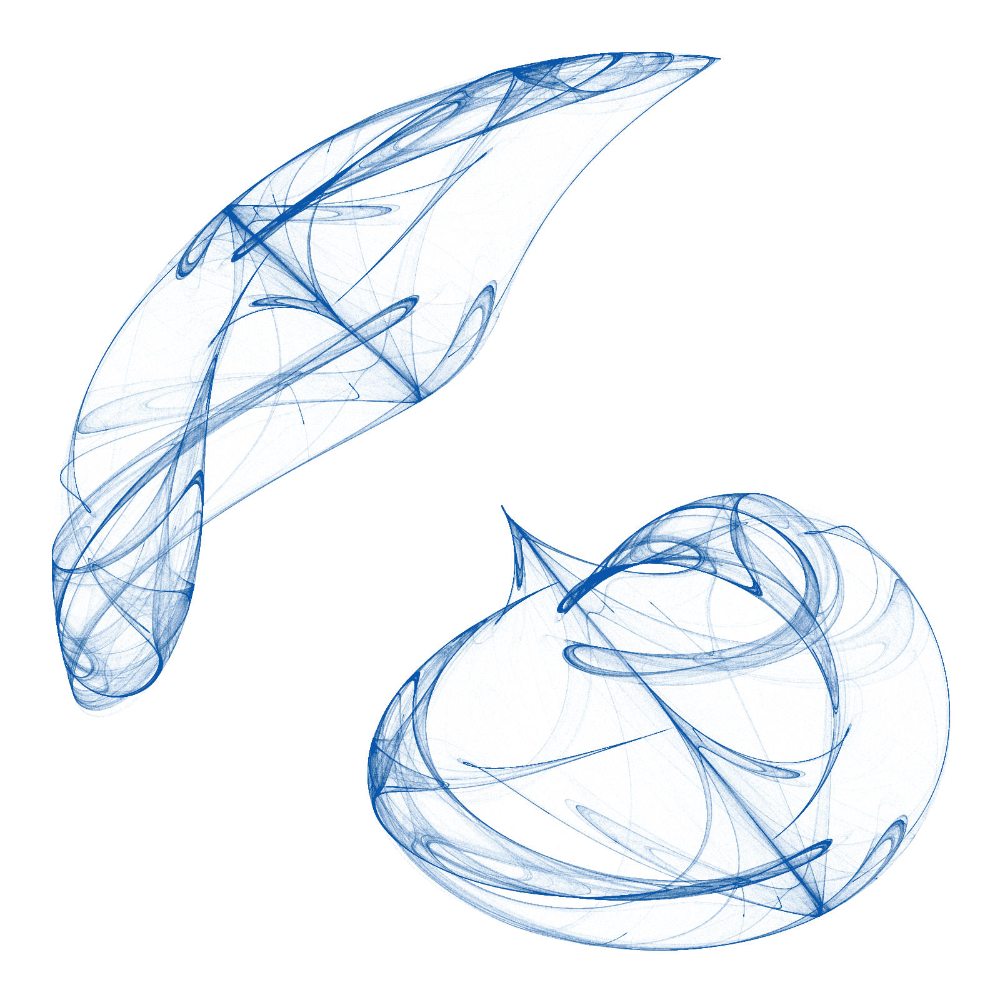

```{r setup, include=FALSE}
knitr::opts_chunk$set(echo = TRUE, eval = FALSE)
```

COMING SOON :-)

<br/>

```{bash}
# TEST
```


```
#test
```

```{r}
library(dada2); packageVersion("dada2")
path <- "MiSeq_SOP"
fnFs <- list.files(path, pattern="_R1_001.fastq$", full.names=TRUE)
sample.names <- sapply(strsplit(basename(fnFs), "_"), `[`, 1)
```
```{r}
filtFs <- file.path(path, "filtered", paste0(sample.names, "_filtered.fq.gz"))
names(filtFs) <- sample.names
filterAndTrim(fnFs, filtFs, maxEE=2, truncLen=240, multithread=TRUE)
```

```{r}
err <- learnErrors(filtFs, multi=TRUE)
```

```{r}
derepFs <- derepFastq(filtFs)
names(derepFs) <- sample.names
```


```{r}
dd.sep <- dada(filtFs, err=err)
```


```{r}
dd.pool <- dada(filtFs, err=err, pool=TRUE)
```

```{r}
st <- makeSequenceTable(dd.sep)
st.sep <- removeBimeraDenovo(st, multithread=TRUE)

st <- makeSequenceTable(dd.pool)
st.pool <- removeBimeraDenovo(st, multithread=TRUE)

st.pool_pool <- removeBimeraDenovo(st, multithread=TRUE, method="pooled")


dim(st.sep); dim(st.pool); dim(st.pool_pool)
```

```{r}

table(colSums(st.sep>0))
table(colSums(st.pool>0))
table(colSums(st.pool_pool>0))

table(rowSums(st.sep>0))
table(rowSums(st.pool>0))
table(rowSums(st.pool_pool>0))

```

```{r}
write.table(t(st.sep), "MiSeq_SOP/st.sep.txt", sep = "\t", quote = FALSE)
write.table(t(st.pool), "MiSeq_SOP/st.pool.txt", sep = "\t", quote = FALSE)
```

```{r}
sq.sep <- getSequences(st.sep)
sq.pool <- getSequences(st.pool)
sum(!sq.sep %in% sq.pool)
sum(sq.sep %in% sq.pool)
sum(!sq.pool %in% sq.sep)
sum(st.sep[,!sq.sep %in% sq.pool])
sum(st.sep[,sq.sep %in% sq.pool])
sum(st.pool[,sq.pool %in% sq.sep])
sum(st.pool[,!sq.pool %in% sq.sep])


```


```{r}
st.sep <- readRDS("MiSeq_SOP/seqtab.nochim_nopool.rds")
st.pool <- readRDS("MiSeq_SOP/seqtab.nochim_pool.rds")
```

```{r}
dim(st.sep); dim(st.pool);

sq.sep <- getSequences(st.sep)
sq.pool <- getSequences(st.pool)
sum(!sq.sep %in% sq.pool)
sum(sq.sep %in% sq.pool)
sum(!sq.pool %in% sq.sep)
sum(st.sep[,!sq.sep %in% sq.pool])
sum(st.sep[,sq.sep %in% sq.pool])
sum(st.pool[,sq.pool %in% sq.sep])
sum(st.pool[,!sq.pool %in% sq.sep])

table(colSums(st.sep>0))
table(colSums(st.pool>0))
table(colSums(st.pool_pool>0))

table(rowSums(st.sep>0))
table(rowSums(st.pool>0))
table(rowSums(st.pool_pool>0))

```

metric	unpooled	psuedo	pooled
no_reads	937761	942031	906077
no_asvs	20332	21269	13206
min_asv	816	1248	2207
max_asv	3082	4155	7522
n_samp_1	17122	17948	2430
n_samp_2	1270	309	1283
n_samp_3	586	265	890
n_samp_4	357	238	797
n_samp_5	215	250	752
n_samp_6	161	245	694
n_samp_7	130	253	711
n_samp_8	84	275	705
n_samp_9	102	229	717
n_samp_10	63	235	733
n_samp_11	55	210	715
n_samp_12	60	213	726
n_samp_13	36	225	750
n_samp_14	42	205	730
n_samp_15	49	169	573


```{r, echo=FALSE, eval=TRUE}

```
